## 收费价格
因为相比公有云，用户自己承担了硬盘与硬件的存储，所以易有云收费相对便宜。
易有云未来偏向基于时长与带宽收费，而功能不收费。
易有云只对存储端收费，用户客户端下载安装不收费。
**(即1台本地电脑可开启存储服务，作为1台NAS设备绑定使用，如您在2台电脑都开启存储服务，就相当于绑定2台NAS设备，我们就要收取2个套餐价格。)**

目前的版本不评估带宽，因为现在无法评估，我将尽最大努力给用户提供足够用户体验的服务器带宽。

| 套餐 |优惠价|原价|有效时长|权益|功能|
|-|-|-|-|-|-|
|免费套餐 |0|0| 7天 |支持添加0个共享帐号，最多2台客户端同时访问设备|仅访问文件功能|
|标准套餐（一年） |28|56| 365天 |支持添加2个共享帐号，最多4台客户端同时访问设备|相册备份、同步圈|
|标准套餐（两年） |56|112| 732天 |支持添加2个共享帐号，最多4台客户端同时访问设备|相册备份、同步圈|
|标准套餐（季） |9.3|13.8| 90天 |支持添加2个共享帐号，最多4台客户端同时访问设备|相册备份、同步圈|
|高级套餐（一年）|88|176| 365天 |支持添加3个共享帐号，最多8台客户端同时访问设备|标准套餐功能 + 异地互联、APP应用导航|
|高级套餐（两年） |176|352| 732天 |支持添加3个共享账号，最多8台客户端同时访问设备|标准套餐功能 + 异地互联、APP应用导航|
|高级套餐（季） |29.3|43.8| 90天 |支持添加3个共享帐号，最多8台客户端同时访问设备|标准套餐功能 + 异地互联、APP应用导航|

## 购买套餐

### 易有云APP

 1、绑定设备后，登录易有云App，首页【我的网盘】里，点击需要购买套餐的网盘【更多选择】——【设备信息】；

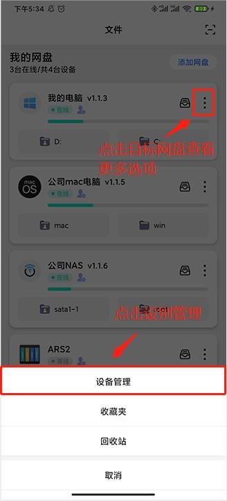

 2、新用户可以免费使用30天高级套餐；
- 点击套餐管理；

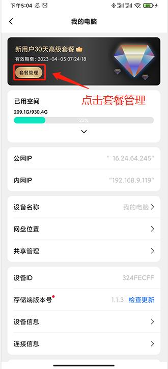

- 选择购买新套餐；
- 如果有兑换码，可以选择使用兑换码兑换

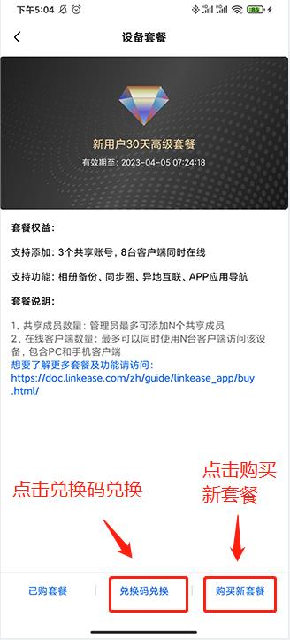

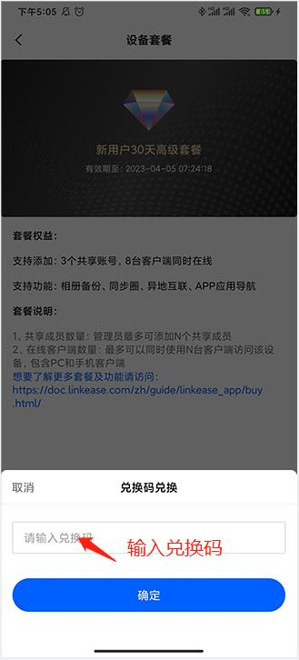

- 选择要购买的套餐，然后点击立即购买

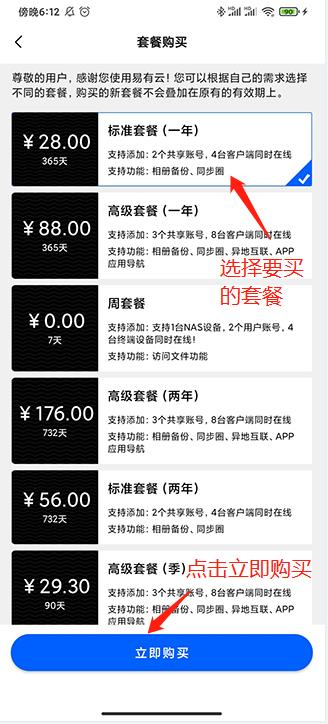

### PC客户端

1、绑定设备后，登录易有云PC客户端，在左上角选择切换要购买套餐的设备后，选择【管理】- 【设备套餐】- 【套餐管理】；  
 

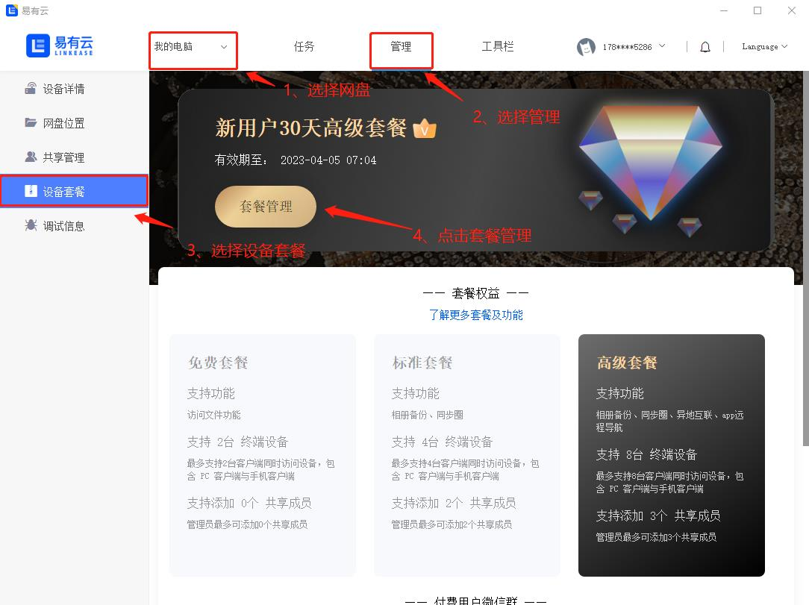

2、点击【套餐管理】，购买新套餐；

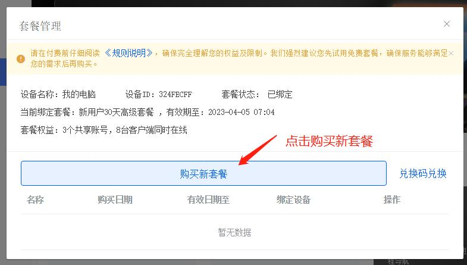

3、选择合适的套餐点击【立即购买】即可

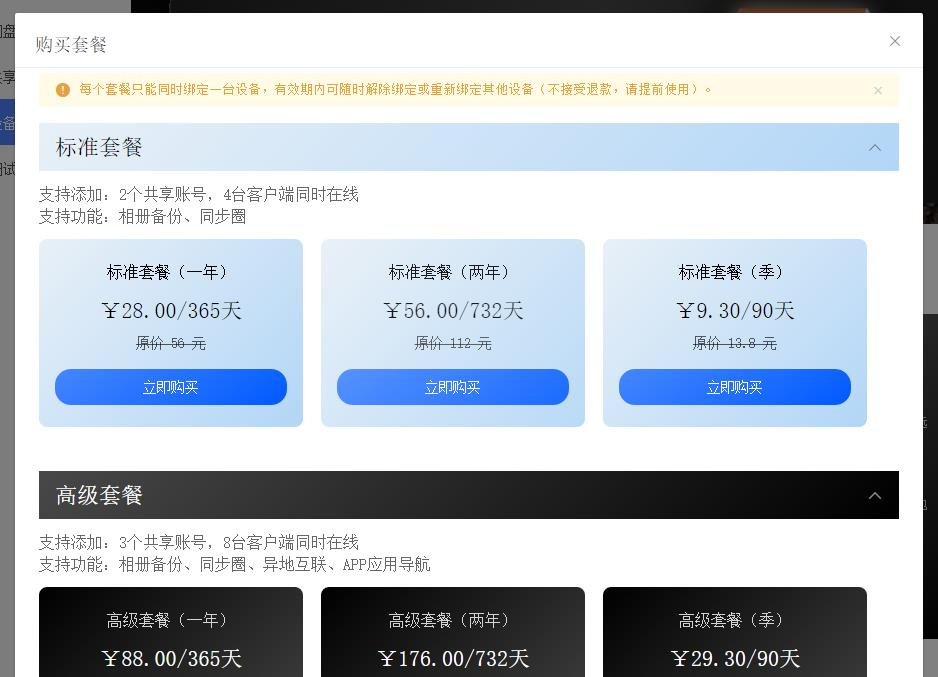

- 如果有兑换码也可以用兑换码兑换；
- 点击【兑换码兑换】

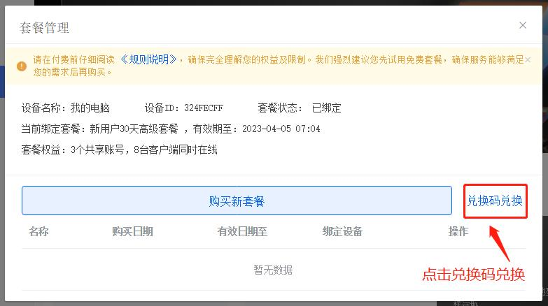

- 输入兑换码

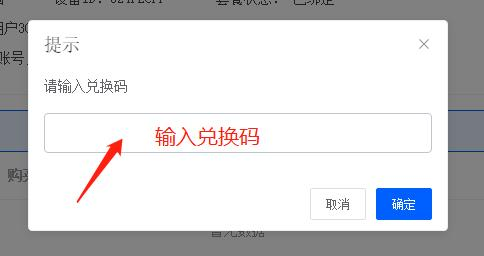

- 易有云新用户可以免费使用30天高级套餐，30天后如果该设备没有绑定过套餐或者套餐过期则会弹窗提示绑定或购买套餐

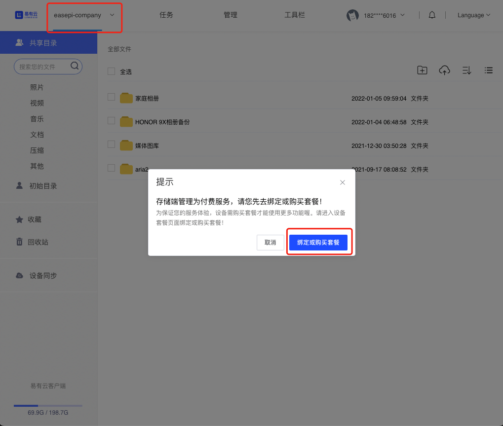

## 常见问题

**1、我绑定了某个套餐后，怎么绑定其他套餐？**

答：目前如果你已经绑定了某个套餐，可以等套餐过期后再购买或者绑定其他套餐；如果套餐没过期可以在“套餐管理-已购套餐”绑定其他套餐。

**2、旧的设备离线或者不用了，但是套餐绑定了旧设备，怎么将套餐绑定到其他新设备上？**

答：将旧设备删除，旧设备上的套餐会解除绑定，然后再在新设备上选择已有套餐进行绑定。