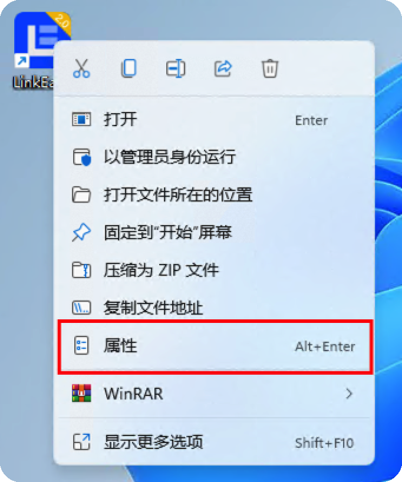
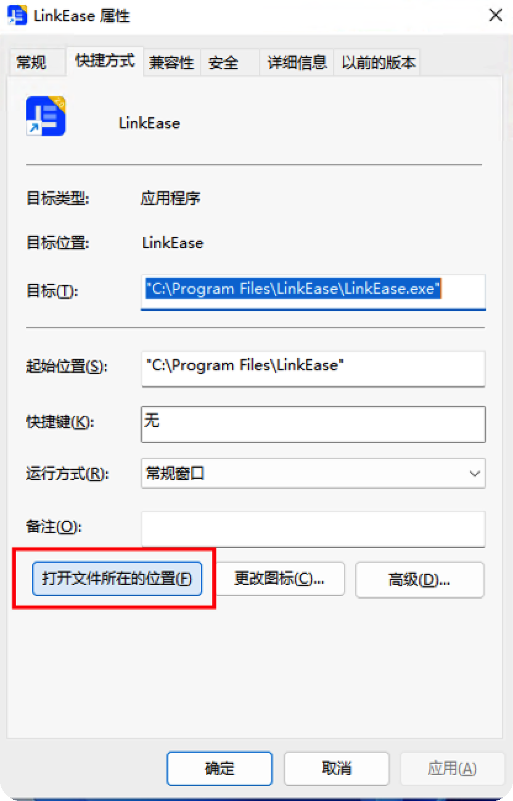
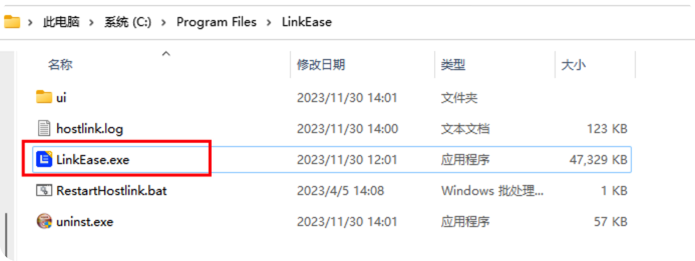
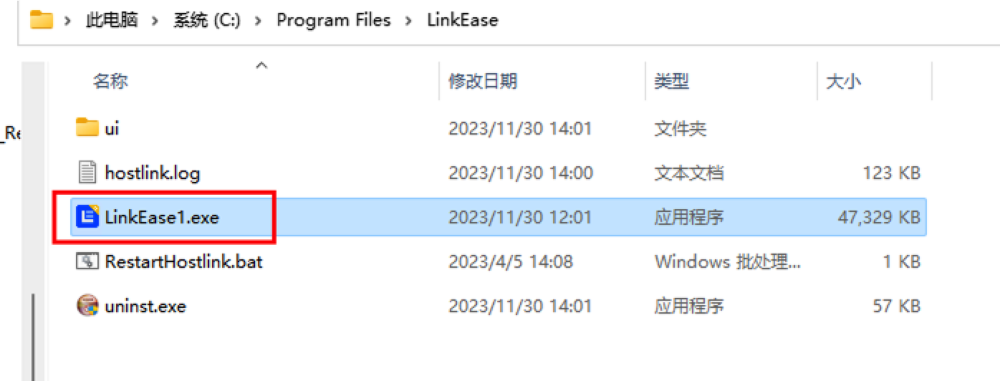
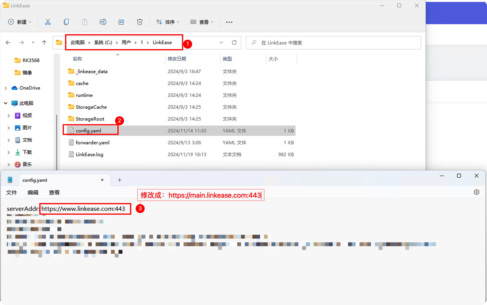

## Q: 删除设备后，如何找回设备套餐？

1.在设备列表页面，切换未购买套餐的设备。在出现的购买套餐提示弹窗上，点击“查看详情”，进入设备套餐页面；


2.在设备套餐页面点击“立即订购”按钮，会出现系统提示，提示您当前还有暂未使用的套餐；


3.点击套餐列表后的“立即使用”，确认后，即可使用您已购买过的套餐，无需再次购买；


4.完成后，设备套餐相关会出现相关套餐信息。


## Q: Windows客户端被检测出风险？

纯属误报。 
现在Windows端被少数几家病毒库检测出存在风险，应该是命中了某些特征导致的误报：

[检测说明](https://www.virustotal.com/gui/file/a8d26f39f0481bea3e31b36ae5168e1582827bf56cbff036c1800a7ed9dd3b59/detection)


**这是属于误报，大家不要担心，就是命中了某些特征而已，各种实测、反馈都是没问题的。**

## Q: Windows客户端显示没网络？

1. 你的 Windows 可能真的没网络。
2. Windows 客户端防火墙把易有云拦截了，可以把易有云程序名字重命名下，再打开看看。

## Q: 无法连接服务器？

如果您的设备无法访问服务器，可能是因为：

您设备的时间不对，导致 HTTPS 证书握手失败，从而无法跟服务器建立连接。

## Q: 为何没传输数据，看监控还占用流量？

1. 是不是别人在传输文件给你，或者你后台还在传输文件。

查看本机的传输列表：


2. 是不是打开了播放器，然后关闭播放器，播放器还在后台播放。
3. 可能同步圈数据在同步
4. 可能你分享设备给别人，别人正在进行文件传输。

## Q：Windows客户端启动后显示白屏或者无法连接网络？

遇到这种情况，可能是被防火墙拦截了，或者系统中安装的某些软件拦截了。


1. 找到易有云快捷方式，右键打开“属性”。



2. 在“属性”中切换到“快捷方式”，点击“打开文件所在的位置”。



3. 打开后找到易有云应用程序。



4. 然后把易有云应用程序改个名字后再打开即可。



## Q：易有云官网或者DDNSTO官网控制台无法访问？

易有云和DDNSTO 域名正在备案中，请暂时使用以下域名访问官网。

1. 易有云： https://main.linkease.com

2. DDNSTO： https://web.ddnsto.com

## Q：易有云PC客户端启动后显示网络错误？

遇到这种情况，可能由于www.linkease.com暂时无法访问。


1. 找到易有云的配置目录。

Windows打开路径：C:\Users\【你的用户名】\LinkEase

macOS打开路径：/Users/【你的用户名】/LinkEase

2. 打开配置文件，将配置文件中的serverAddr：https://www.linkease.com:443 这个改成 https://main.linkease.com:443，保存。



## Q：iStoreOS软件商店无法访问？

1. 打开首页终端执行以下命令；

```
sh -c "$(curl -sSL http://fw.koolcenter.com/iStoreOS/alpha/fix-istore.sh)"
```


