### 同步圈

同步圈可以将多个不同设备的文件夹关联起来进行相互同步（备份），  
构成一个同步圈，保证你的数据备份在多个设备或者硬盘上。 例如：   
当我们在公司还没编辑完文件，    
想要回家后继续编辑我们公司还没编辑完的文件，  
通过易有云同步圈，能让你公司电脑文件和家里电脑文件实时同步。  

#### [点击查看视频教程](https://www.bilibili.com/video/BV1cN4y1j7PB?spm_id_from=333.999.0.0)

#### 安装易有云
- 家里电脑安装易有云客户端[开启网盘](/zh/guide/linkease/install/device/windows.md)；
- 公司电脑安装易有云客户端[开启网盘](/zh/guide/linkease/install/device/windows.md)；
- 易有云客户端登录同一易有云账号，并且易有云是运行状态；
- 如果还有别的设备，在设备里[安装易有云并配置](/zh/guide/linkease/install/device/synology.md)；
- 成功开启网盘后，我们可以看到【我的存储】下面多了几个网盘；

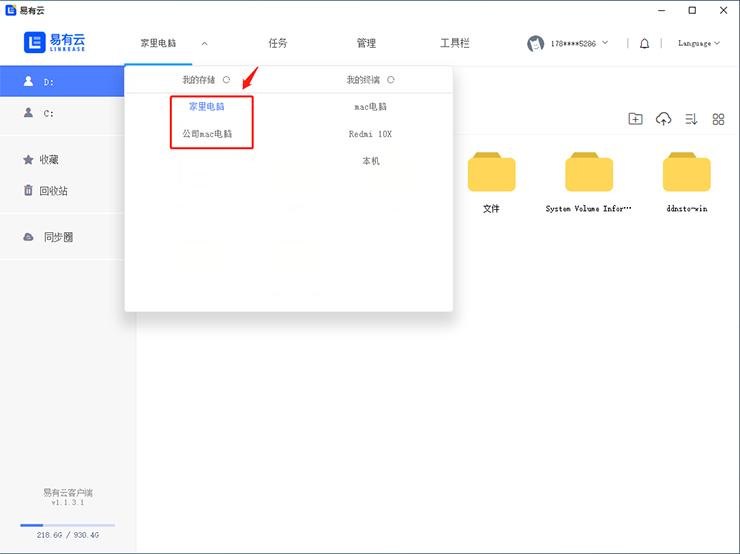

#### 开启同步圈
- 打开易有云电脑客户端，点击【工具栏】，然后点击【同步圈】；

1.打开同步圈：
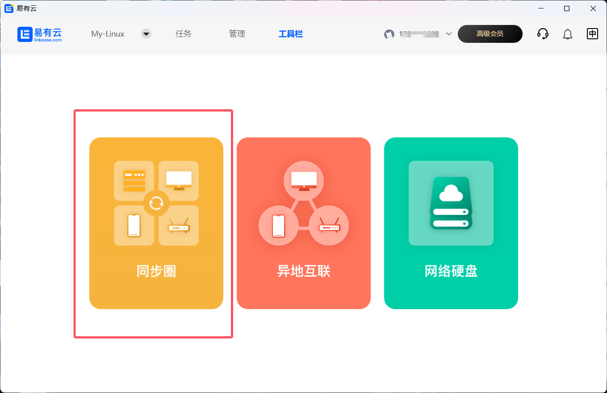

### 存储端同步

- 添加【存储端】设备作为文件同步，每个同步圈目前只能添加3个存储端；

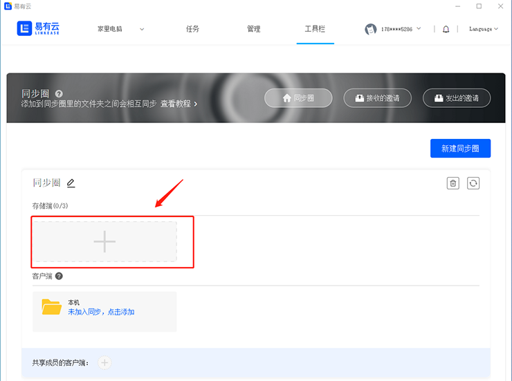

- 选择存储端设备的文件同步目录路径；

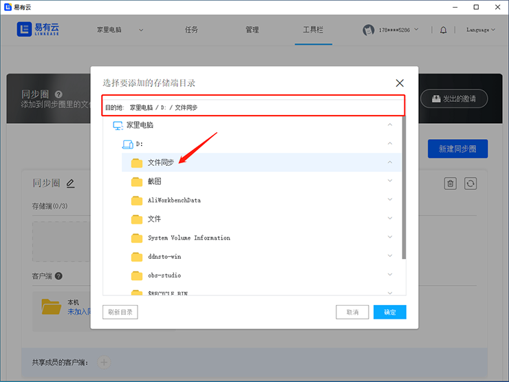

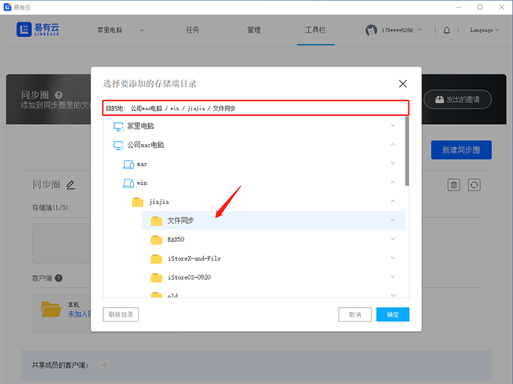

### 添加一个客户端和存储端同步

- 添加【客户端】设备（也就是本机电脑）作为文件同步；

- 选择客户端设备的文件同步目录路径；

- 选择好文件同步目录路径后，点击【立即同步】，三个设备下的文件就开始同步了；

### 查看是否已经成功开启了同步圈
- 我们可以在任何一个设备的同步圈目录下增加或者删除文件，另外的同步圈设备也会跟着增加或者删除文件；
- 在【家里电脑】的同步圈目录下新增一个文件；

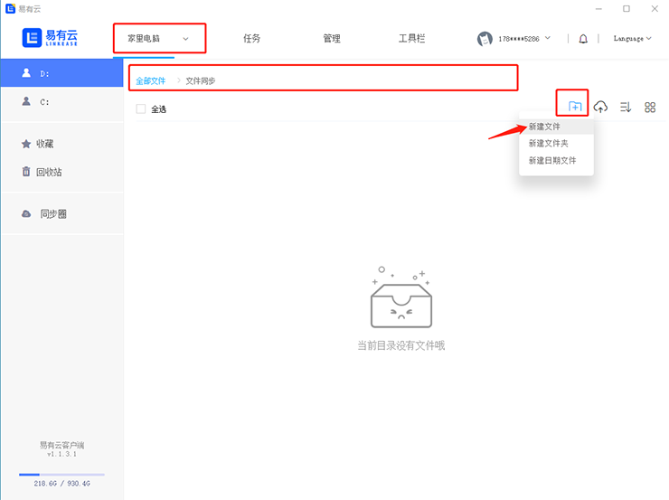

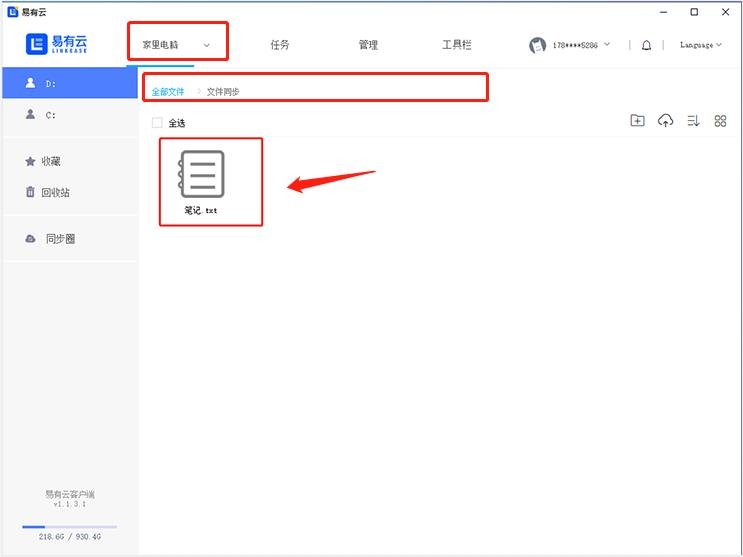

- 可以看到【公司mac电脑】的同步圈目录下也同步新增了同样的文件；

- 可以看到【本机电脑】的同步圈目录下也同步新增了同样的文件；

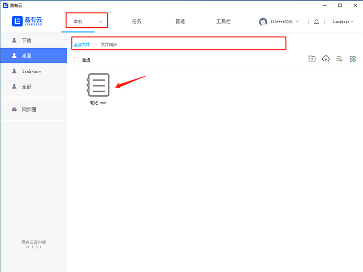

### 查看同步状态
- 点击同步文件夹右侧【更多选项】- 点击【状态】可以查看实时信息；

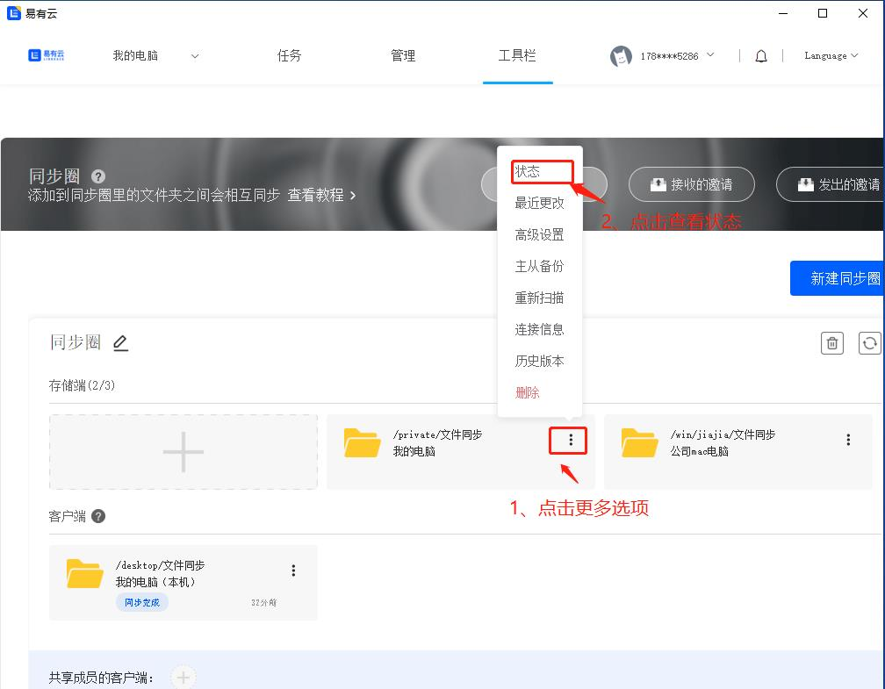

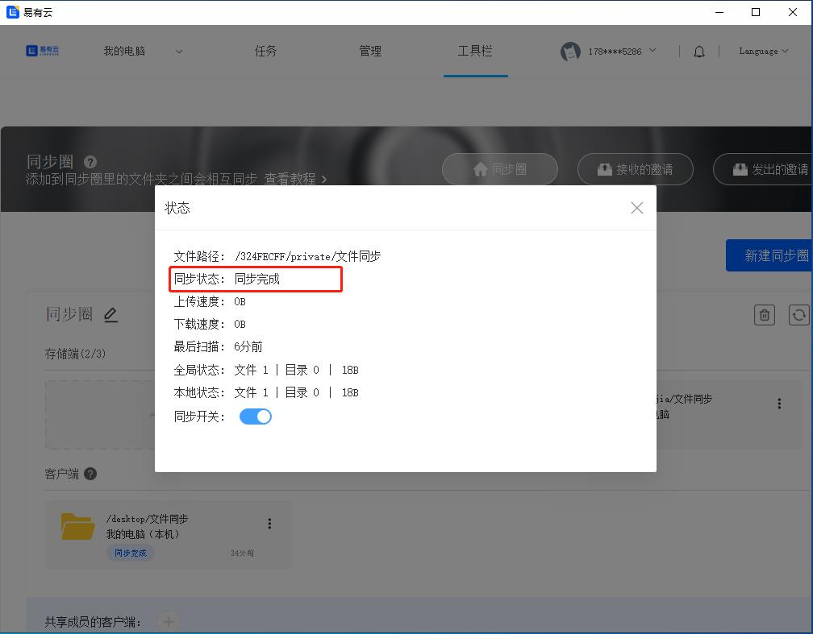

### 高级设置
- 【高级设置】可以设置【文件监听】、【扫描间隔】、【同步方式】和【版本控制】；
- 可以自己选择【同步方式】：  
1、发送与接收：当前文件夹的改动会应用到其他设备，同时接收其他设备的改动；  
2、仅发送：当前文件夹的改动会应用到其他设备，不会接收其他设备的改动；  
3、仅接送：当前文件夹的改动不会应用到其他设备，但是会接收其他设备的改动；  

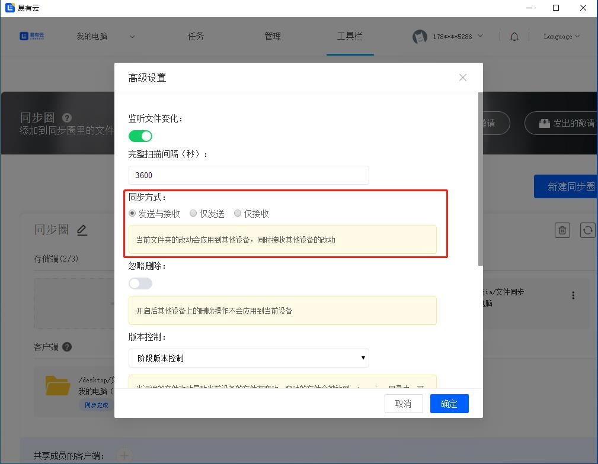

### 不小心删除或覆盖了文件，可以在【历史版本】重新恢复回来

- 点击设备【更多】里的【历史版本】

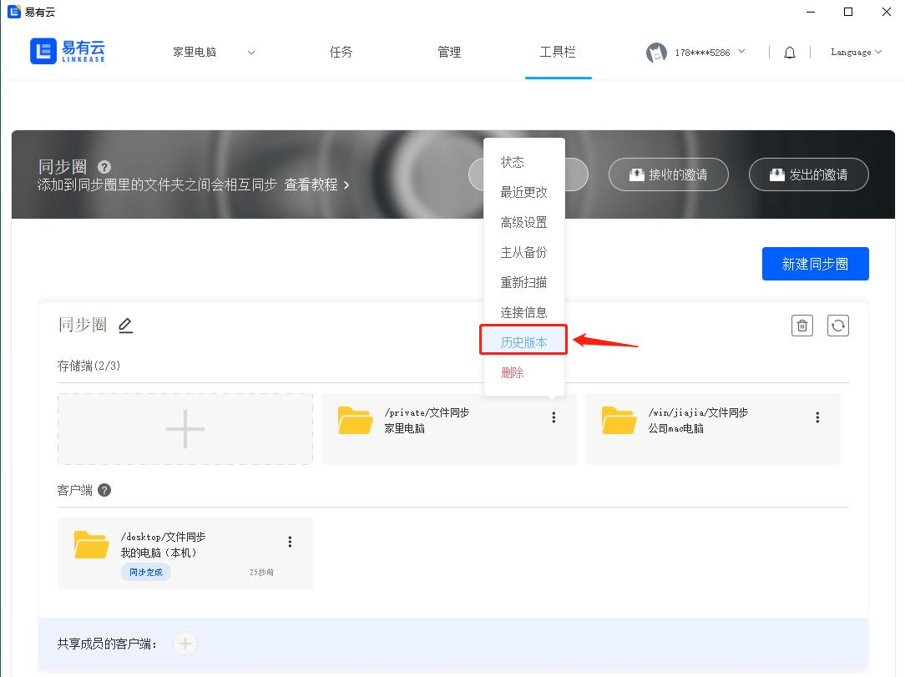

- 选择要不小心删除或覆盖了的文件，点击【恢复】就可以恢复回来啦

### 主从备份

#### 除了可以存储端文件夹之间相互同步，我们还可以选择某一个存储端的文件夹来作为备份文件夹，备份文件夹只作为同步的备份，备份文件夹里的改动不影响同步。

- 点击同步文件夹右侧【更多选项】-点击【主从备份】，选择一个备份文件夹；

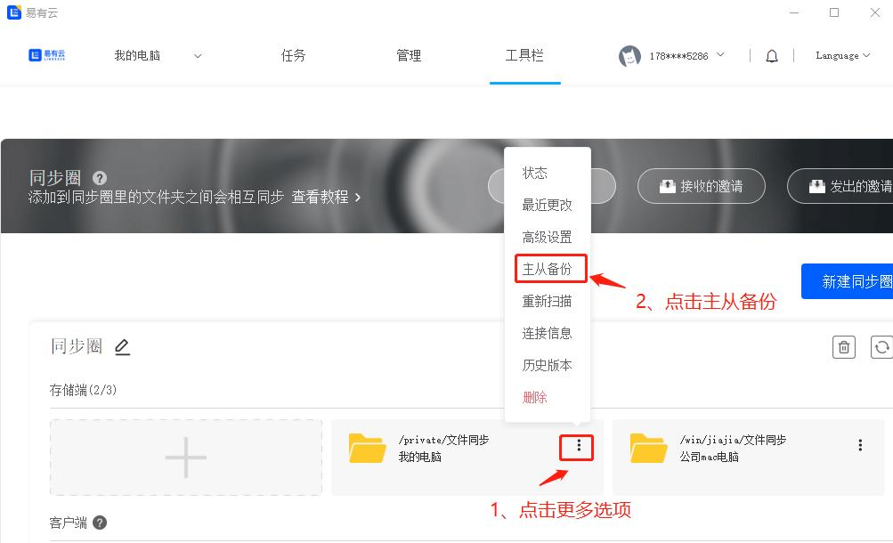

- 就可以看到这里添加了一个备份文件夹，只作为备份使用；

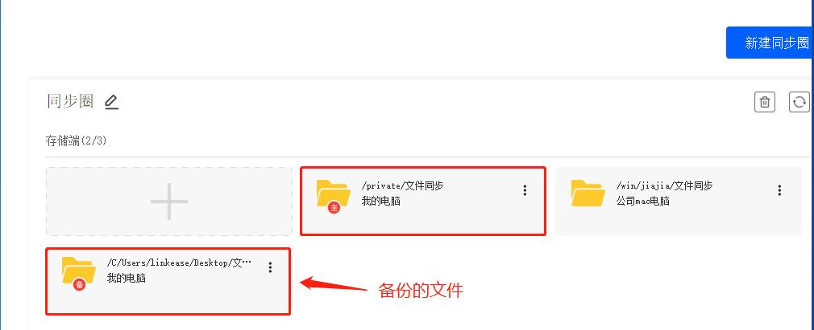

#### 同步到其他客户端

在其他客户端也添加本机文件夹后，我们就可以在当前客户端看到其他客户端的同步文件夹。
