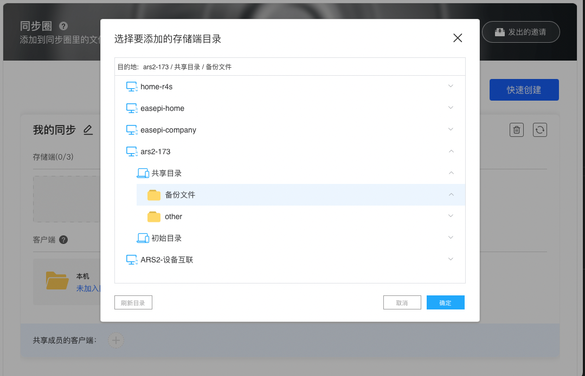
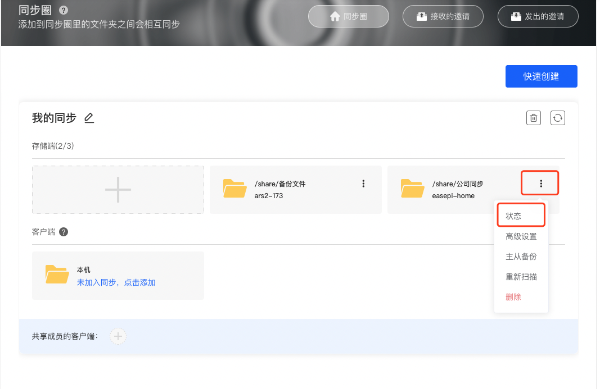
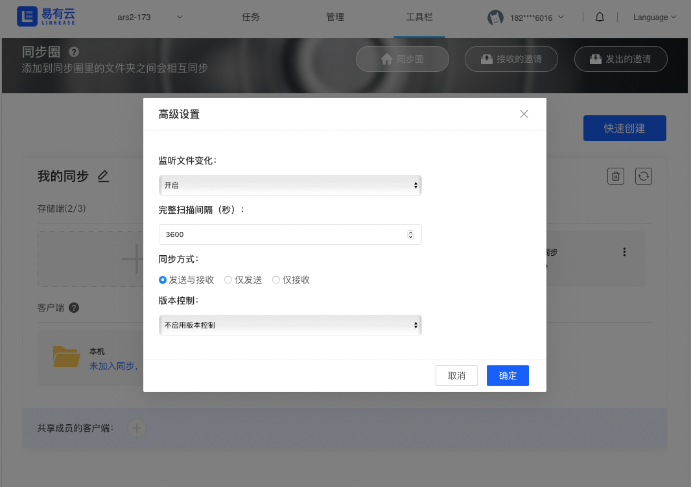
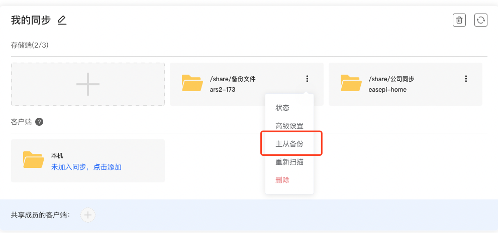
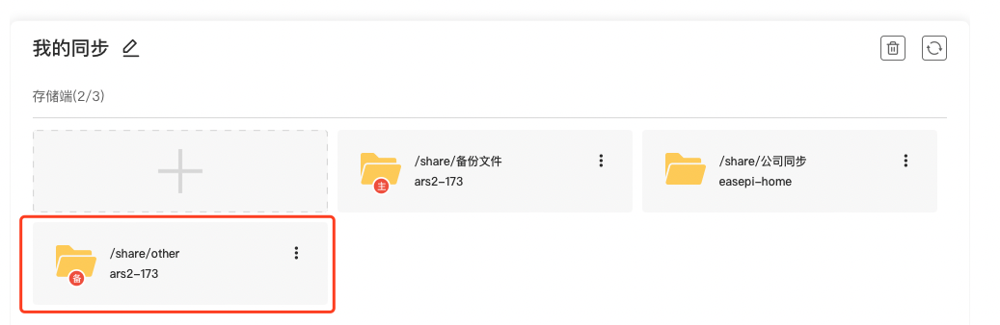
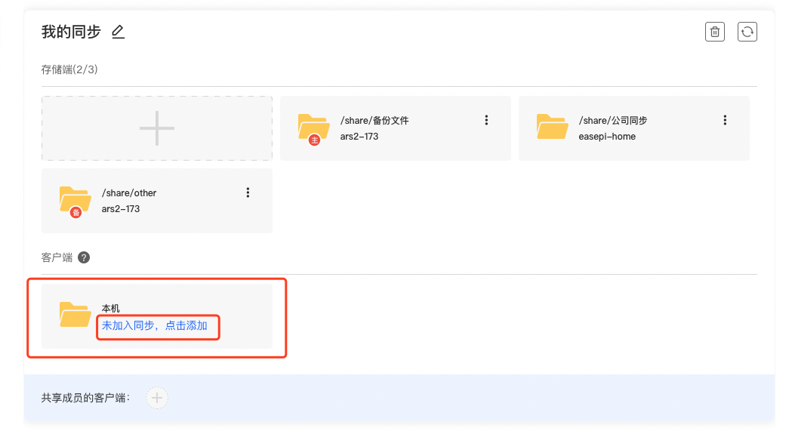
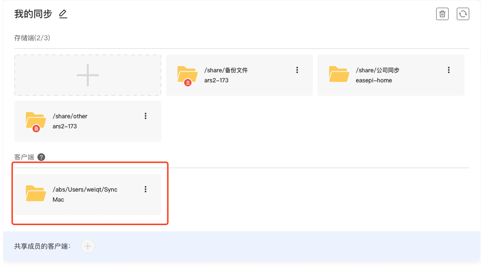

## 同步圈

将多个不同设备的文件夹关联起来进行相互同步（备份），构成一个同步圈，保证你的数据备份在多个设备或者硬盘上。
使用同步圈功能，需要将存储端（版本0.8.7及以上）和PC客户端更新到最新版本。

#### [点击查看视频教程](https://www.bilibili.com/video/BV1cN4y1j7PB?spm_id_from=333.999.0.0)

将多个不同设备的文件夹关联起来进行相互同步（备份），构成一个同步圈，保证你的数据备份在多个设备或者硬盘上。

可以往同步圈里添加存储端、客户端或共享成员的客户端文件夹，同步圈的文件夹之间会相互同步。

**打开易有云电脑客户端，点击工具栏，然后点击同步圈，点击快速创建后输入同步圈的名称，最后确定；**

1.打开同步圈：

2.新建一个同步圈：

## 存储端同步

* 因为每个同步圈必须至少有一个存储端的文件夹，创建完成后我们首先添加存储端的文件夹。

* 可以新建多个同步圈，但是每个同步圈目前只能添加3个存储端。

比如这里我将公司的ARS2的文件同步到家里的ARS2上。

**1.点击添加；**

**2.选择一个存储端文件夹；**

**3.往这个同步圈继续添加另一个存储端文件夹，这样我们就往同步圈里添加了两个存储端的文件夹，添加好后点击右上角的立即同步按钮即可开始同步。**

**4.点击同步文件夹右侧更多选项-状态可以查看实时信息。**

**5.高级设置可以设置文件监听、扫描间隔、同步方式和版本控制。**

## 主从备份

**除了可以存储端文件夹之间相互同步，我们还可以选择某一个存储端的文件夹来作为备份文件夹，备份文件夹只作为同步的备份，备份文件夹里的改动不影响同步。**

1.点击主从备份，选择一个备份文件夹；

2.就可以看到这里添加了一个备份文件夹，只作为备份使用。

## 同步到客户端

可添加本机文件夹到同步圈，也可以添加账号下其他客户端，其他客户端文件夹需要在对应的客户端上添加。

**A.同步到本机**

在客户端-本机这里点击添加：

选择好本机文件夹后就可以加入同步了。

**B.同步到其他客户端**

在其他客户端也添加本机文件夹后，我们就可以在当前客户端看到其他客户端的同步文件夹。
