### 多设备互传
当你有n部手机、n台电脑，保存着你重要的资料，  
而你想要统一管理和访问你这些散布在各地的资料。    
没关系，易有云可以快速的帮你做到，  
让你随时随地查看不同设备下的文件。

### 前置条件
- 手机上安装易有云APP；
- 电脑上安装易有云电脑客户端，并且易有云客户端是运行的状态；
- APP和PC端都登录同一易有云帐号；

### 手机快速访问电脑文件

- 打开易有云APP，设备列表里就会看到本机(手机端)和PC端；

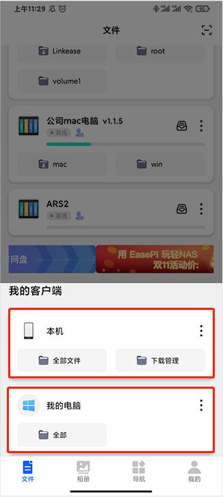

- 点击PC端就可以查看PC端绑定的目录；

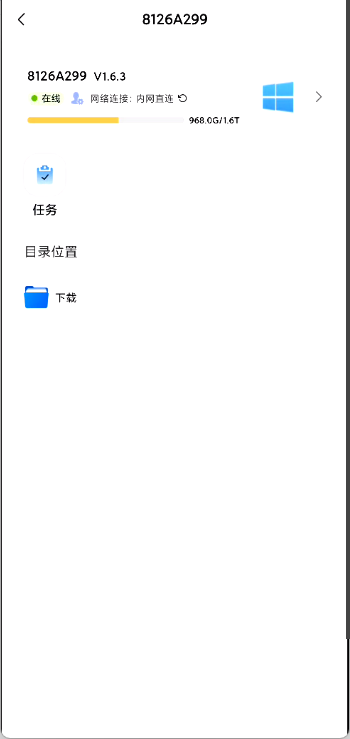

- 也能浏览本机(手机端)的目录。

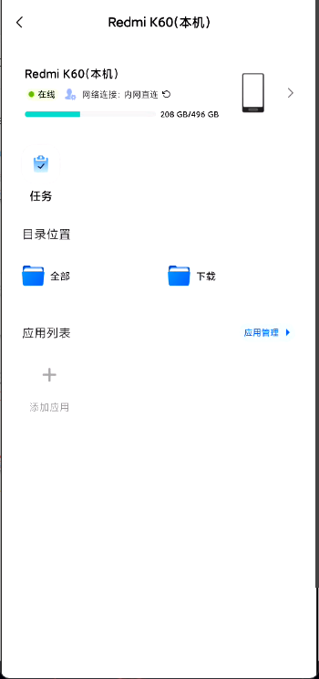

### 电脑快速访问手机文件

- 打开易有云PC端，点击左上角；
- 可以看到所有绑定的客户端；
- 选择手机即可；

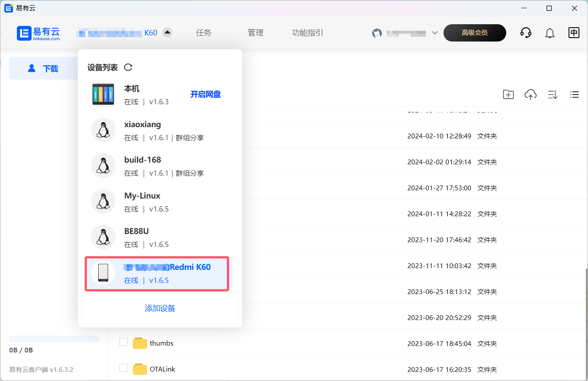

- 然后就能看到手机的下载目录里的内容了。

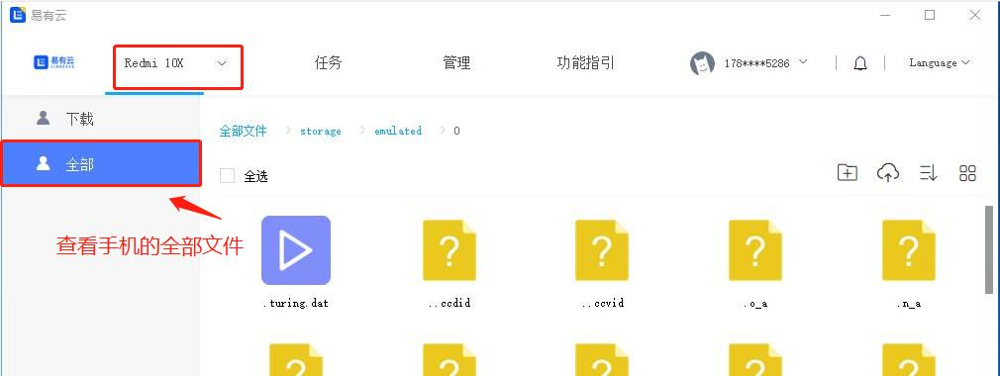

- PC端访问手机端的文件目录有限制，比如iPhone，默认为空，看不到任何文件，那么就必须添加文件。

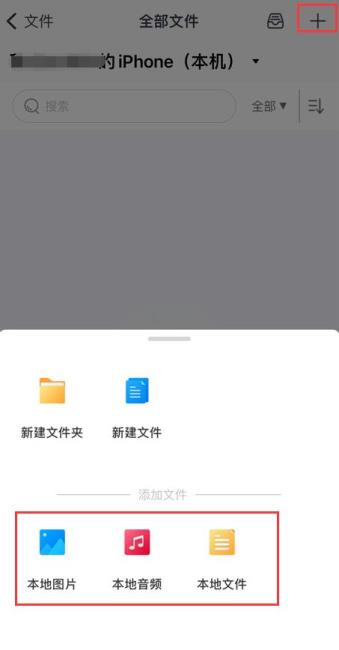

### 文件互传

#### 比如我在手机端浏览PC的端的文件，然后下载到手机，然后就可以在手机端随意分享。

- 浏览PC端的文件，找到目标文件，然后下载；

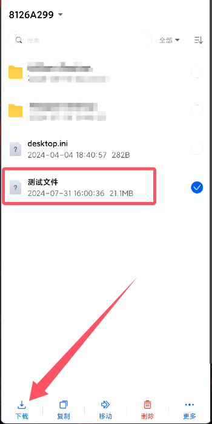

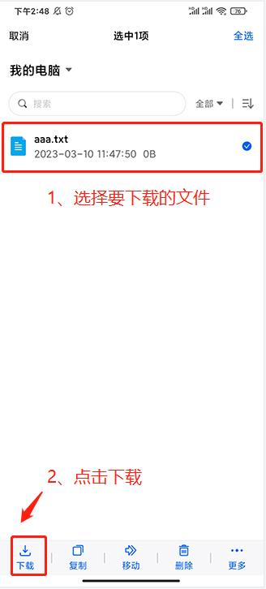

- 下载完成后，就能在本机(手机端)内看到下好的文件。

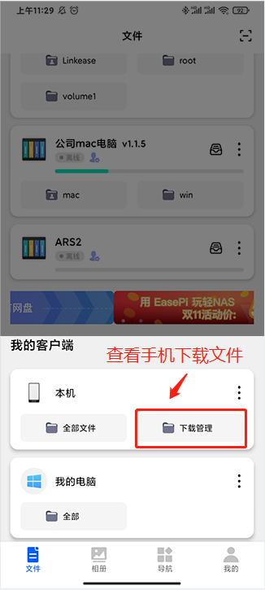

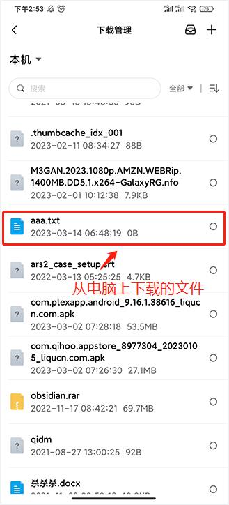

- 还可以把文件分享给别人。

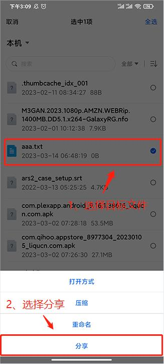

### 比如我在手机端直接上传手机里的文件到pc端
- 找到pc端的目录位置（也就是手机要上传到pc端的文件位置：比如D盘的一个位置）；
- 点击右上角【添加】；
- 然后选择要上传的文件类型（本地文件、本地音频、本地视频）；

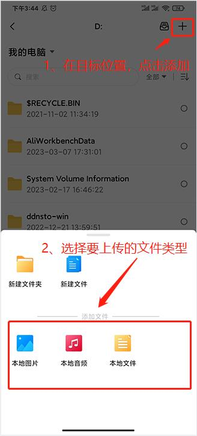

#### 比如我在PC端浏览手机端的文件，也能下载使用。

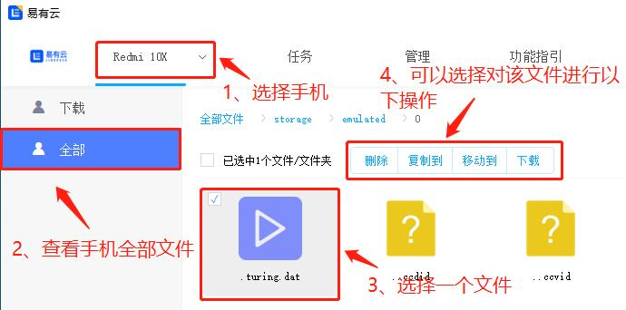

