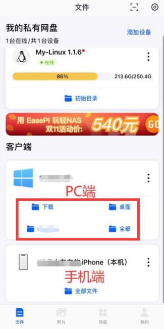
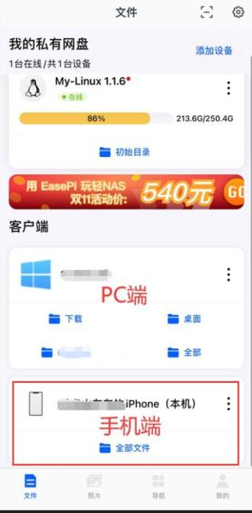
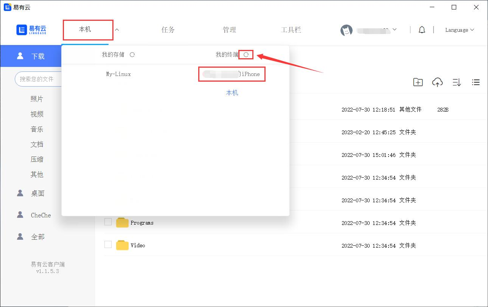
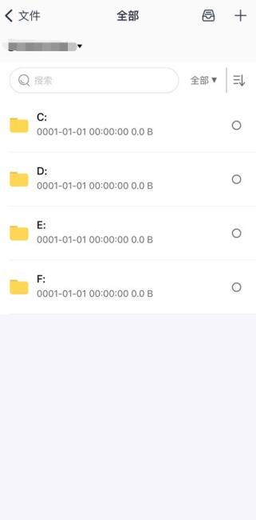
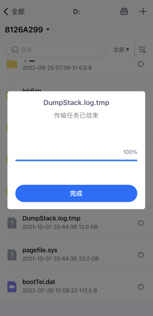
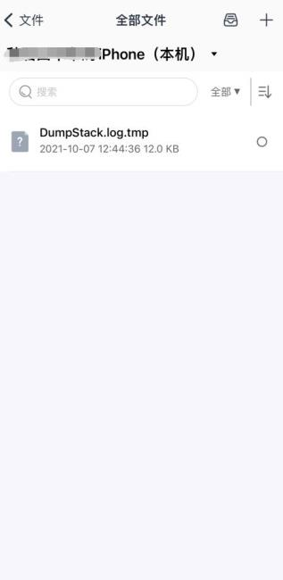
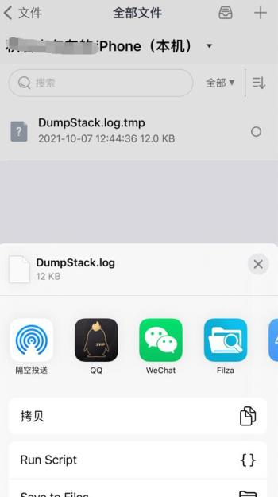
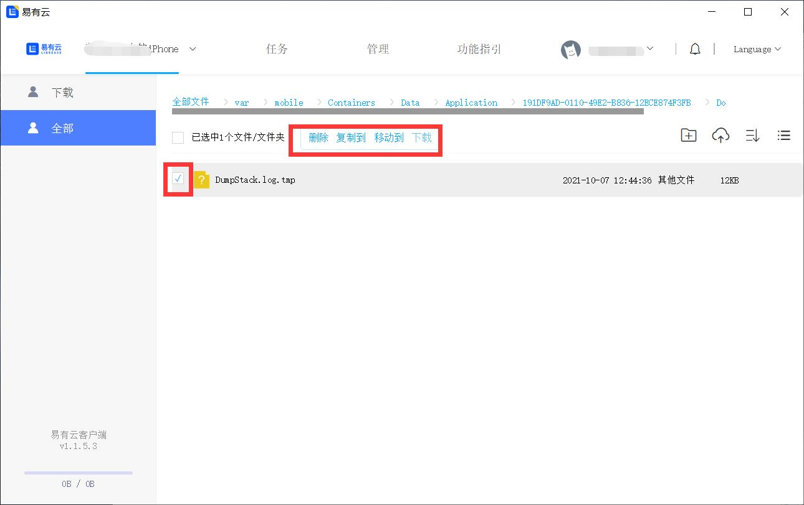

## 前置条件

- 手机上安装易有云APP
- 电脑上安装易有云电脑客户端
- APP和PC端都登录同一易有云帐号

## 手机快速访问电脑文件

* 打开易有云APP，就能看到客户端下面显示的PC端和本机(手机端)；

* 蓝色字体就是PC的各种目录，点击进去就能查看PC端的文件。

* 也能浏览本机(手机端)的下载目录，点击“全部文件”。

## 电脑快速访问手机文件

* 打开易有云PC端，点击左上角，我的终端(点击旁边的刷新按钮)，就可以看到登录的客户端了，选择手机。

* 然后就能看到手机的下载目录里的内容了。

* PC端访问手机端的文件目录有限制，比如iPhone，默认为空，看不到任何文件，那么就必须添加文件。

## 文件互传

#### 比如我在手机端浏览PC的端的文件，然后下载到手机，然后就可以在手机端随意分享。

* 浏览PC端的文件，找到目标文件，然后下载；

* 下载完成后，就能在本机(手机端)内看到下好的文件，并且可以分享。

#### 比如我在PC端浏览手机端的文件，也能下载使用。

