### 共享设备

管理员账号可以共享设备给多人使用，适合家庭共享，非常方便。

#### 目前最多3位，如需更多成员数量请联系客服

### 前提条件
- 共享的成员也必须安装易有云；

### 方式一：通过易有云APP共享

- 易有云App首页【设备列表】—— 在要共享的设备右上角【更多选项】—— 【设备管理】 —— 【共享管理】;

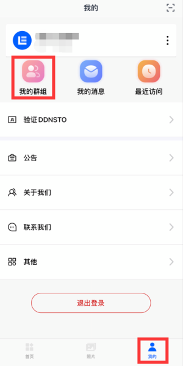

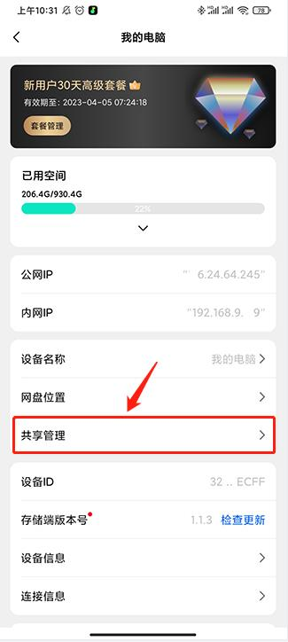

- 点击【邀请用户】，输入邀请成员的手机号码，等待受邀成员接受邀请；

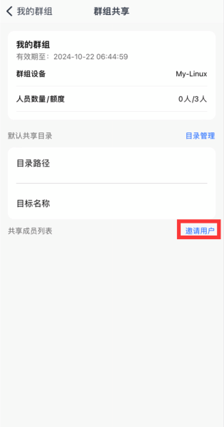

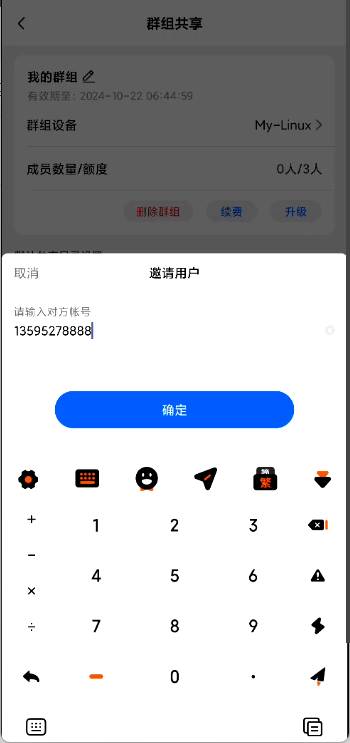

#### 接受邀请

- 受邀成员在首页点击【添加网盘】按钮，然后点击【接受共享设备】；

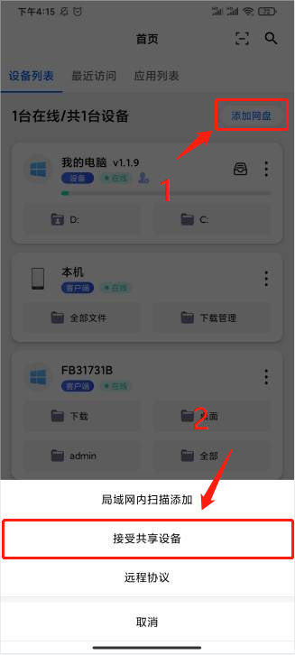

- 点击【查看】—— 【接受】；

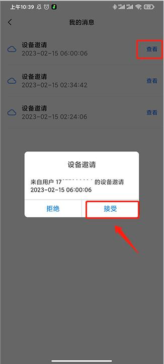

- 或者在【我的】 —— 点击【我的消息】查看并接受邀请；

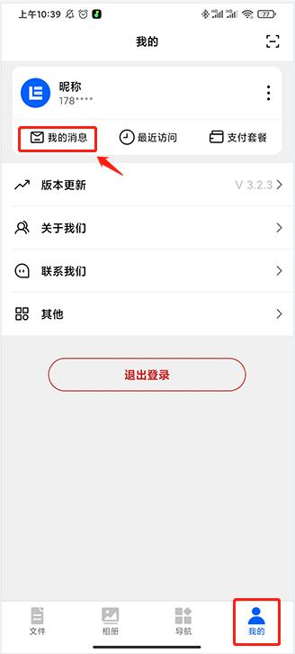

#### 更改共享目录
- 添加完共享成员后，共享设备下面会多了一个【共享目录】；

- 如果要更改共享目录，点击共享设备右上角【更多选项】 —— 【设备管理】;

- 点击【网盘位置】；

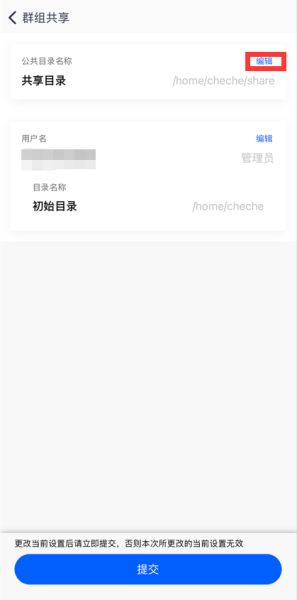

- 在公共目录点击【编辑】；

- 点击【路径设置】选择你想要分享的文件路径；

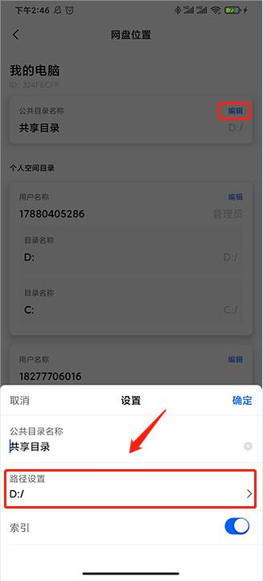

- 点击【提交设置】，就更改好共享目录了；

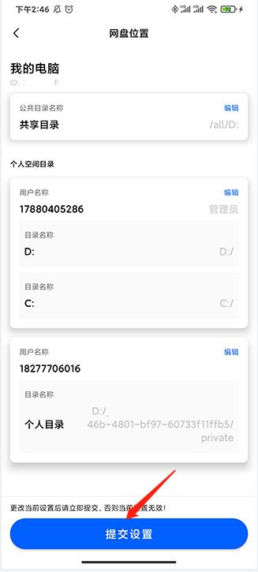

#### 取消共享

如何解绑和取消共享？

- 易有云App首页【设备列表】—— 在已经共享的设备右上角【更多选项】—— 【设备管理】 —— 【共享管理】;

- 在共享成员列表中，找到要取消共享的成员，点击删除；

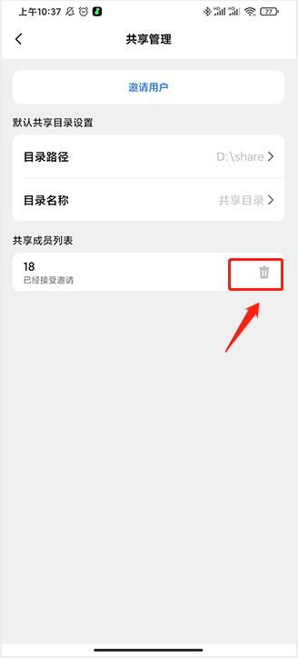

#### 设备删除和取消共享后，将会删除该用户在这台设备上的所有数据，且无法找回，请谨慎操作！

### 方式二：通过易有云客户端共享
- 打开易有云客户端，点击左上角选择要共享的设备 —— 点击【管理】 —— 点击【共享管理】 —— 点击【邀请用户】；

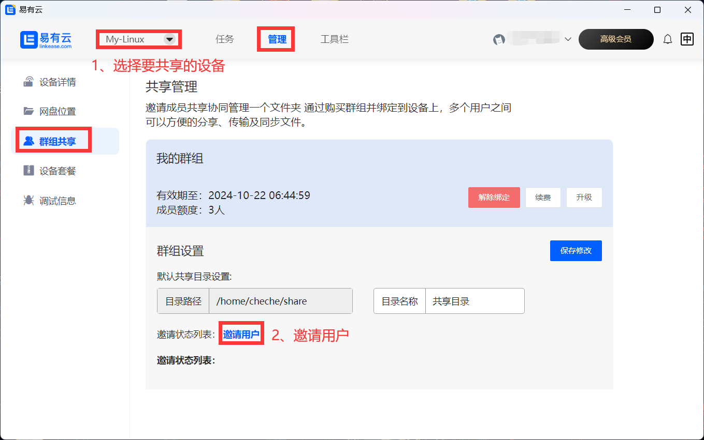

- 输入邀请成员的手机号码，等待受邀成员接受邀请；

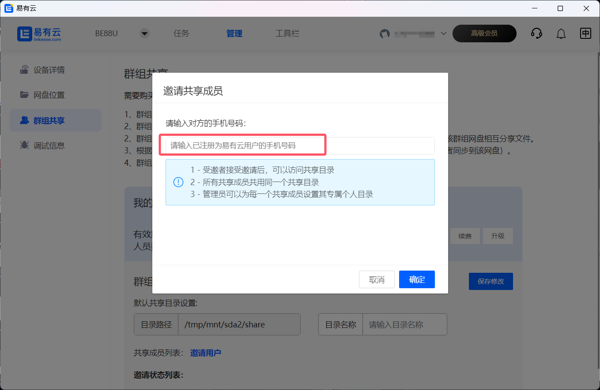

#### 接受邀请
- 受邀成员在易有云客户端右上角点击【消息通知】—— 点击【设备邀请】 —— 点击【接受】；

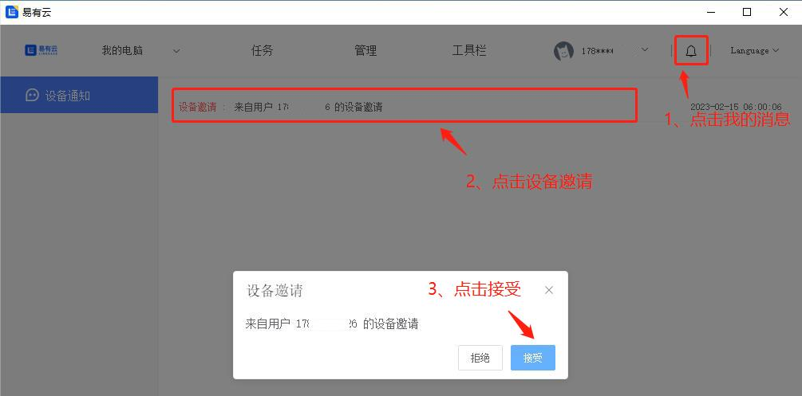

#### 更改共享目录
- 打开易有云客户端，点击左上角选择共享的设备 —— 点击【管理】 —— 点击【共享管理】 —— 在默认共享目录设置下双击【目录路径】;

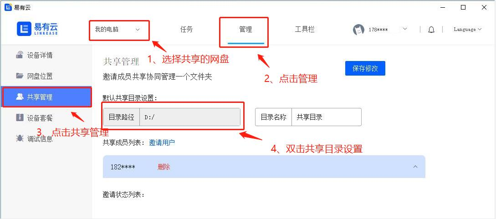

- 选择你想要分享的文件路径；

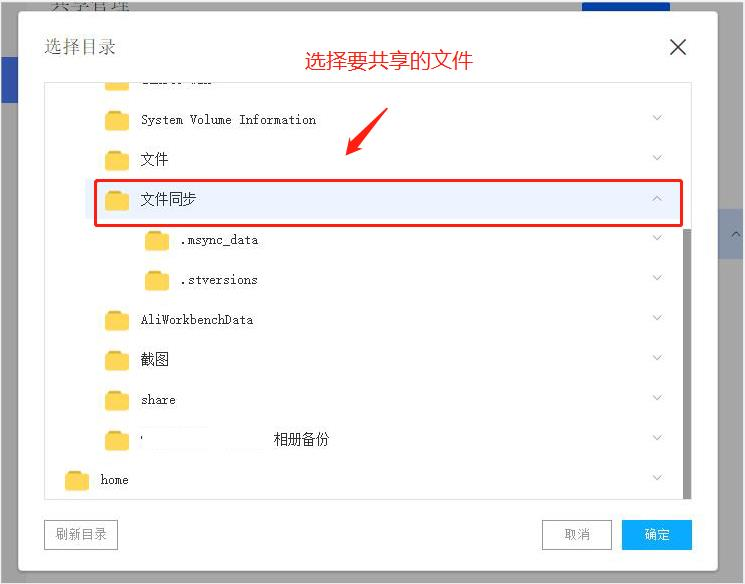

- 点击【保存修改】就更改好共享目录了；

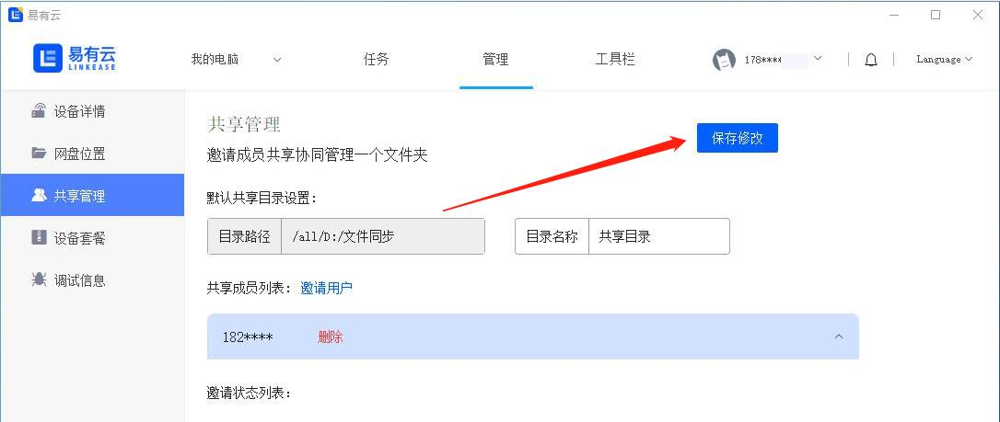

#### 取消共享
- 在易有云客户端左上角选择想要取消共享的设备 —— 点击【管理】 —— 点击【共享管理】 —— 在共享成员列表中，找到要取消共享的成员，点击【删除】；

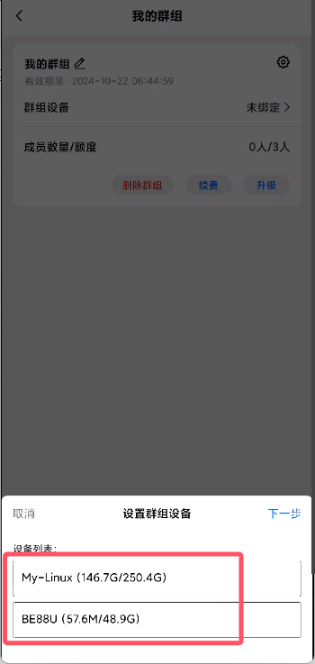

