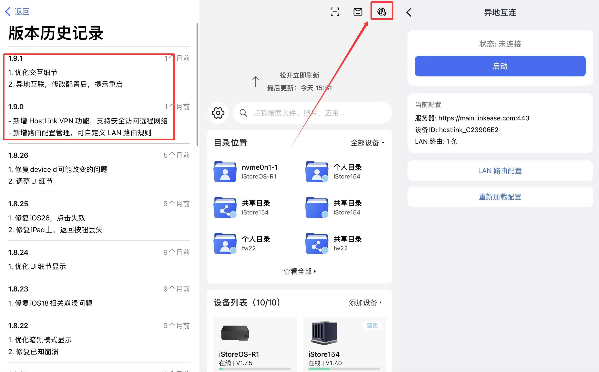
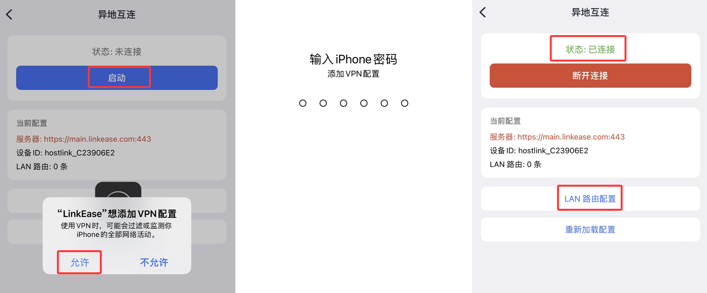
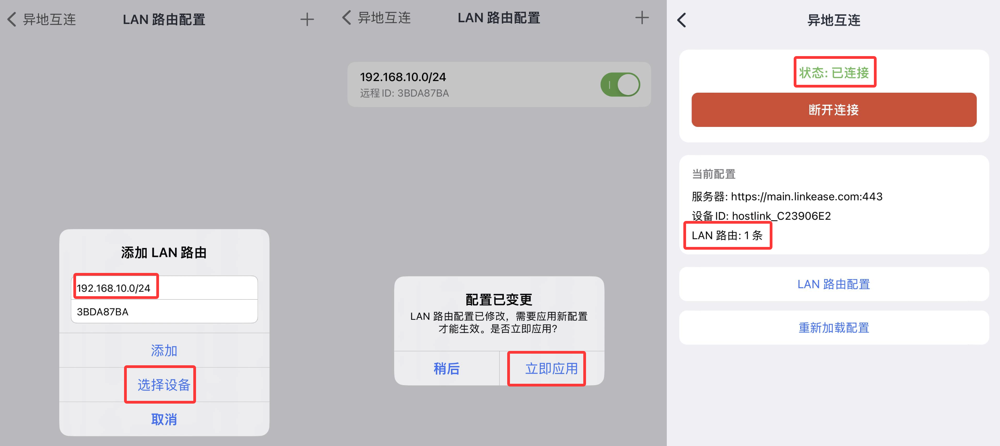
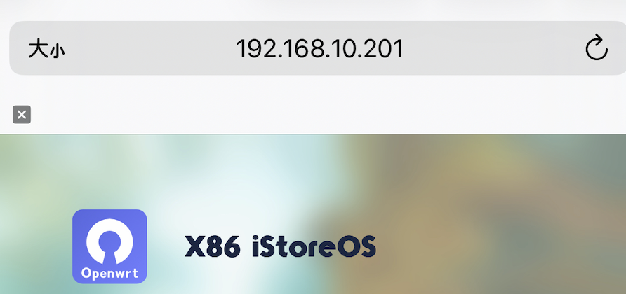

### APP也能异地互联

* 当你公司或家里的 NAS/iStoreOS/DSM 等设备上[安装易有云并配置](/zh/guide/linkease/install/device/istoreos.md)；
* 只需要一部手机，在异地就能直接访问你家里的设备。

* 目前仅支持 iOS 系统，且安装最新版 1.9.1+
* 安卓版后续适配中ing

### APP如何开启异地互联？

- 保证家里 NAS/iStoreOS/DSM 等设备[安装易有云并配置](/zh/guide/linkease/install/device/istoreos.md)，且保持设备在线；
- 手机安装最新的易有云APP，登录同一易有云账号。

#### 1、安装易有云APP并打开，点击首页右上角图标——>异地互联

#### 2、首次进入点击“启动”，会提示添加 V-P-N 配置，允许并输入手机密码，添加完成

* 首次启动，还未添加 LAN 路由，需要自行添加。

#### 3、点击“LAN 路由配置”——>添加 LAN 路由：

- 添加 LAN 网段：格式一般为IP/24，例如192.168.1.0/24，“选择设备”即为远端安装了易有云存储端的设备。

- 比如你家里路由器 LAN 口IP为192.168.2.1，那么你的网段就是：192.168.2.0/24。

- 填写 LAN 网段、选择好设备后，并添加，提示配置变更，立即应用！

- 返回手机异地互联首页，即可启动。

#### 4、手机异地互联正常启动后，就能随时随地通过手机网络访问家里的路由器/NAS等设备。

* 只要在你添加的网段内的路由器、NAS、iStoreOS 等设备的 IP 都能访问。

