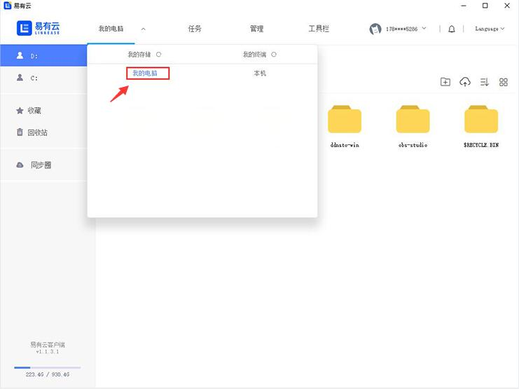
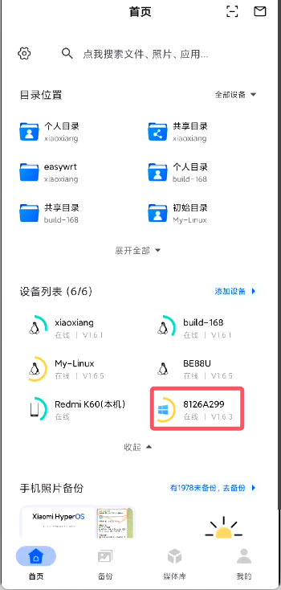
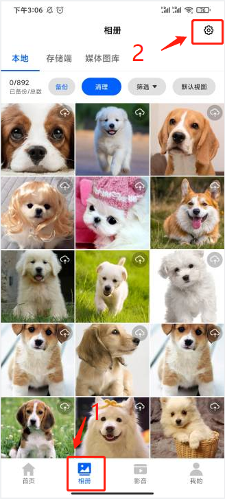
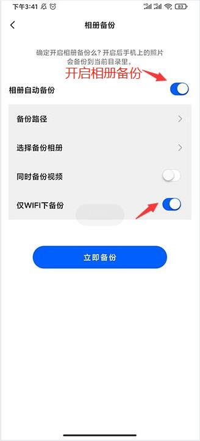
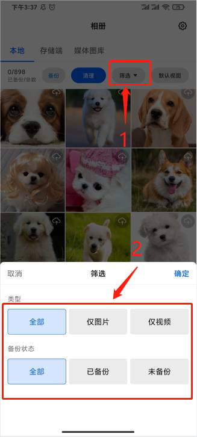
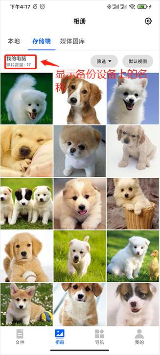
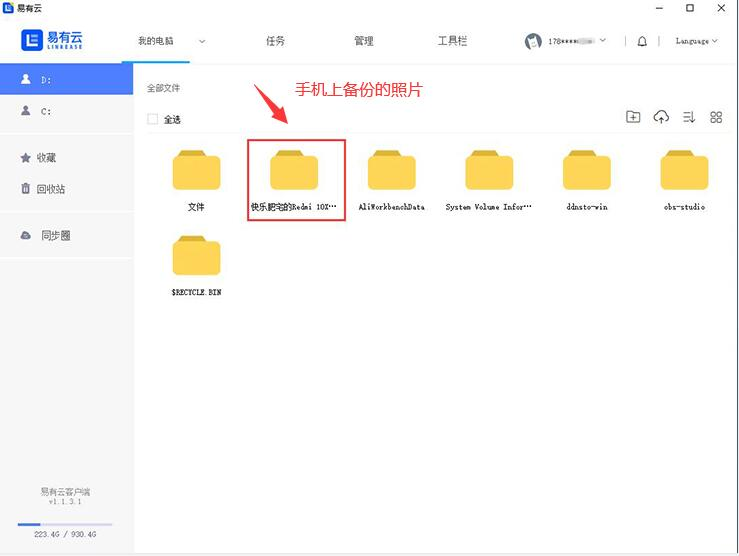
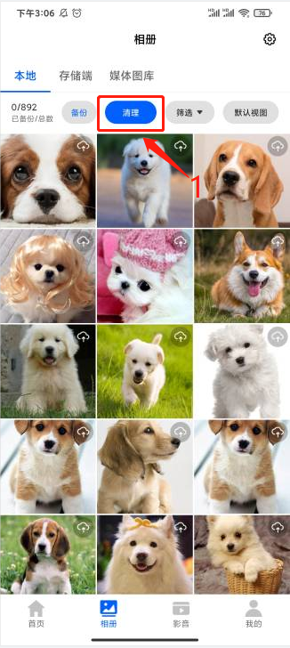
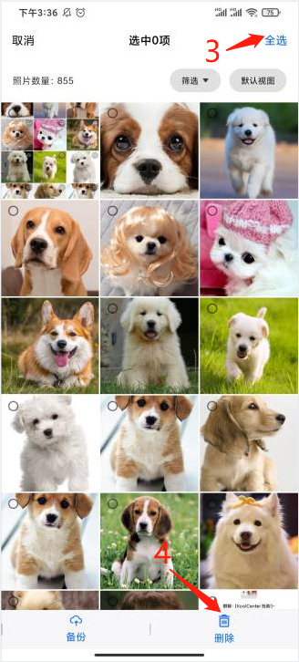
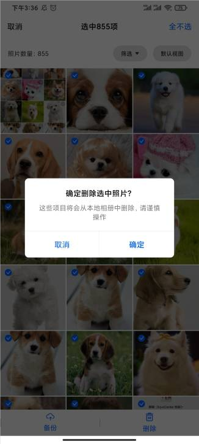

### 相册备份

随着我们手机照片的增多，手机可用空间也会变得越来越少，所以我们需要给手机来个瘦身。      
我们可以通过易有云把手机里的照片备份到自己的电脑或者硬盘、U盘里等等，  
并且还可以随时随地的访问和分享给亲朋好友。  
这样既能给我们手机瘦身，又不用担心你的照片会丢失。

### 安装易有云
- 下面我们演示把手机照片备份到电脑，如果要备份到别的设备可以查看[安装及配置](/zh/guide/linkease/install/device/synology.md)；
- 安装易有云电脑客户端，[开启网盘](/zh/guide/linkease/install/device/windows.md)；选择电脑上的磁盘或者目录作为一个“网盘”；
- 成功开启网盘后，我们可以看到【本机】；
- 注意：易有云客户端要保持运行状态；

- 安装易有云APP，并且易有云APP要和易有云客户端登录同一易有云账号；
- 打开易有云APP，就可以在【首页】——【设备列表】下面看到刚刚配置好的电脑端；

### 开启相册自动备份

- 选择【相册】，点击右上角的【设置】；

- 开启相册自动备份，还可以开启仅WIFI下备份；

### 选择备份路径

- 选择备份的路径（安装了易有云客户端，即:照片/视频的备份位置 )，设备选择配置好的网盘；
- 如果你有多个设备（设备必须安装易有云并开启网盘），想把相片/视频等备份到不同的设备，就必须切换备份目标，一次只能设置一个；

- 选择好备份路径后，点击立即备份，手机里的相片就会自动备份到你的电脑里面了；

### 条件筛选备份
* 若要筛选已备份/未备份、照片/视频，点击【筛选】即可选择条件筛选；

### 查看备份好的照片/视频
- 备份好的照片在【存储端】下可见，也会显示是备份在哪个设备上的；

- 还可以在电脑上查看已经备份好的照片/视频；

### 清理备份好的照片/视频
- 点击【清理】，可以把备份好的照片/视频清理掉，还可以清理不需要的照片/视频，并且还可以清理相似的照片等。

