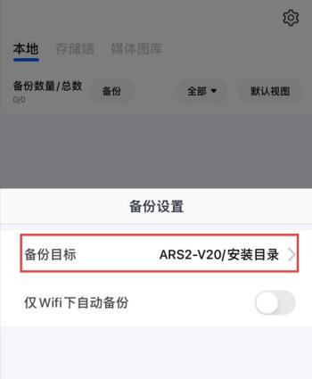
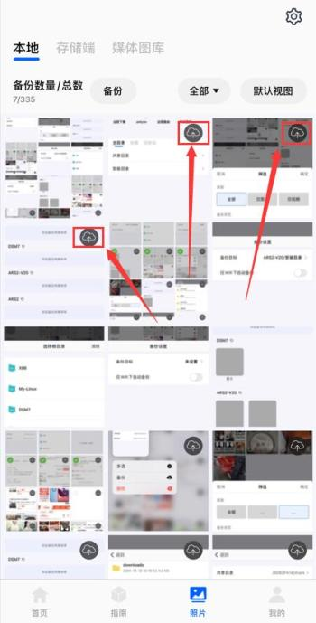
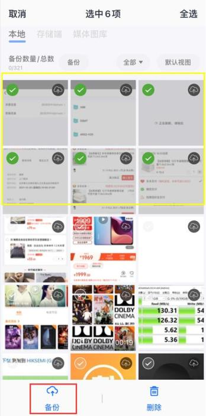
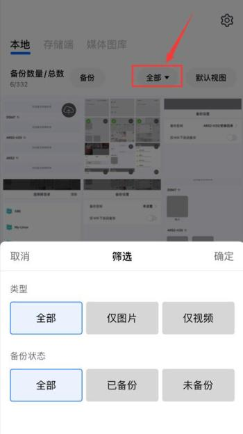
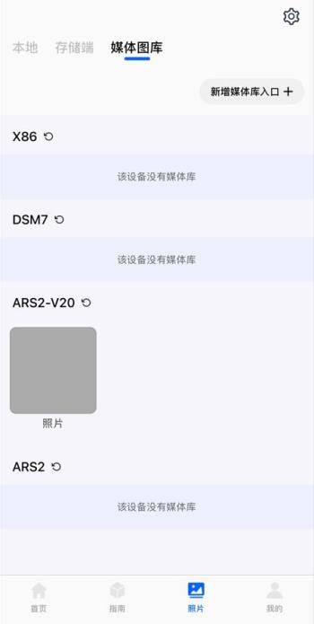
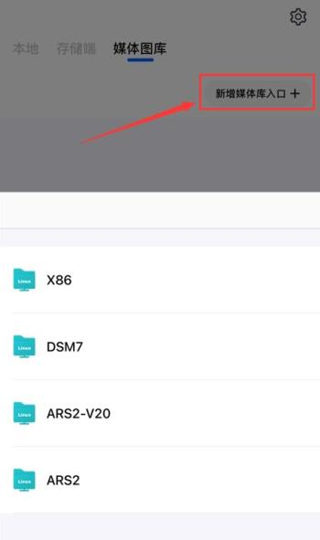

### 相册备份

如何备份照片呢？

* 存储端必须升级至0.5.3或者更新；
* 易有云App更新至(Android v3.0.1/iOS v1.2.0)或者更新。

**1.进入易有云App首页底部——照片；**

**2.点击右上角的齿轮，设置备份目标；**

* 备份目标：安装了易有云存储端的设备 (即:照片/视频的备份位置 )。

* 点击备份目标，进入选择合适的位置；

* 若有多个存储端，想把相片/视频等备份到不一样的地方，就必须切换备份目标，一次只能设置一个；

* 仅WiFi下自动备份，按需设置。

**3.设置好备份目标后，就可以开始备份了；**

* 在照片——本地，若要单独备份某个照片或者视频，点击右上角的备份按钮即可；

* 若要多选，长按某照片，出来多选选项，然后一一选择备份，也可以右上角全选；

* 若要筛选已备份/未备份、照片/视频，点击全部即可选择条件筛选。

**4.备份好的照片在存储端下可见，也会显示是某设备上的备份。**

* 也可在备份目标的路径下看到某某的备份相册。

### 媒体图库

说完了照片备份，再来看媒体图库。媒体图库是干嘛的？

你可能多个手机备份，或者自建的其他图片/视频文件夹等，就可以从这里添加成一个图库，方便管理。

简单来说就是一个自定义图片或视频的文件夹。

* 直接点击“新建媒体库入口”，选择合适的文件夹即可。

