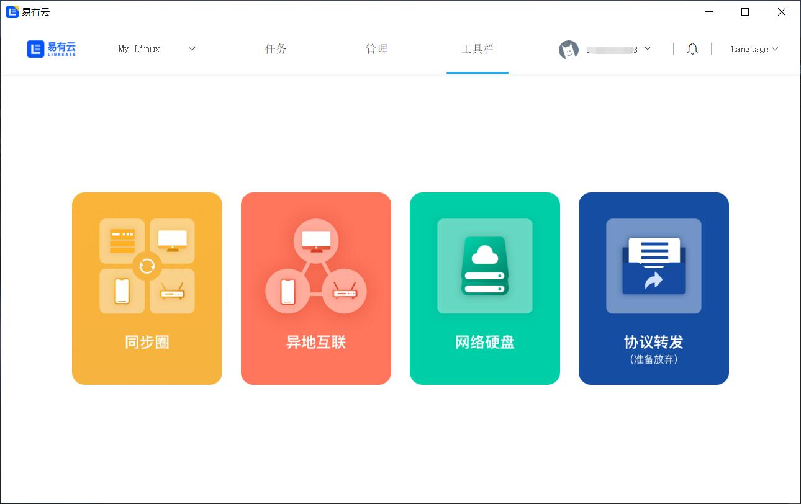
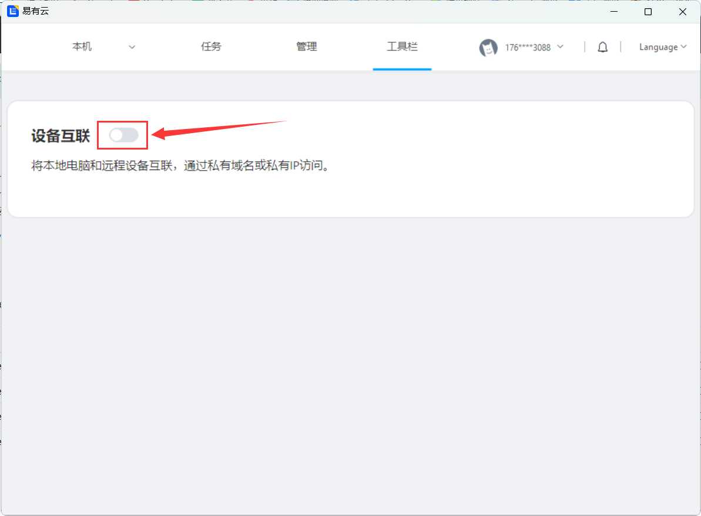
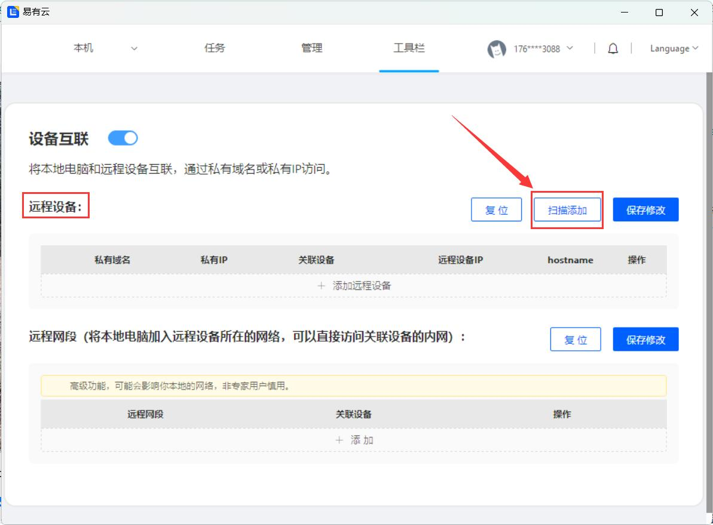
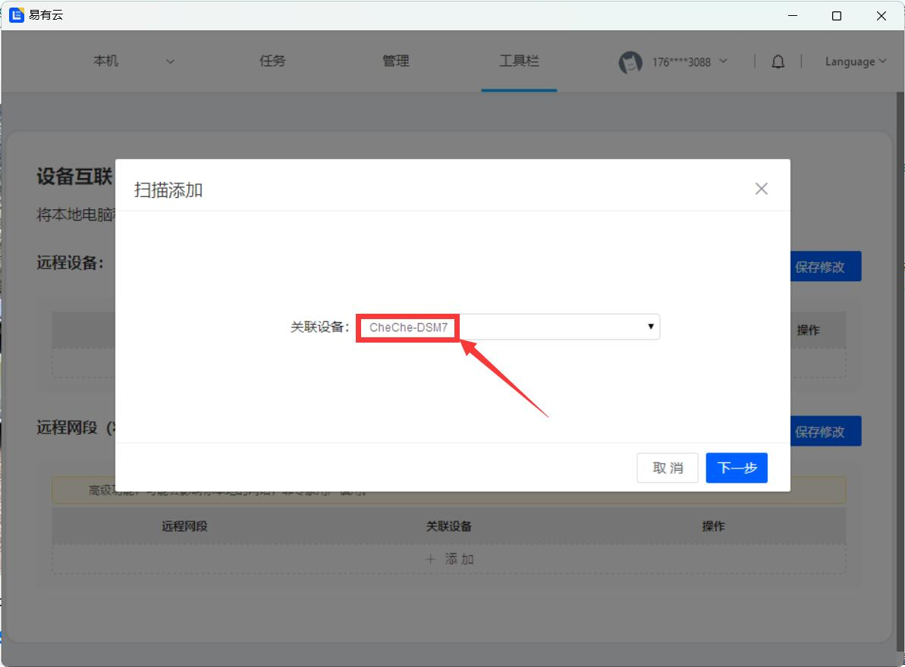
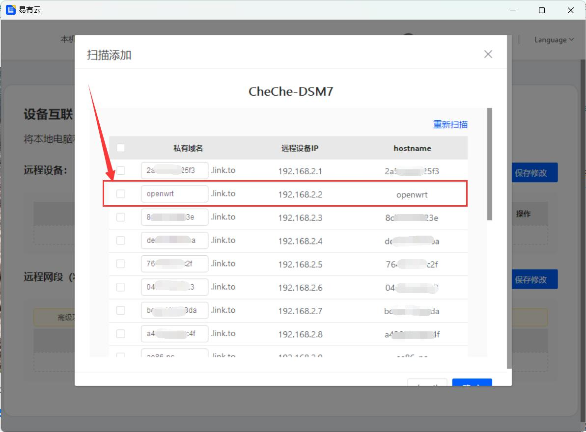
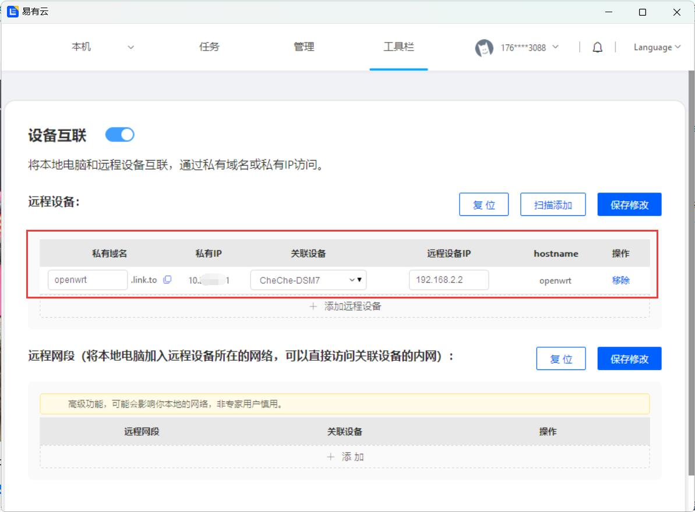
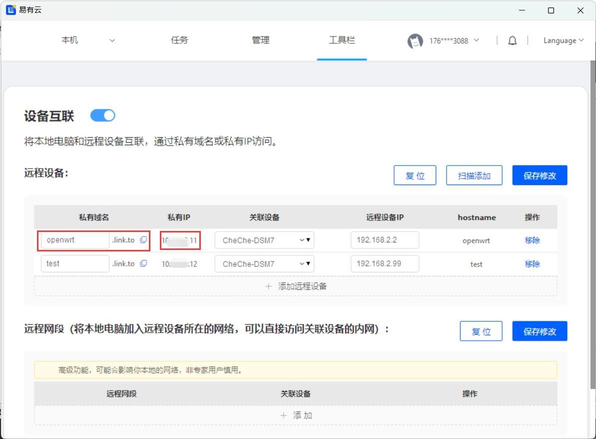

## 异地互联

将本地电脑和远程设备互联，通过私有域名或私有IP访问。
简单来说就是可以通过易有云PC端，来远程访问远端易有云私有网盘所在网络的设备。

**打开易有云电脑客户端，点击工具栏，然后点击设备互联；**

然后点击启用：

## 远程设备

假设场景：自家的网络里，有设备安装了易有云存储端，并且开机处于联网状态，目前在外网某电脑上安装易有云PC客户端，然后远程访问家里的设备。

**1.在远程设备里，点击“扫描添加”；然后选择“关联设备”；**

选择的“关联设备”即为你远端安装了易有云存储端的设备。

**2.然后会扫描出很多设备，选择一个要远程的设备；**

扫描出的设备，都是和易有云存储端同一内网里的设备。

教程设备所在网段为192.168.2.x，选择一个openwrt。

添加完成后，会显示所有信息。

* **也可以手动添加，“添加远程设备”，然后填写私有域名、选择关联设备和远程设备的ip，保存修改。**

设备IP：关联的易有云存储端同一内网里的设备IP

**3.完成添加后，就可以通过私有域名或者私有ip，直接远程访问设备。**

## 远程局域网

访问远端存储端所在的局域网。

**“添加”远程网段：格式一般为IP/24，例如192.168.9.0/24，选择的“关联设备”即为你远端安装了易有云存储端的设备。**

* 有小伙伴不懂网段：比如你家里路由器LAN口IP为192.168.2.1，那么你的网段就是：192.168.2.1/24。

添加完成后，就能直接访问远端192.168.9.x的设备。

* 比如：Synology设备所在的局域网(192.168.9.x)加入到远程网段里，然后Synology drive就可以直接访问。