### 异地互联

异地互联可以将本地电脑和远程设备互联，通过私有域名或私有IP访问。  
简单来说就是可以通过易有云PC端，来远程访问远端易有云私有网盘所在网络的设备。  
当我们想要远程多个设备时，可以用易有云的异地互联。  
易有云是点对点通信的，速度快。

### 安装易有云

- 公司 NAS [安装易有云并配置](/zh/guide/linkease/install/device/istoreos.md)；
- 家里电脑安装易有云客户端；
- 登录同一易有云账号，并且公司 NAS 要保持在线状态；

### 开启异地互联
- 点击【工具栏】 - 【异地互联】

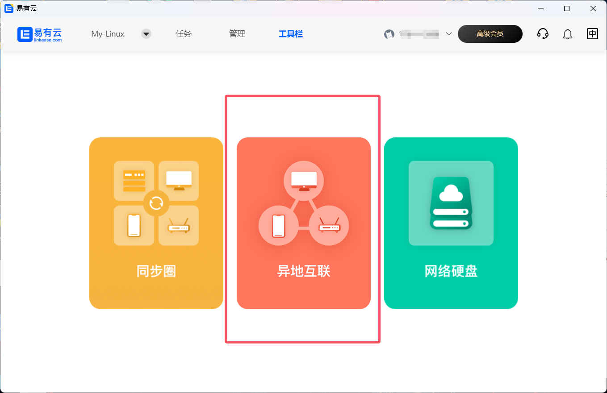

- 点击启用异地互联；

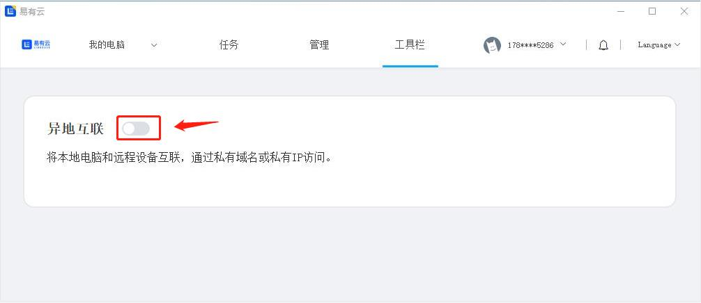

### 远程公司NAS

#### 方式一：通过【添加远程设备】
- 点击【添加远程设备】

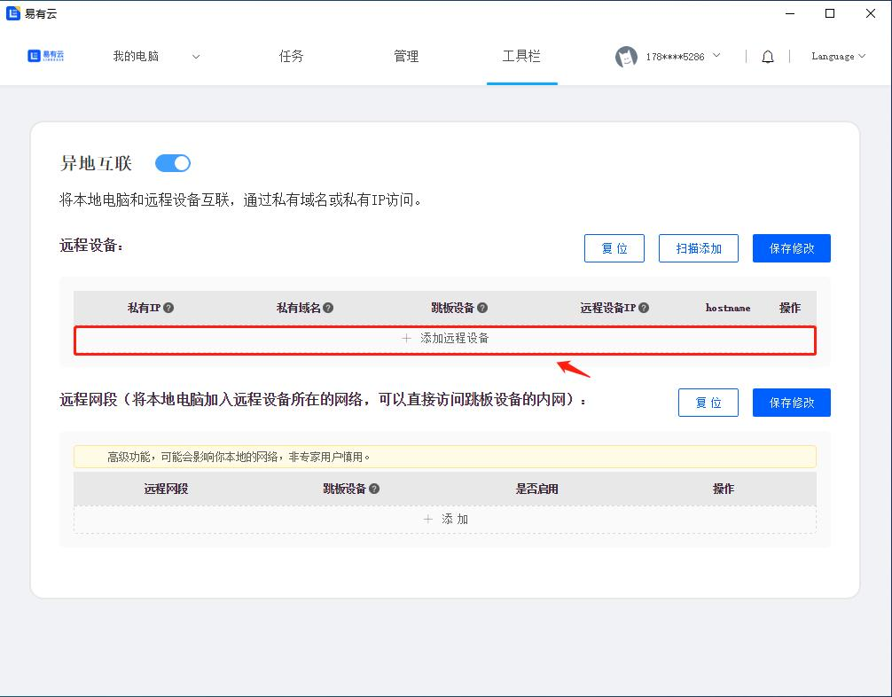

- 私有域名：可以随便填（最好填英文）
- 跳板设备：选安装了易有云的 NAS ；
- 远程设备IP：填 NAS 内网IP；

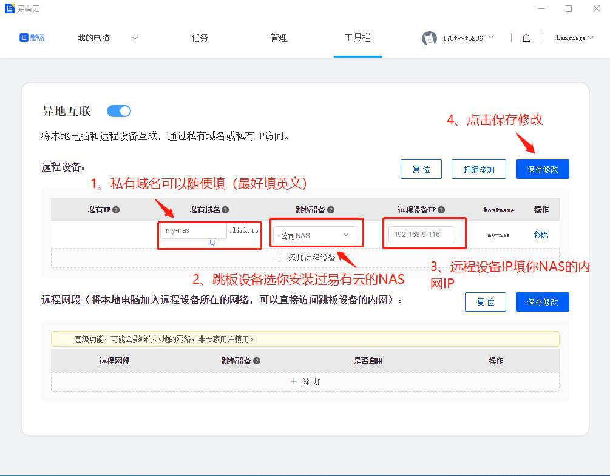

- 点击【保存修改】；
- 会自动生成一个【私有IP】；

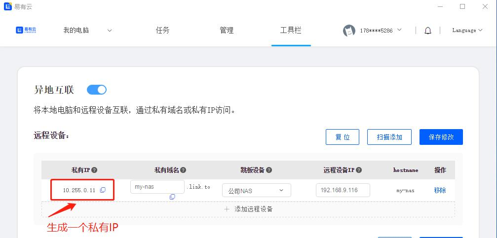

- 复制这个【私有IP】或者【私有域名】到浏览器中打开；
- 就可以远程访问你的 NAS 了；

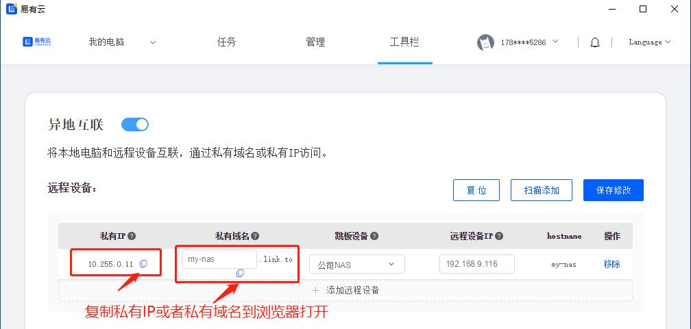

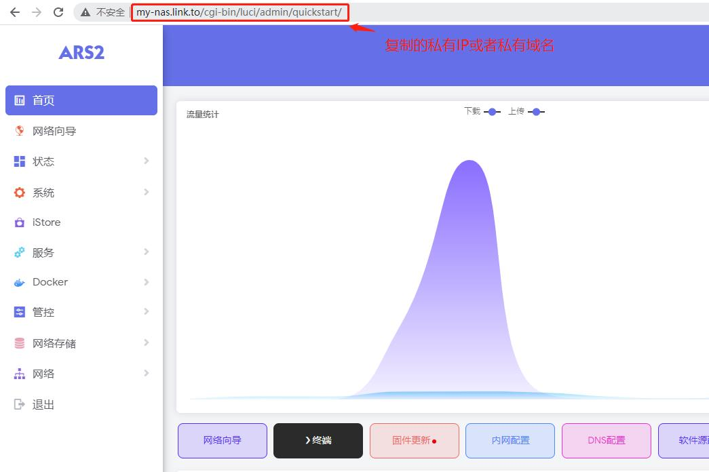

#### 方式二：如果觉得手动一个一个添加太麻烦，还可以通过【扫描添加】
- 点击【扫描添加】；

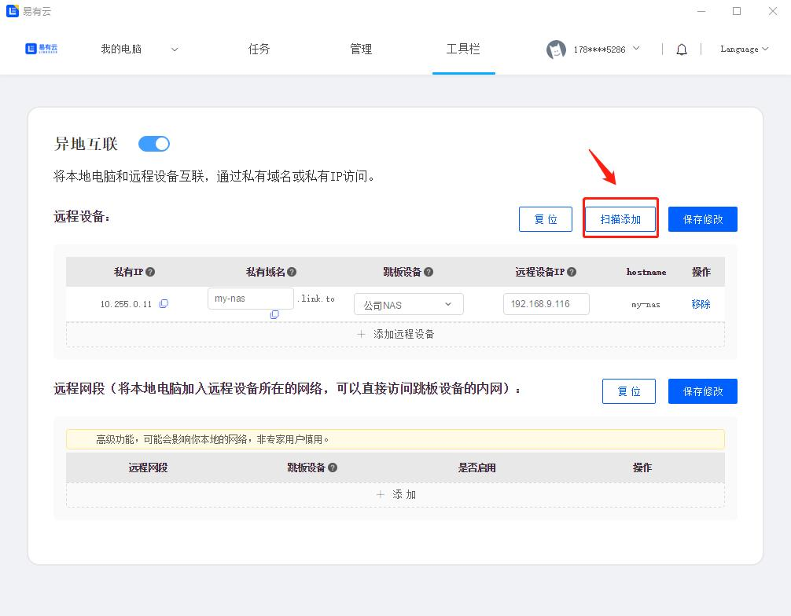

- 跳板设备：选择 NAS ;

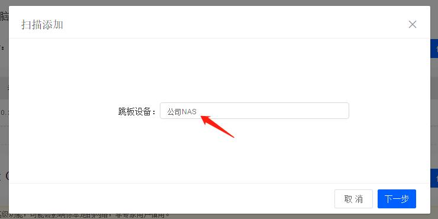

- 易有云自动扫描出和 NAS 在同一网段内，所有安装了易有云的设备；

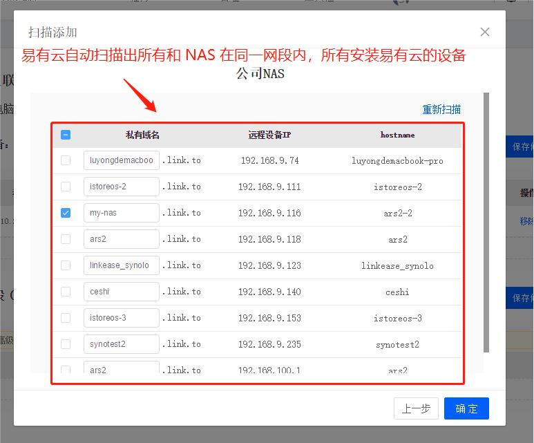

- 点击全选

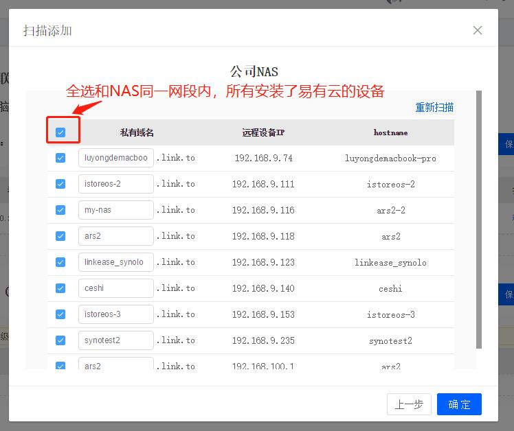

- 就自动添加好了和 NAS 在同一网段内，所有安装了易有云的设备了；
- 只需要复制要远程访问设备的【私有域名】或者【私有IP】就可以远程访问了；

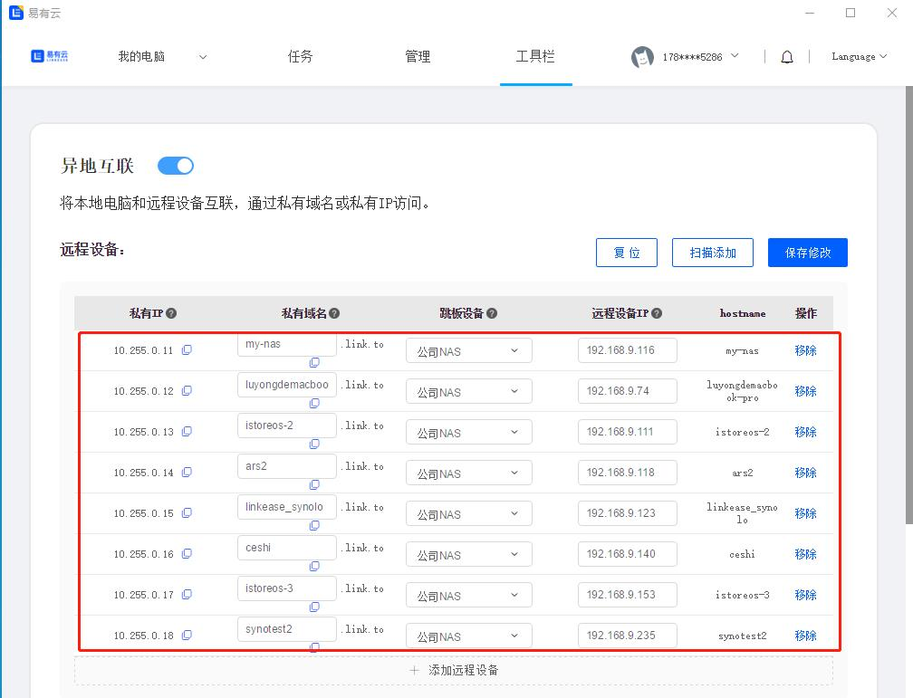

### 远程网段

#### 如果有网络经验的人，可以尝试使用远程网段，小白的话，请谨慎使用，否则的话，有可能会把网络搞挂了。

- 添加 远程网段：格式一般为IP/24，例如192.168.9.0/24，选择的“关联设备”即为你远端安装了易有云存储端的设备。

- 有小伙伴不懂网段：比如你家里路由器LAN口IP为192.168.2.1，那么你的网段就是：192.168.2.1/24；

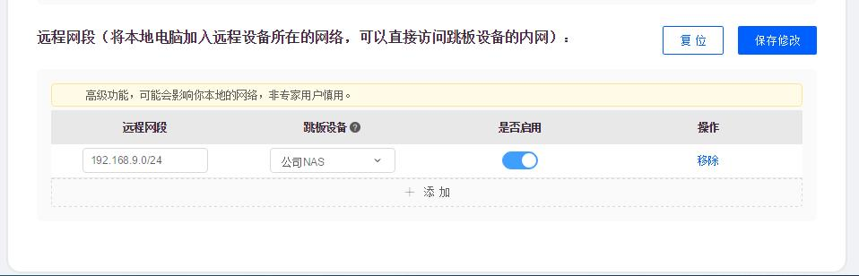

添加完成后，就能直接访问远端192.168.9.x的设备；

- 比如：Synology设备所在的局域网(192.168.9.x)加入到远程网段里，然后Synology drive就可以直接访问。