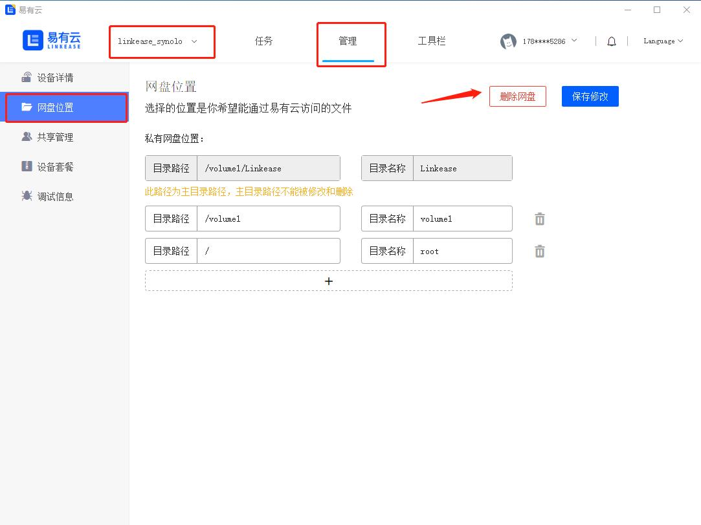
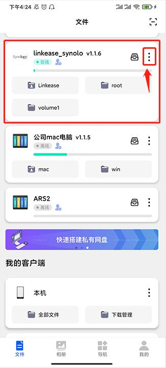
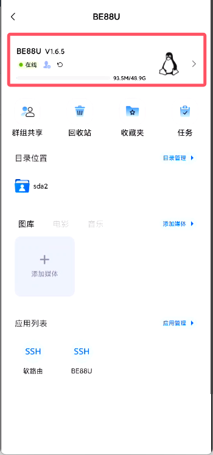
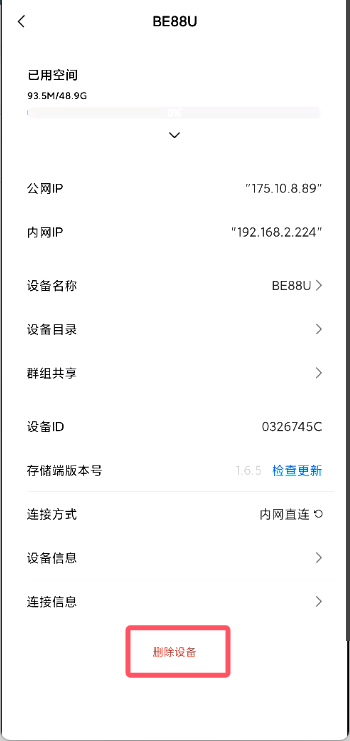

### 解绑

易有云电脑客户端和易有云APP都可以解绑。

#### 方式一：下载易有云电脑客户端，登录你的账号
- 网盘选择你要解绑的设备，在导航栏选择【管理】- 【网盘位置】- 【删除网盘】
- 删除网盘后，就自动解绑了该设备下的账号

#### 方式二：下载易有云APP，登录你的A账号
- 下载易有云并登录易有云APP
- 在首页【设备列表】选择你要解绑的设备 - 【删除设备】
- 删除设备后，就自动解绑了该设备下的账号

