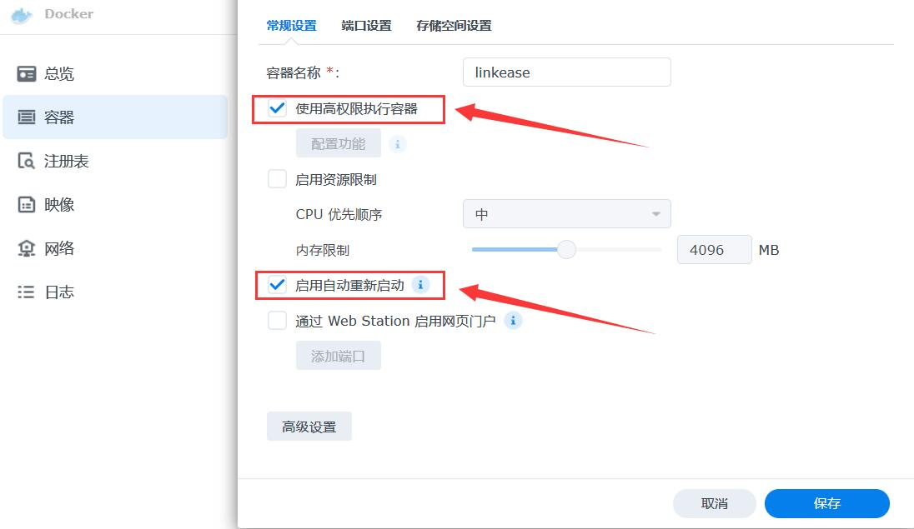

### Docker

[无法拉取易有云&DDNSTO Docker镜像？](https://www.bilibili.com/video/BV1FnUUYeEn9/)

**<font color="#dd0000">Docker方式安装易有云，包括并不限于Unraid/爱快/群晖/各种Linux发行版等，只要有Docker的设备都成。</font><br />**


* 铁威马：首先在应用中心里安装Docker(TOS 4.0及更高的系统)，然后在控制面板——终端与SNMP——启用SSH访问。然后电脑利用putty、xshell等工具登录终端，然后输入“sudo -i”和密码获取临时ROOT权限，然后进行下面的教程。

* 群晖：在控制面板——终端机与SNMP——启用SSH访问。然后电脑利用putty、xshell等工具登录终端，然后输入“sudo -i”和密码获取临时ROOT权限，然后进行下面的教程。

* Linux发行版：某些Linux系统可能默认不自带Docker，那么就需要终端命令安装Docker：

```
首先执行：curl -sSL https://get.docker.com/ | sh

上一条命令执行完毕后，执行：sudo chmod 777 /var/run/docker.sock
```
Docker安装完成后，进行下面的教程。

**<font color="#dd0000">终端命令安装Docker版易有云教程开始：</font><br />**

**1.终端部署命令：(先不要直接复制，看下面的说明)**

```
docker run -d \
    -p 8897:8897 \
    --network host \
    --name linkease \
    --restart always \
    -v <path for data files>:/linkease-data \
    -v <path for config files>:/linkease-config \
    -v /etc/localtime:/etc/localtime:ro \
    -e PUID=$(id -u) \
    -e PGID=$(id -g) \
    registry.istoreos.com/linkease/linkease
```

* 更改网页访问端口：（若不变更，忽略！）
```
    -p 8897:8897 \
```
如果不想使用8897的访问端口，比如改成8888，就改前一个8897：
```
    -p 8888:8897 \
```

* 挂载易有云主目录和配置文件目录：
```
<path for data files>  主目录映射在设备的实际路径
<path for config files>  配置文件目录映射在设备的的实际路径

比如主目录设为 /mnt/sda1/linkease-data
配置文件目录设为 /mnt/sda1/linkease-config
```
那么这两行命令就为：
```
    -v /mnt/sda1/linkease-data:/linkease-data \
    -v /mnt/sda1/linkease-config:/linkease-config \
```

 * 若有几个磁盘的都想挂载：（若无，忽略！）
 
比如有 /mnt/sda1、/mnt/sda2、/mnt/sda3 等几个磁盘挂载点；

那么就直接添加挂载命令：
``` 
    -v /mnt/sda1:/Disk1 \
    -v /mnt/sda2:/Disk2 \
    -v /mnt/sda3:/Disk3 \ 
```
挂载以后在绑定过程中就能直接绑定 Disk1、Disk2、Disk3 这几个盘。


* 所以最终实际要执行的部署命令为：

```
docker run -d \
    -p 8897:8897 \
    --network host \
    --name linkease \
    --restart always \
    -v /mnt/sda1/linkease-data:/linkease-data \
    -v /mnt/sda1/linkease-config:/linkease-config \
    -v /etc/localtime:/etc/localtime:ro \
    -v /mnt/sda1:/Disk1 \
    -v /mnt/sda2:/Disk2 \
    -v /mnt/sda3:/Disk3 \
    -e PUID=$(id -u) \
    -e PGID=$(id -g) \
    registry.istoreos.com/linkease/linkease
```

 * 某些Linux发行版，可能要加上“sudo”提权才能运行，按提示输入Linux的密码，命令如下：

```
sudo docker run -d \
    -p 8897:8897 \
    --network host \
    --name linkease \
    --restart always \
    -v /mnt/sda1/linkease-data:/linkease-data \
    -v /mnt/sda1/linkease-config:/linkease-config \
    -v /etc/localtime:/etc/localtime:ro \
    -v /mnt/sda1:/Disk1 \
    -v /mnt/sda2:/Disk2 \
    -v /mnt/sda3:/Disk3 \
    -e PUID=$(id -u) \
    -e PGID=$(id -g) \
    registry.istoreos.com/linkease/linkease
```


**2.安装后第一次打开(访问地址: http://docker设备ip:8897)，需要绑定设备，请查看 [易有云绑定教程](/zh/guide/linkease/install/cloud.md)。**

## 常见问题

**注意事项：**

* 易有云尽可能使用点对点进行网络传输，建议网络配置使用host网络，不要使用bridge网络(可能造成samba等协议无法访问)。

[镜像地址](https://hub.docker.com/r/linkease/linkease/)

* 若群晖用docker安装，建议去Docker管理器里，先停用linkease容器，然后编辑，开启`使用高权限执行容器`和`启用自动重新启动`，保存应用。



* 如果需要更新镜像，请停止linkease的docker项目，并删除，再重新输入整个命令拉取新镜像。
