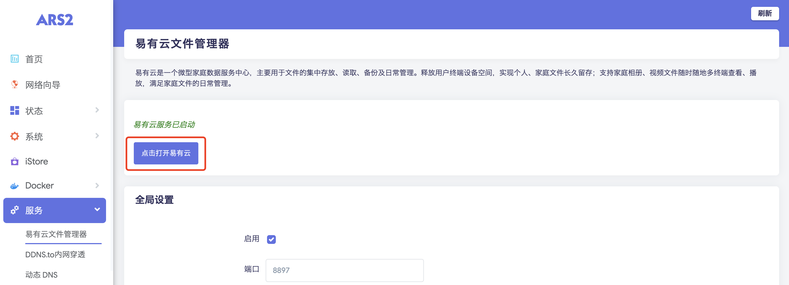

### EasePi

EasePi固件“iStore”应用商店，已默认安装易有云存储端，直接就可使用。

**1、打开iStore，找到 易有云 点击打开。**

**2、然后点击 ‘点击打开易有云’，如果服务没有启动，请先点击 ‘启用’ 并保存应用。**

**3、安装后第一次打开，需要绑定设备，请查看 [存储端绑定教程](/zh/guide/linkease/install/bind.md)。**

