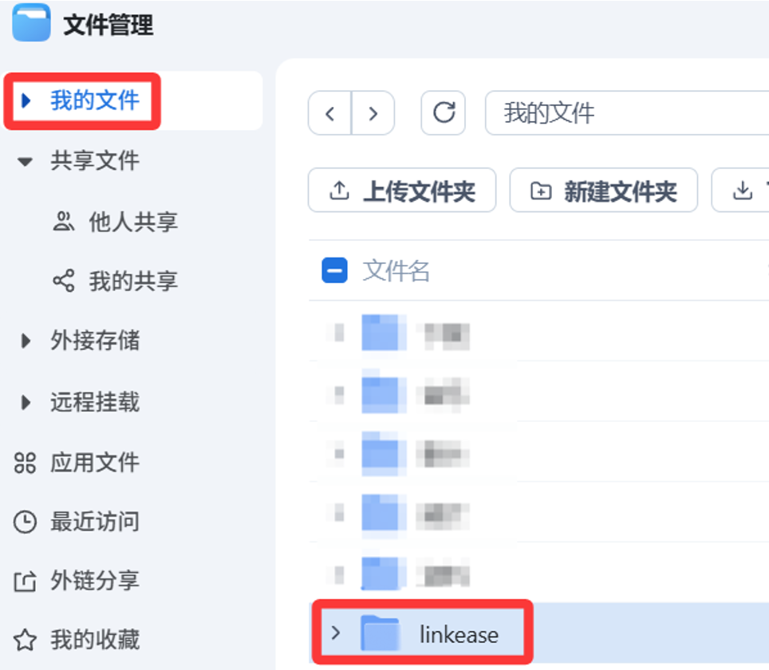
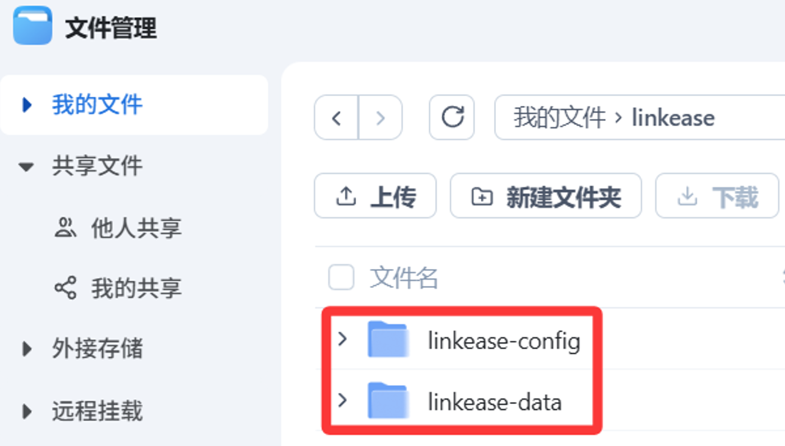
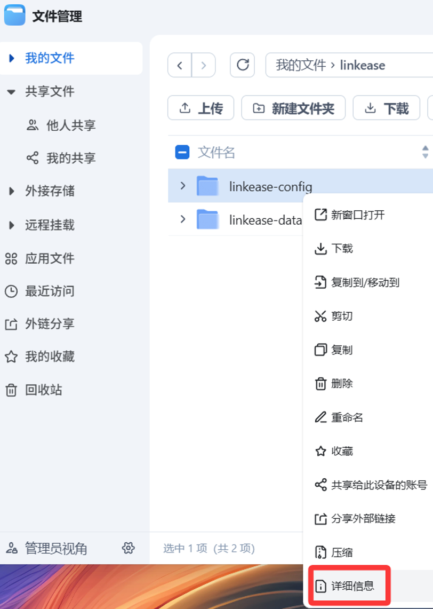
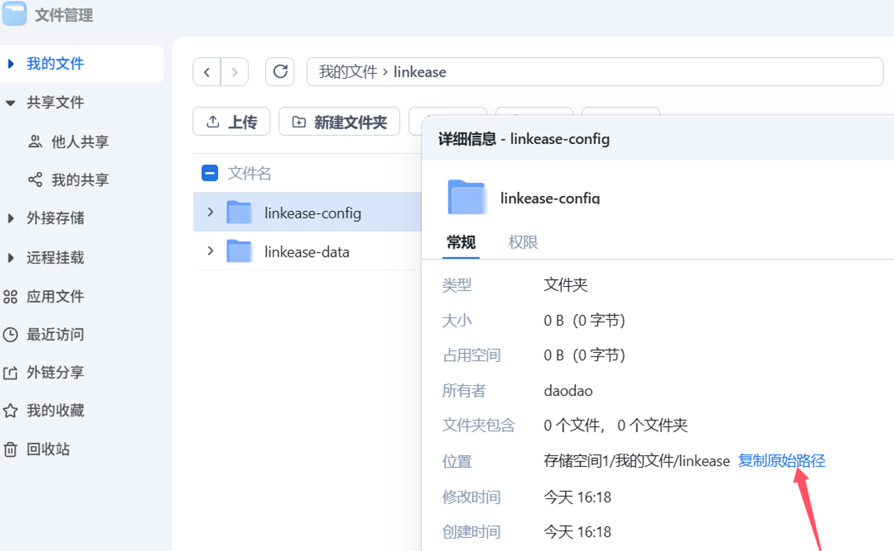
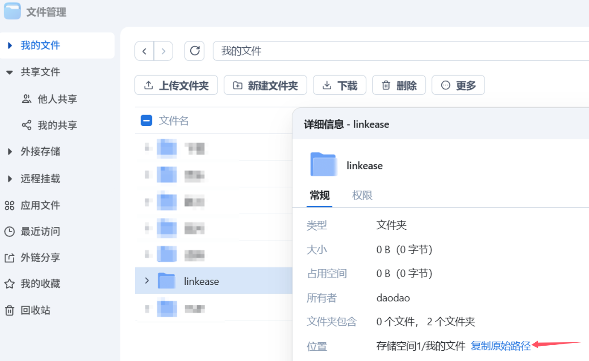
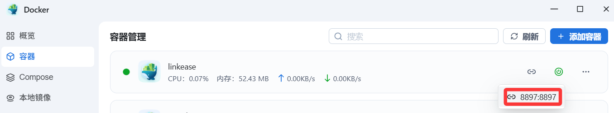
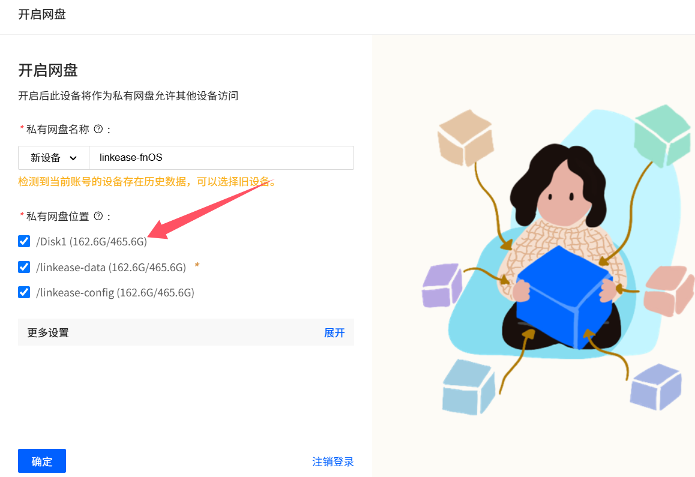

### 飞牛

[飞牛NAS远程文件管理-易有云安装教程](https://www.bilibili.com/video/BV1XwmZYCEQa/)

[无法拉取易有云&DDNSTO Docker镜像？](https://www.bilibili.com/video/BV1FnUUYeEn9/)


**<font color="#dd0000">飞牛终端命令安装Docker版易有云教程开始：</font><br />**

* 电脑利用putty、xshell等工具登录飞牛的终端；

**终端运行以下命令：(先不要直接复制，看下面的说明)**
```
docker run -d \
    -p 8897:8897 \
    --network host \
    --name linkease \
    --restart always \
    -v <path for data files>:/linkease-data \
    -v <path for config files>:/linkease-config \
    -v /etc/localtime:/etc/localtime:ro \
    -e PUID=$(id -u) \
    -e PGID=$(id -g) \
    registry.istoreos.com/linkease/linkease
```

* 挂载易有云主目录和配置文件目录：
```
<path for data files>  主目录映射在设备的实际路径
<path for config files>  配置文件目录映射在设备的的实际路径
```
首先在飞牛——文件管理里，创建一个文件夹，用来当易有云主目录和配置目录：





文件夹名（随意），教程这里创建一个 linkease 文件夹，然后在内再创建 linkease-data 当主目录，linkease-config 当配置目录；

**如何查看实际路径呢？** 右键选中文件夹——详细信息——复制原始路径。






就能得到实际路径：
```
主目录： /vol1/1000/linkease/linkease-data
配置目录： /vol1/1000/linkease/linkease-config
```

那么这两行命令就为：
```
    -v /vol1/1000/linkease/linkease-data:/linkease-data \
    -v /vol1/1000/linkease/linkease-config:/linkease-config \
```


* 如果想整个磁盘都想挂载为一个空间，便于易有云方便管理：



「我的文件」下的linkease的实际路径为：**/vol1/1000/linkease**；那「我的文件」代表的整个磁盘路径就为：**/vol1/1000**；

那么就直接添加一行挂载命令：
``` 
    -v /vol1/1000:/Disk1 \
```


* 飞牛用终端命令安装Docker，需要“sudo”提权，按提示输入飞牛的密码，命令如下：
```
sudo docker run -d \
    -p 8897:8897 \
    --network host \
    --name linkease \
    --restart always \
    -v /vol1/1000/linkease/linkease-data:/linkease-data \
    -v /vol1/1000/linkease/linkease-config:/linkease-config \
    -v /vol1/1000:/Disk1 \
    -v /etc/localtime:/etc/localtime:ro \
    -e PUID=$(id -u) \
    -e PGID=$(id -g) \
    registry.istoreos.com/linkease/linkease
```
* 进入飞牛系统管理页面，找到“Docker”，会看到“linkease”已经运行；然后浏览器通过飞牛的IP+8897的端口，即可访问易有云进行绑定操作。




