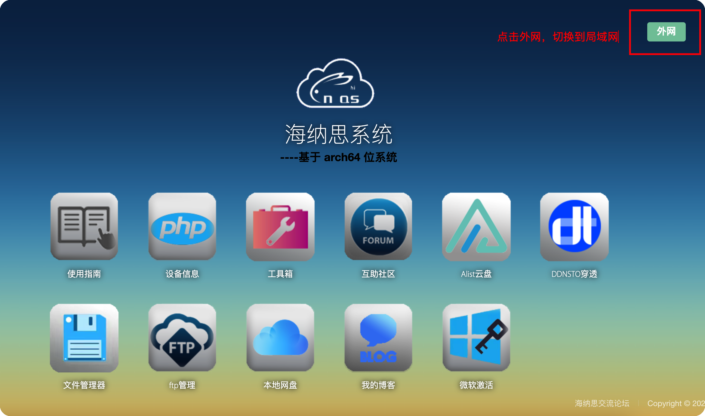
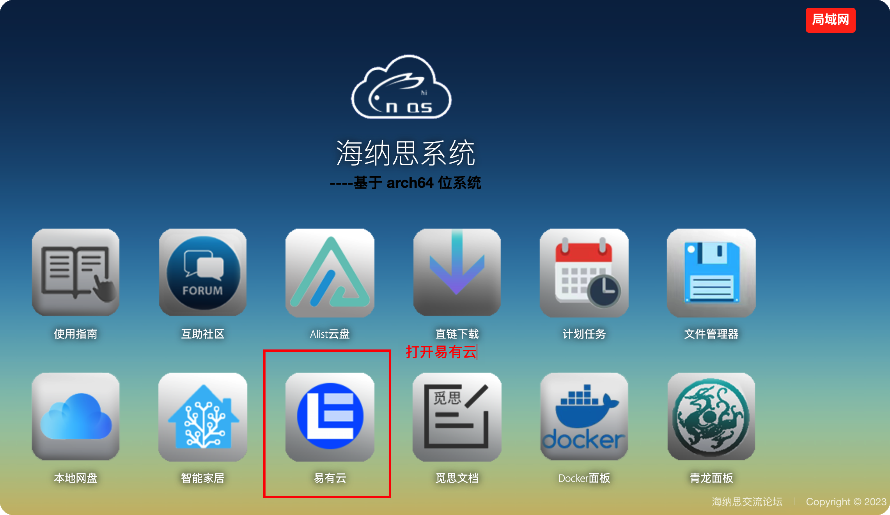

### 海纳思NAS

**1.使用前准备**

- 需要将系统更新到至少 **“20230701”** 版本

- 开始配置前我们需要在设备上接入一个U盘或者移动硬盘（图片），用作易有云的存储空间，
为了与系统更好地兼容且提高读写速度，建议将硬盘的文件系统格式化成ext4。

**2.开始配置**

海纳思系统从 **“20230701”** 版本开始已经内置了易有云，我们不用另外安装，直接打开就可以配置了。

如果版本较低可以参考这个安装方法：[海纳思NAS低版本安装教程](/zh/guide/linkease/install/device/linux.md)

**3.第一次打开，需要绑定设备，请查看 [易有云绑定教程](/zh/guide/linkease/install/cloud.md)。**

