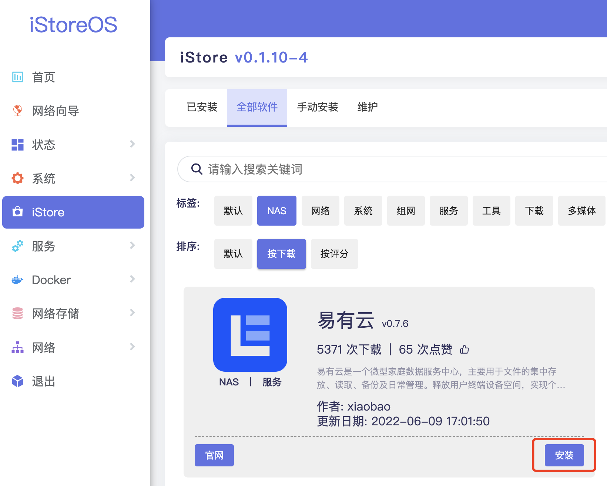
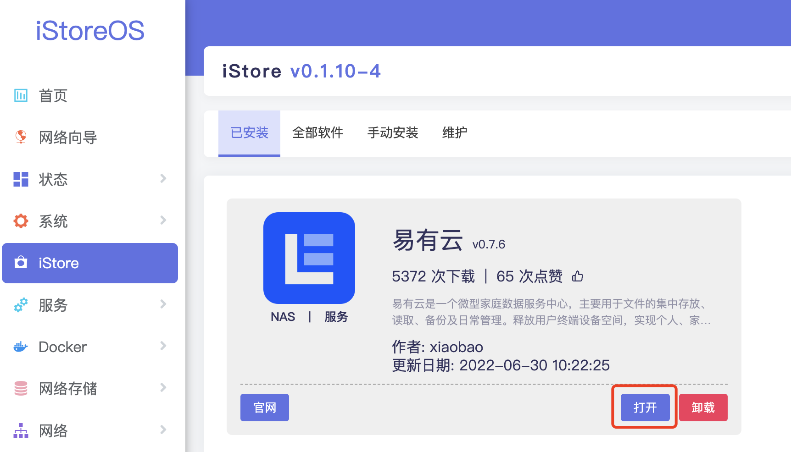

### iStoreOS

iStoreOS固件可以从“iStore”应用商店安装使用。

**1、打开iStore，选择“全部软件”，找到 易有云 点击“安装”。**

**2、等待安装完成后，点击“打开”。**

**3、然后点击 “点击打开易有云”，如果服务没有启动，请先点击 ‘启用’ 并保存应用。**

**4、安装后第一次打开，需要绑定设备，请查看 [易有云绑定教程](/zh/guide/linkease/install/cloud.md)。**
