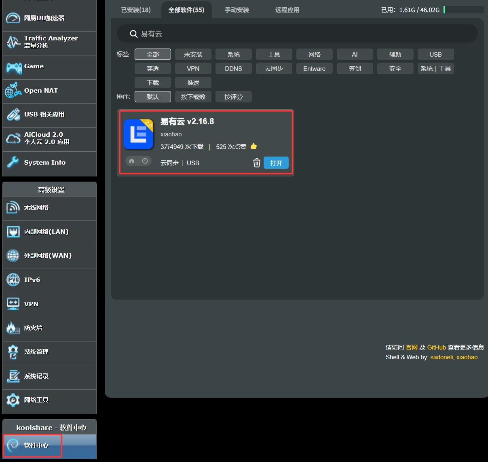
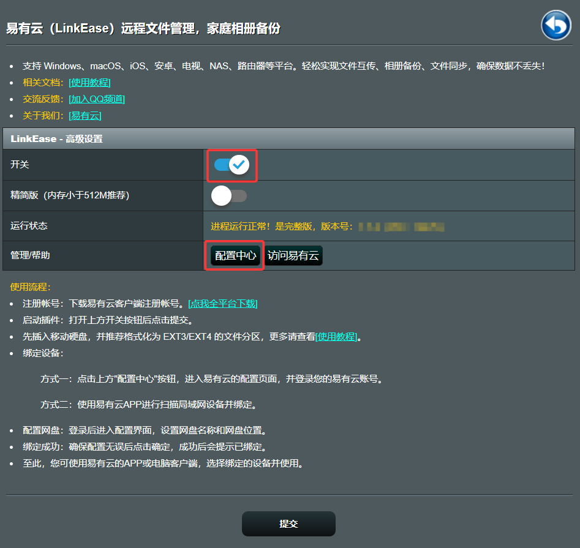

### ASUSGO 固件

* 绑定设备前，请确保您已在路由器端接入容量不小于16GB的存储设备，如U盘，移动硬盘等；

如软件中心无法更新最新版本，请下载[离线包进行安装](https://rogsoft.ddnsto.com/linkease/linkease.tar.gz) 

**1.ASUSGO固件(koolcenter固件)，在软件中心搜索并安装易有云；**

**2.安装后打开易有云，开启「开关」，运行状态为「运行正常」后，点击「配置中心」开始配置；**

**3.需要绑定设备，请查看 [易有云绑定教程](/zh/guide/linkease/install/cloud.md)。**
