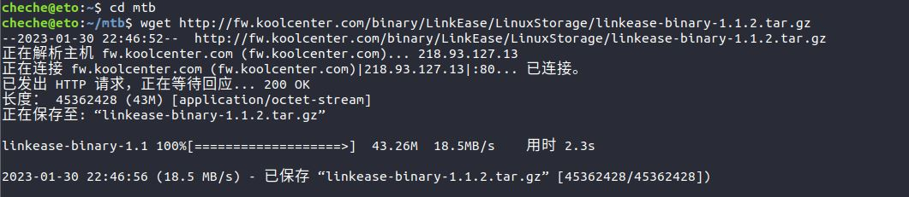
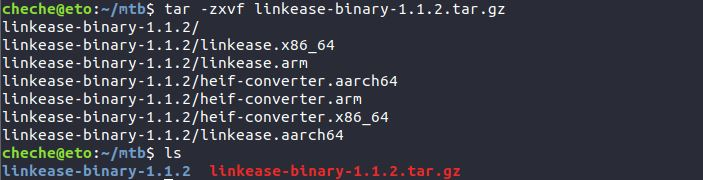

### Linux 通用版

**1.首先在命令窗口中登录您的linux系统**

**2.在光标后输入“cd mtb” ，点击回车，进入mtb目录中。输入“ls”确认；**
 <table><tr><td bgcolor=#bae2fe>cd mtb</td></tr></table>

mtb为存放Linux易有云存储端的目录，根据自身实际情况，可新建任意目录。

**3.在光标后输入"wget 存储端链接"，点击回车，下载易有云存储端。输入“ls”确认；**

* **如何获取易有云linux存储端链接：**

点击[存储端下载链接](https://fw.koolcenter.com/binary/LinkEase/LinuxStorage/)，打开易有云存储端下载链接。

看更新日期，找到最新的那个版本，右键“linkease-binary-x.x.x.tar.gz”文件，在出现的弹窗中单击“复制链接地址”，即可复制该存储端链接。

 <table><tr><td bgcolor=#bae2fe>wget 
http://fw.koolcenter.com/binary/LinkEase/LinuxStorage/linkease-binary-1.1.2.tar.gz</td></tr></table>

**在光标后输入“tar -zxvf linkease-binary-x.x.x.tar.gz”解压刚刚下载的程序包；输入“ls”确认；**

当前最新版本是1.1.2，刚刚下载的也是1.1.2，那么解压命令就是：

<table><tr><td bgcolor=#bae2fe>tar -zxvf linkease-binary-1.1.2.tar.gz</td></tr></table>

**4.在光标后输入“cd linkease-binary-1.1.2”；输入“ls”确认；**
<table><tr><td bgcolor=#bae2fe>cd linkease-binary-1.1.2</td></tr></table>

若您使用的是x86_64架构的Linux输入“chmod 755 linkease.x86_64”给予软件运行权限：

<table><tr><td bgcolor=#bae2fe>chmod 755 linkease.x86_64</td></tr></table>

若您使用的是arm架构的Linux输入“chmod 755 linkease.arm”给予软件运行权限：

<table><tr><td bgcolor=#bae2fe>chmod 755 linkease.arm</td></tr></table>

**5.在光标后输入命令运行软件；**

若您使用的是x86_64架构的Linux输入“./linkease.x86_64”运行软件：

<table><tr><td bgcolor=#bae2fe>./linkease.x86_64</td></tr></table>

若您使用的是arm架构的Linux输入“./linkease.arm”给予软件运行权限：

<table><tr><td bgcolor=#bae2fe>./linkease.arm</td></tr></table>

**6.复制命令窗中出现的网址在浏览器中打开，即可进入易有云向导页面**

**7.安装后第一次打开，需要绑定设备，请查看 [存储端绑定教程](/zh/guide/linkease/install/cloud.md)。**
