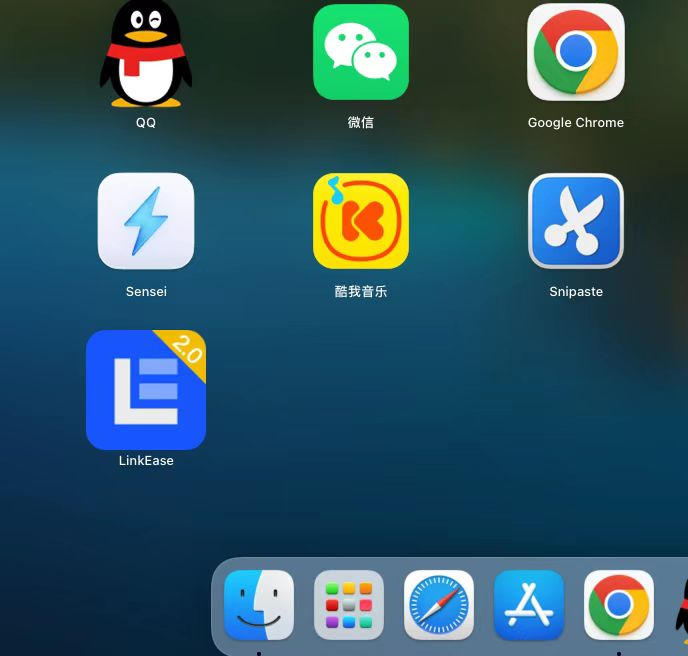
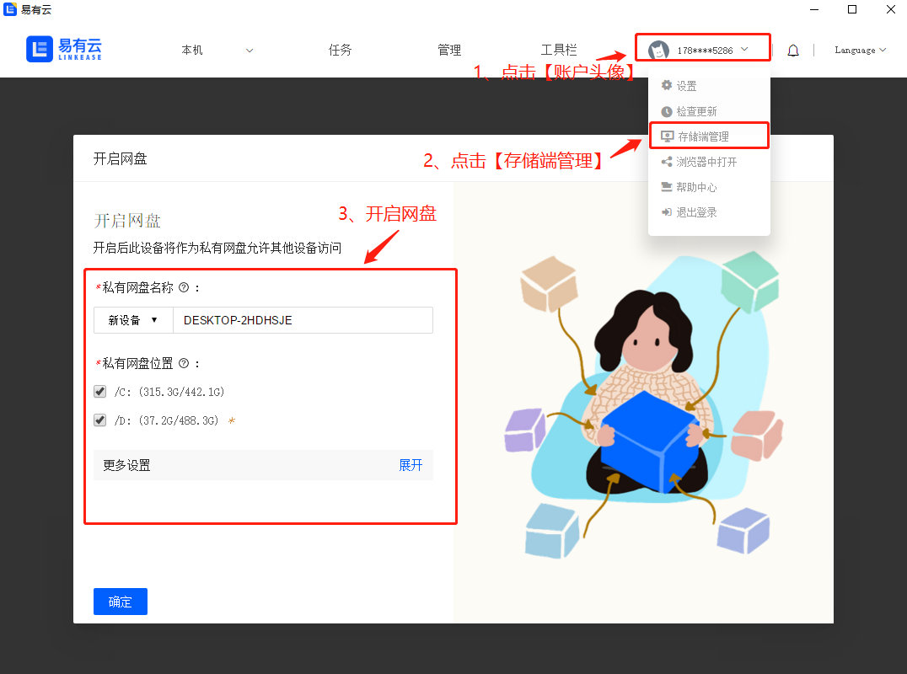
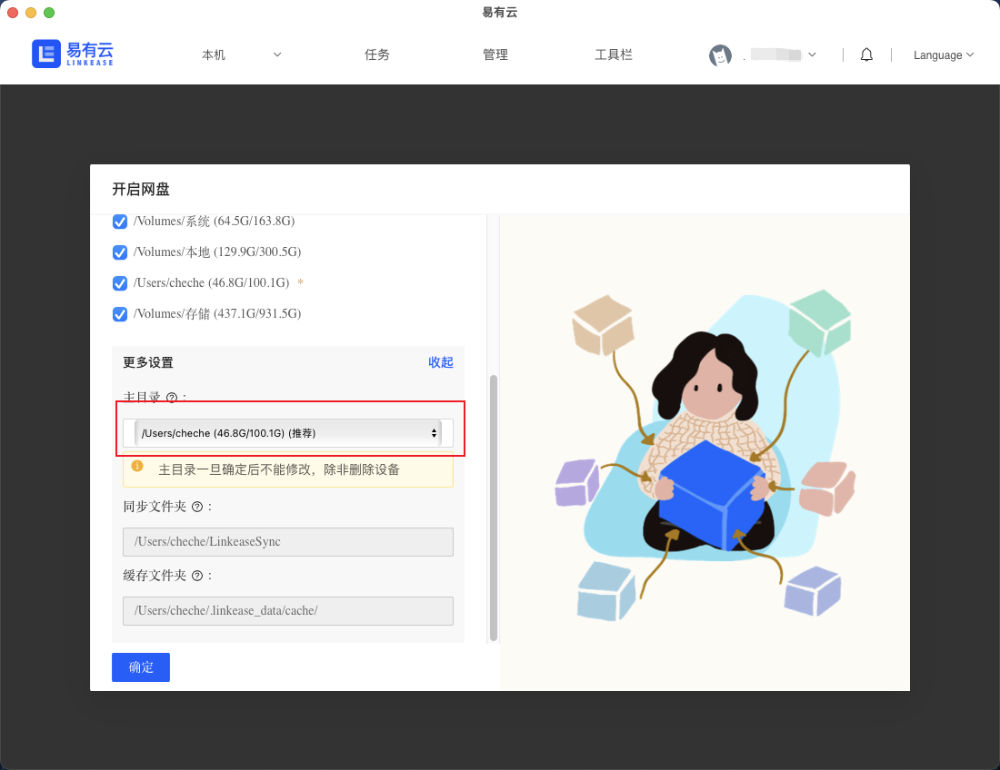

### MacOS

**1.[下载MAC版](https://www.linkease.com/download/?type=macOS)易有云**

**2.下载好后，在电脑⾥找到LinkEase.dmg进⾏安装，拖⾄应⽤⽂件夹⾥。**

**3.点开易有云软件，按指示登录你的易有云账号。**

**4.进⼊客户端界⾯后，点击账户头像。下拉菜单栏选择“存储端管理”，来开启你的⽹盘。**

**5.开启⽹盘需要选择“你的⽹盘位置”，你还可以在“更多设置”⾥选择主⽬录的位置（我们会默认给你⼀个主⽬录位置）。**

**6.点击【确定】成功开启网盘，你可以通过其他设备访问这台已开启⽹盘的设备了。**  
**接下来，你还可以绑定设备，[请查看绑定设备教程](/zh/guide/linkease/install/device/synology.md)。**