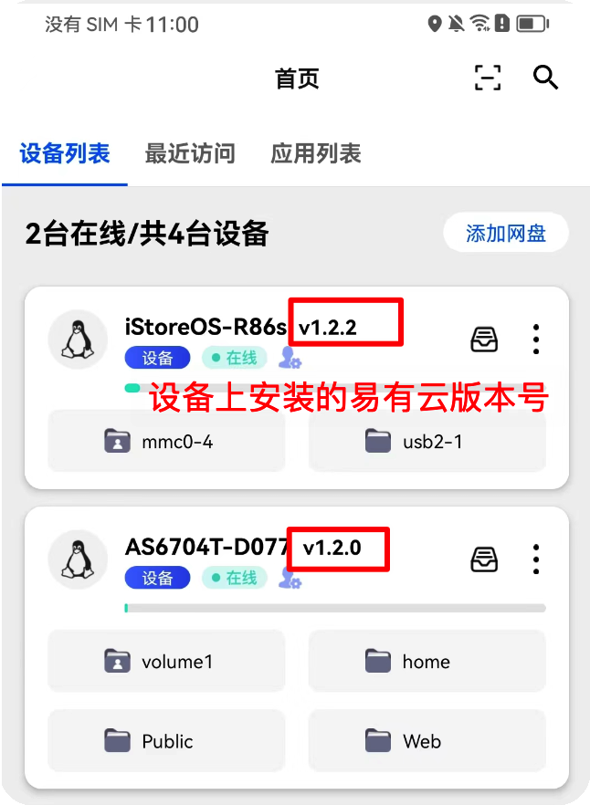
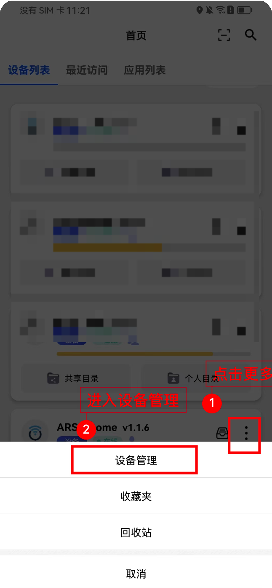
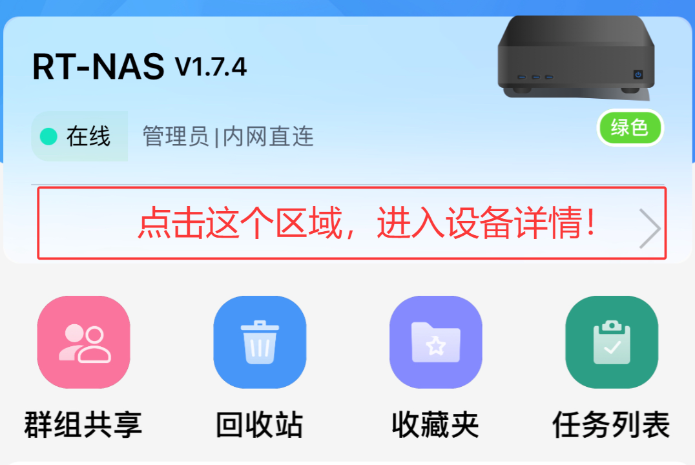

* 易有云目前支持市面上常见的设备/系统，附带详细安装教程和更新易有云的注意事项。

### 易有云支持的设备/系统：

* 某些设备/系统不能完整支持所有的功能，如梅林路由器不支持同步圈。

| 设备/系统 | 安装教程 | 最新版本 | 版本升级注意 |
|-|-|-|-|-|
|EasePi| [详细教程](/zh/guide/linkease/install/device/easepi.html) | v1.2.2  | iStore商店直接升级 |
|iStoreOS| [详细教程](/zh/guide/linkease/install/device/istoreos.html) | v1.2.2 |  iStore商店直接升级 |
|华硕NAS| [详细教程](/zh/guide/linkease/install/device/asus_nas.html) | v1.2.2 | 软件中心直接升级 |
|Koolcenter 梅林| [详细教程](/zh/guide/linkease/install/device/koolcenter_merlin.html) | v1.2.2 | 软件中心直接升级 |
|Koolcenter Lede| [详细教程](/zh/guide/linkease/install/device/koolcenter_lede.html) | v1.2.2 | iStore商店直接升级 |
|OpenWrt| [详细教程](/zh/guide/linkease/install/device/openwrt.html) | v1.2.2 | 覆盖安装新版 |
|群晖| [详细教程](/zh/guide/linkease/install/device/synology.html) | v1.2.2 | iStore商店直接升级|
|威联通| [详细教程](/zh/guide/linkease/install/device/qnap.html) | v1.2.2 | 覆盖安装新版 |
|Docker| [详细教程](/zh/guide/linkease/install/device/docker.html) | v1.2.2 | 新建docker容器 |
|爱快| [详细教程](/zh/guide/linkease/install/device/ikuai.html) | v1.2.2 | 新建docker容器 |
|Unraid| [详细教程](/zh/guide/linkease/install/device/docker.html) | v1.2.2  | 新建docker容器 |
|铁威马| [详细教程](/zh/guide/linkease/install/device/docker.html) | v1.2.2 | 新建docker容器 |
|Windows| [详细教程](/zh/guide/linkease/install/device/windows.html) | v1.2.2  | Windows客户端下载覆盖更新 |
|macOS| [详细教程](/zh/guide/linkease/install/device/mac.html) | v1.2.2  | macOS客户端下载覆盖更新 |
|Linux 通用版| [详细教程](/zh/guide/linkease/install/device/linux.html) | v1.2.2 | Linux专用程序包下载覆盖更新 |
|极空间| [详细教程](/zh/guide/linkease/install/device/docker.html) | v1.2.2  | 新建docker容器 |

### 如何查看设备上安装的易有云是不是最新版

#### 在易有云APP上查看

### 如何更新设备上的易有云版本

#### 在易有云APP上更新

1. 打开设备管理页面，找到存储端版本号，点击检查更新

**注意：如果遇到APP更新不了或者更新报错的情况，则需要手动更新设备上的易有云。**

#### 手动更新

1. 根据设备手动更新最新版，查看“版本升级注意”，

[手动更新方式](/zh/guide/linkease/install/device/support.html#易有云支持的设备-系统)

