### 群晖

<!-- 当我们想要在外网访问我们群晖的文件，  
我们可以用群晖自带的插件。    
但今天我教大家用另外一种方式：  
通过手动安装易有云插件，  
来外网访问我们群晖的文件，  
因为易有云是点对点通信的，速度更快。  
 并且安装了易有云之后我们还可以实现[远程硬盘挂载](https://doc.linkease.com/zh/guide/linkease/tips/mount.html)、  
[相册备份](https://doc.linkease.com/zh/guide/linkease/function/photo_backup.html)、[文件同步](https://doc.linkease.com/zh/guide/linkease/function/file_backup.html)、[远程桌面](https://doc.linkease.com/zh/guide/linkease/tips/remote.html)等功能。  
下面我们来看看如何操作。   -->

#### 第一步：下载易有云

**点击 [易有云下载](https://www.linkease.com/rd/linkease-syonlogy/)，下载Synology插件**

* 请根据自己群晖的CPU型号以及DSM版本选择相对应的易有云
* DSM7.x安装或者更新


#### 第二步：在群晖套件中心手动安装易有云插件
**如升级新版本时提示端口被占用，请先停用当前版本插件再进行升级**
- 登录群晖操作系统，点击【套件中心】，在出现的套件中心弹窗上点击【手动安装】

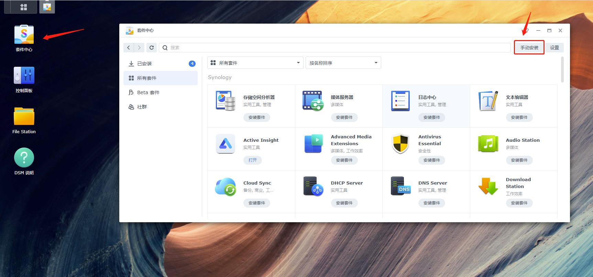

- 选择已下载的插件上传，按照指示步骤完成插件安装

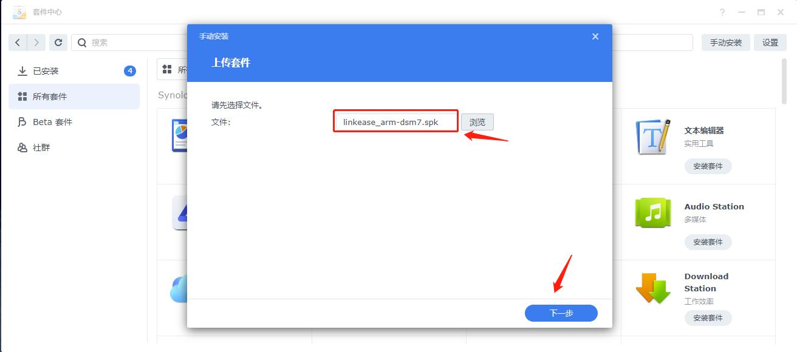

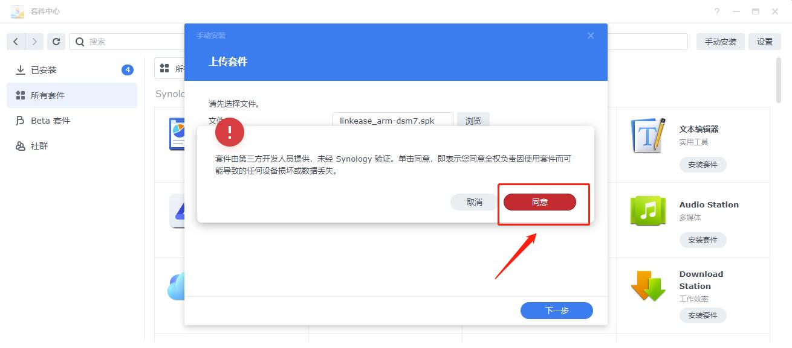

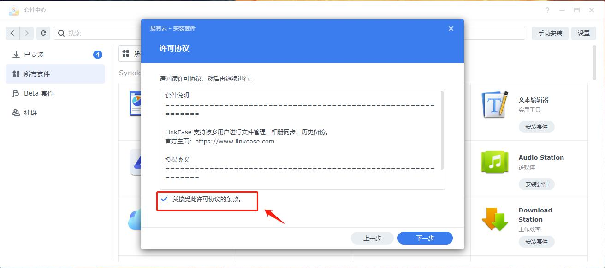

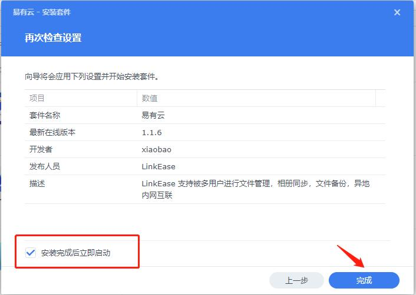

- 安装易有云插件时，易有云会默认给你创建一个共享文件夹

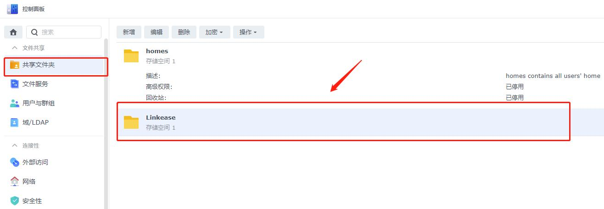


#### 第三步：插件安装完成后，进行配置
- 在套件中心—已安装—易有云—点击下方的URL进行配置。

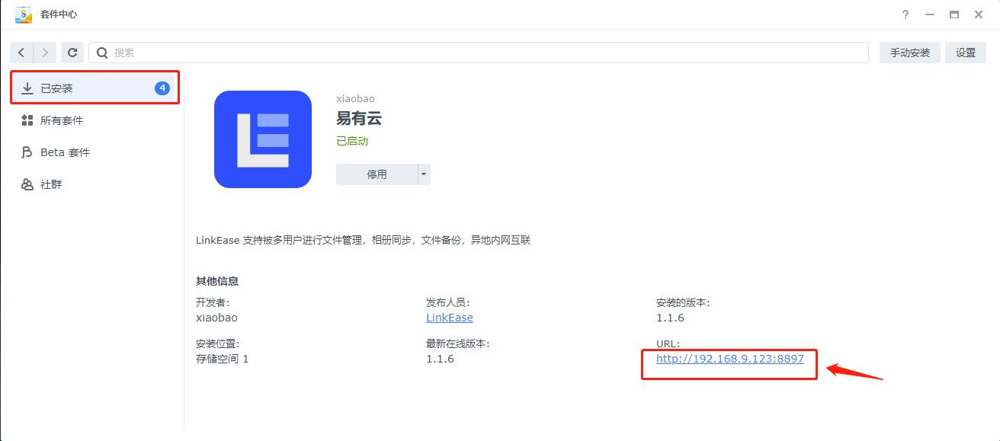

**安装后第一次打开，需要绑定设备，请查看 [易有云绑定教程](/zh/guide/linkease/install/cloud.md)。**

 ### 如何升级易有云？
 #### 方式一：[下载易有云](https://www.linkease.com/rd/linkease-syonlogy/)最新版本，重新[手动安装易有云]()
 #### 方式二： 在易有云APP上[升级](/zh/guide/linkease/install/update.html)

## 常见问题
#### 注意！由于DSM7.x对权限严格控制，所以额外配置权限(DSM6.x用户无需处理)。有两种方法配置：

### 方法一： 
#### 进入“控制面板”—“共享文件夹”, 在目标文件夹上右键选择“编辑”，选择“权限”页签，在页签内用户选择器选择“系统内部用户账户”, 找到“linkease”，勾选“可读写”，最后保存。

ps：目标文件夹：绑定存储端时选中的文件夹或者你易有云想访问的文件夹。

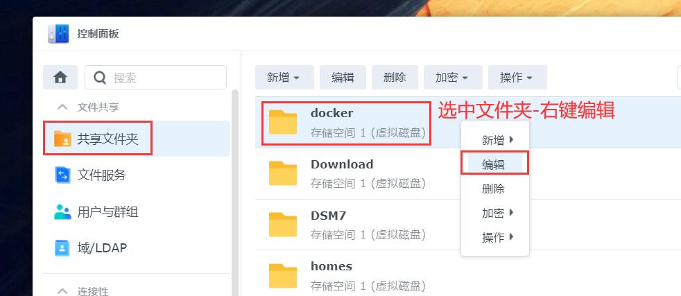

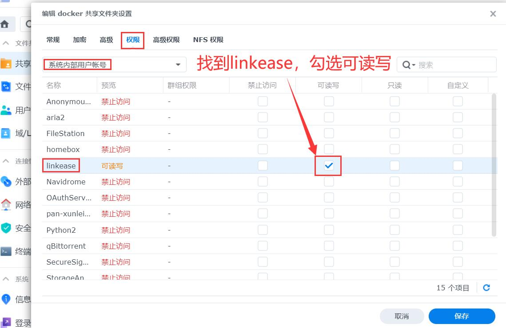

### 方法二：

#### 如果有root权限，开启ssh后进入群晖终端，执行以下两条指令：

1.先开启ssh：“控制面板”—“终端机和SNMP”—“启用SSH功能”—应用。
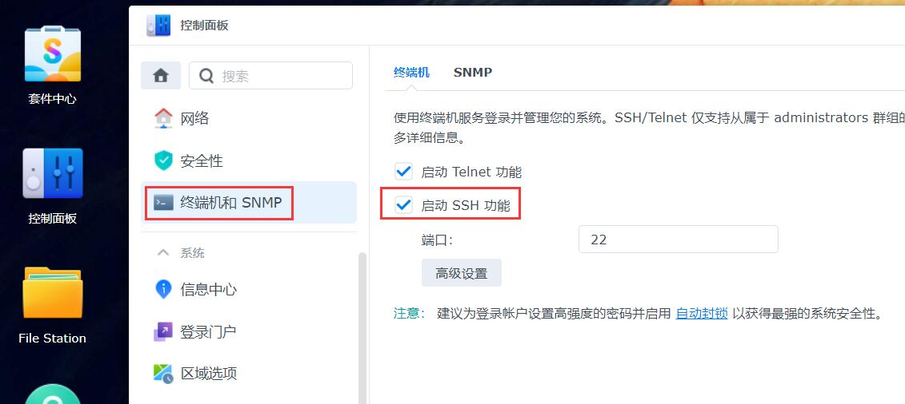

2.登录群晖SSH，终端执行：
```
先执行
sudo  sed -i 's/package/root/g' /var/packages/LinkEaseAgent/conf/privilege
再执行
sudo /usr/syno/bin/synopkg restart LinkEaseAgent
```

### 如何让群晖其他文件夹，也让易有云有权限访问？
- 进入群晖【控制面板】- 【共享文件夹】选择目标文件夹（也就是你想让易有云有权访问的文件夹）- 【编辑】，选择【权限】用户选择器选择【系统内部用户账户】, 找到【linkease】，勾选【可读写】，最后保存。

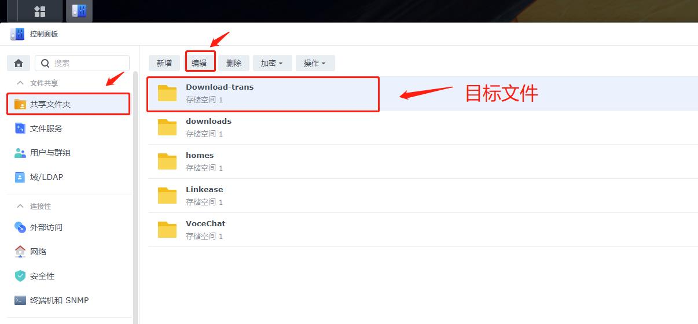

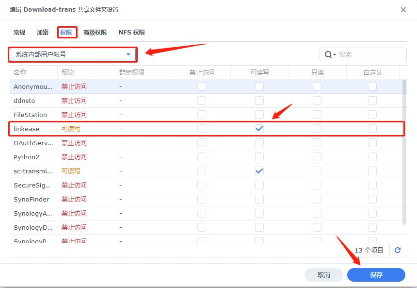


- 打开易有云，选择群晖，在状态栏选择【管理】- 【网盘位置】- 【私有网盘位置】点击【添加】

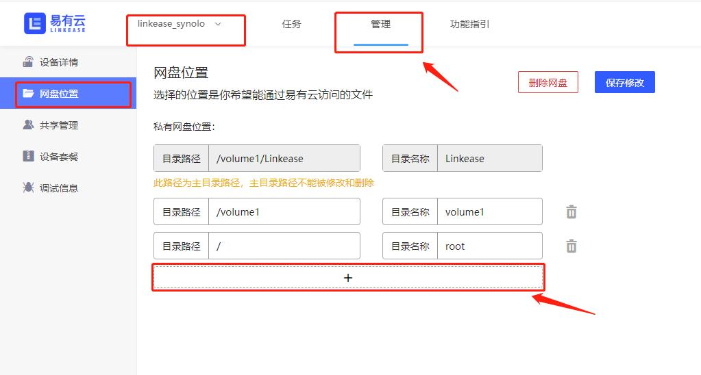

- 选择群晖共享给易有云的文件夹

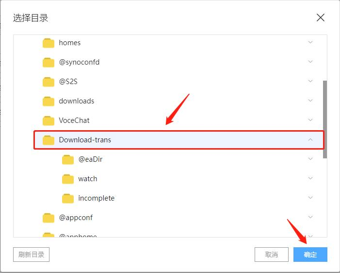

- 点击保存修改

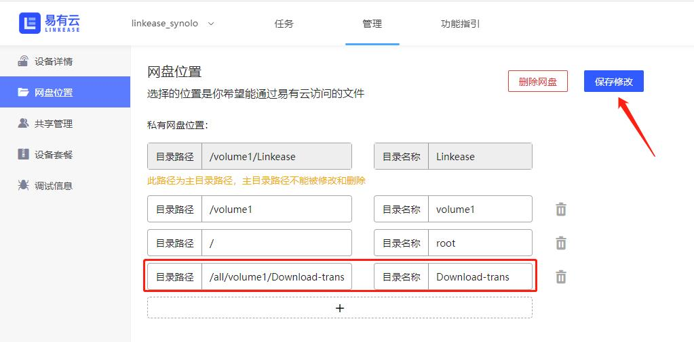

- 回到易有云首页，就可以访问群晖共享给易有云的文件夹了

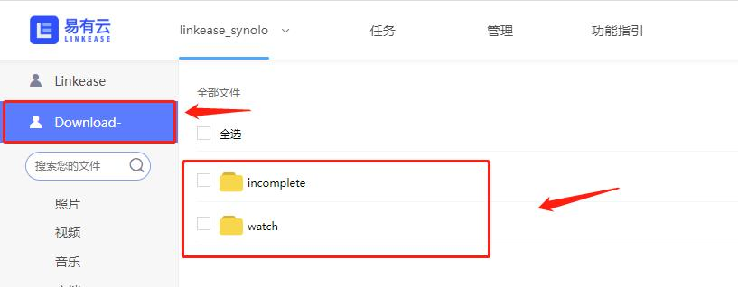


#### [群晖登录了A账号，想把A账号换绑成B账号？](/zh/guide/linkease/install/delete.html)