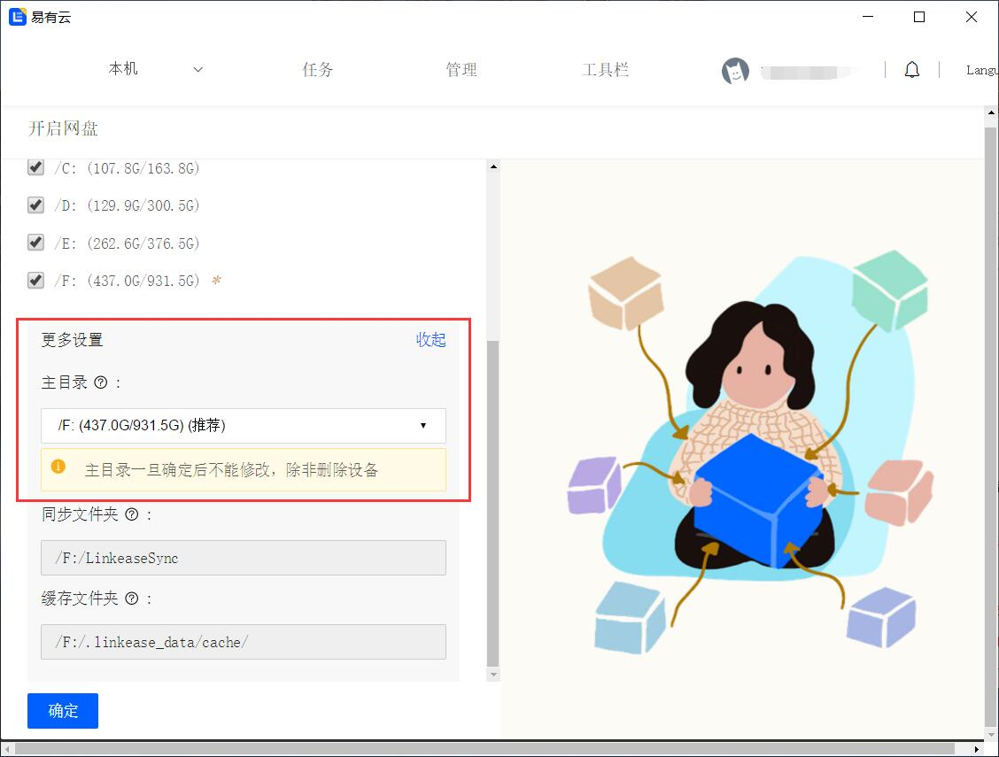

### Windows

**1.进入“[下载中心](https://doc.linkease.com/downloads/)”，选择Windows[下载](https://fw.koolcenter.com/binary/LinkEase/Client/LinkEaseWin.zip)；**

Windows端的客户端和存储端是同一程序。

**2.下载的LinkEaseWin.zip，解压成文件夹，然后直接点击LinkEase.exe(绿色软件不用安装)运行；**

* **下面开始启用windows端的存储端：**

**3.按提示登录易有云账号，客户端界面——账户头像——“存储端管理”——“选择私有网盘位置”和更多设置——“设置主目录”；**

**4.然后绑定设备，[存储端绑定教程](/zh/guide/linkease/install/cloud.md)。**
