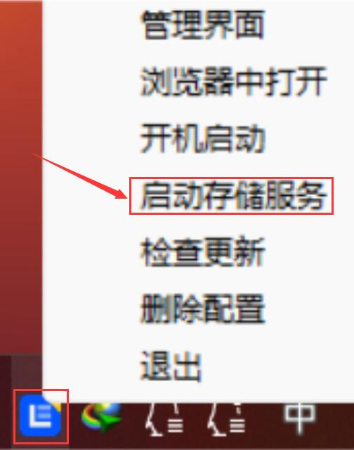

### Windows

**1.进入“[下载中心](https://doc.linkease.com/downloads/)”，选择Windows[下载](https://fw.koolcenter.com/binary/LinkEase/Client/LinkEaseWin.zip)；**

Windows端的客户端和存储端是同一程序。

**2.下载的LinkEaseWin.zip，解压成文件夹，然后直接点击LinkEase.exe(绿色软件不用安装)运行；**

**3.按提示登录易有云账号，右键点击右下角的易有云图标——启用存储服务；**

**4.然后绑定设备，[存储端绑定教程](/zh/guide/linkease/install/cloud.md)。**
