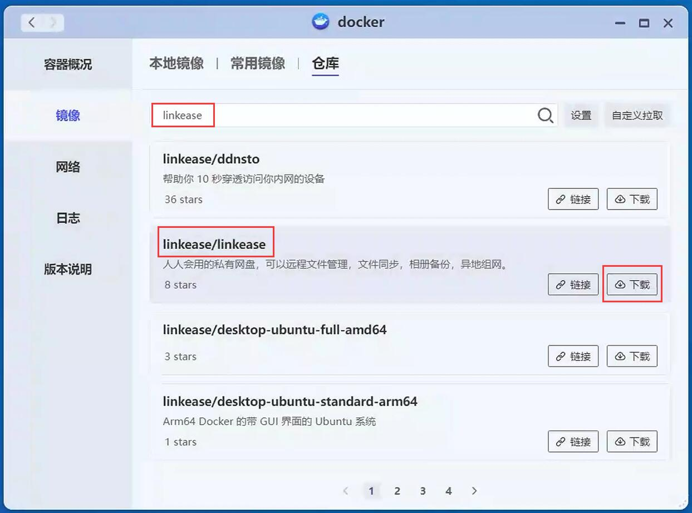
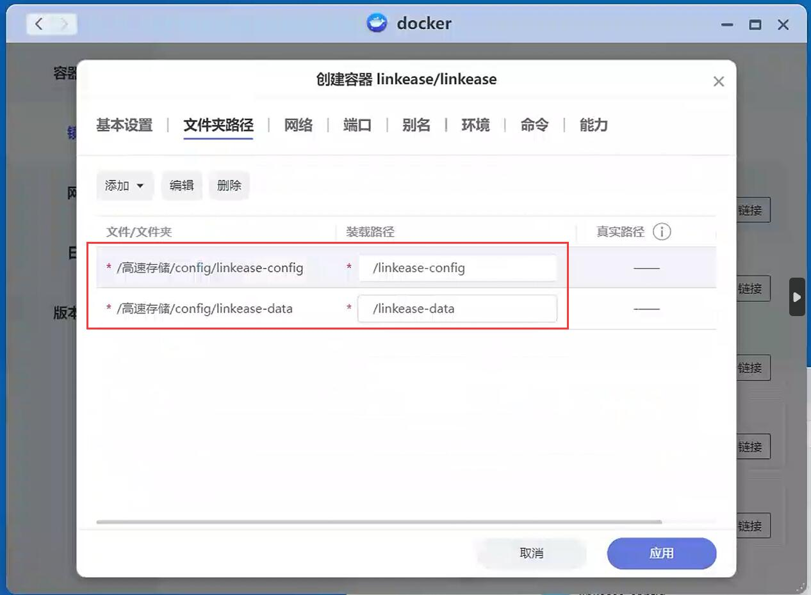

### 极空间

**1.极空间系统中，打开docker，并搜索“linkease”；**



**2.找到“linkease”，并下载，选择“latest”下载最新镜像；**


**3.下载完成后，并创建“linkease”容器，配置文件夹路径；**

```
装载路径：
/linkease-config
/linkease-data

真实路径：(可以自定义，只要能映射装载路径就可以)
/高速存储/config/linkease-config
/高速存储/config/linkease-data
```



**4.配置完成后，启动“linkease”容器，然后访问(访问地址: http://docker设备ip:8897)，需要绑定设备，请查看 [存储端绑定教程](/zh/guide/linkease/install/cloud.md)。****
