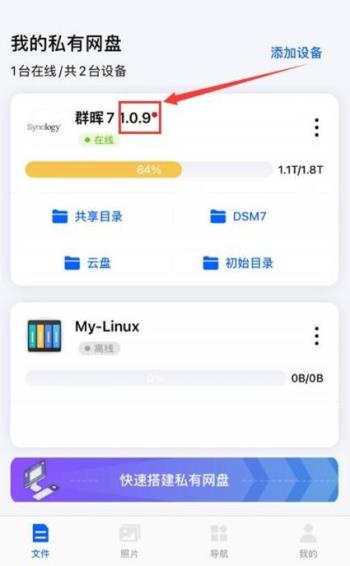

### 升级

易有云App端可以直接更新存储端版本。

**1.进入易有云App，在线设备右边数字就是存储端的版本号，如果发现红点，就代表有更新；**

**2.点击进入“设备信息”——“检查更新”，就会有存储端新版的更新日志，点击“立即更新”；**

**3.等待更新完成即可，存储端新版就更新完成了。**

**4.关于群晖/威联通等设备通过App升级存储端后，系统里的版本还是老版本？**

群晖/威联通等系统直接安装存储端后，App升级存储端，但是系统里还是显示老的版本号，这个不用管，只要易有云App里看到已经是最新版，就不用理群晖/威联通等系统里显示的版本号。