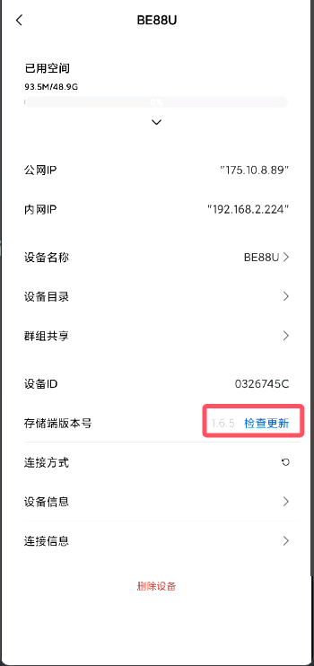

### 升级

易有云App端可以直接更新版本。

**在首页【我的网盘】选择你要升级的设备 - 【更多】 - 【设备管理】- 【检查更新】**

**等待更新完成即可，该设备的易有云就更新完成了。**

**关于群晖/威联通等设备通过App升级存储端后，系统里的版本还是老版本？**

群晖/威联通等系统直接安装存储端后，App升级存储端，但是系统里还是显示老的版本号，这个不用管，只要易有云App里看到已经是最新版，就不用理群晖/威联通等系统里显示的版本号。