## 应用导航

* **开启网盘后，可以远程访问web网页、SSH等。类似远程穿透。**

* 1.功能位于易有云——导航——应用导航——添加应用。

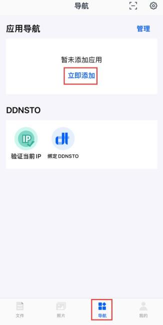

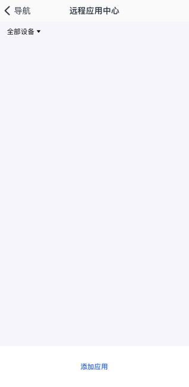

* 2.选择跳板设备，然后就能发现一些远程应用。

**跳板设备：已经开启网盘的设备**

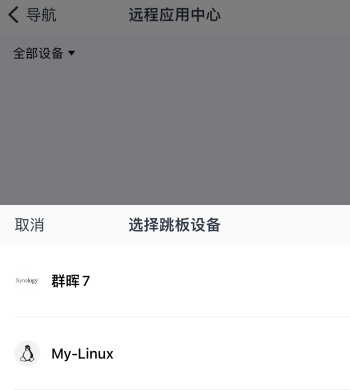

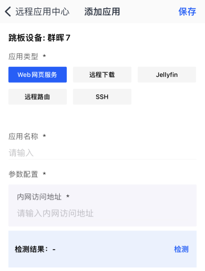


## Web网页服务

就是单纯的Web页面远程访问，可以附加端口。

* 首先确定要访问的设备上安装绑定了易有云存储端，或者同一IP段内有设备绑定了易有云存储端。

**1.选择Web网页服务；**

```
应用类型：选择Web网页服务
应用名称：自定义即可
内网访问网址：Web服务的网址，前缀要加http://或者https://，可附带端口
```

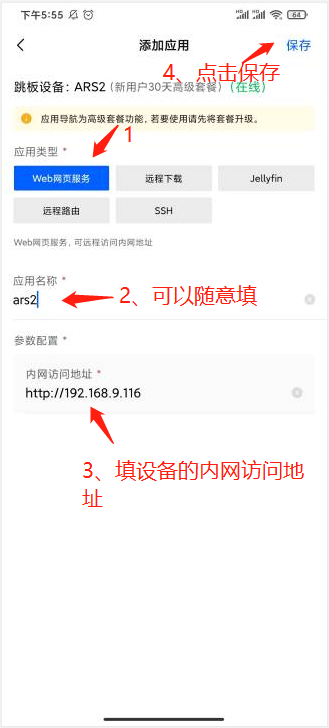

**2.右上角保存后，就能在应用中心里看到刚添加的应用。点击图标即可访问。**

* 每一个应用图标后面都有“删除/编辑/收藏”按钮，其中收藏的话，可以在易有云App首页展示出来。

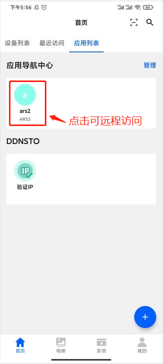


## 远程下载

* 首先确定要远程下载的设备上安装绑定了易有云存储端，且安装了Aria2。

**1.选择远程下载；**

```
应用类型：选择远程下载
应用名称：自定义即可
RPC地址：http://安装Aria2设备的ip:6800/jsonrpc，比如http://192.168.2.10:6800/jsonrpc
RPC密钥：设置的Aria2的RPC令牌
```

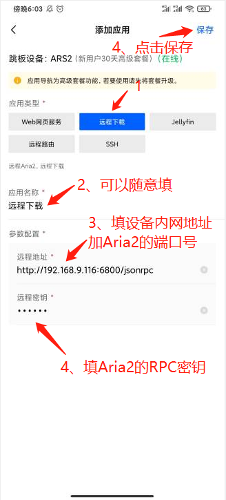

**2.右上角保存后，就能在应用中心里看到刚添加的应用。点击图标即可访问。**

* 每一个应用图标后面都有“删除/编辑/收藏”按钮，其中收藏的话，可以在易有云App首页展示出来。

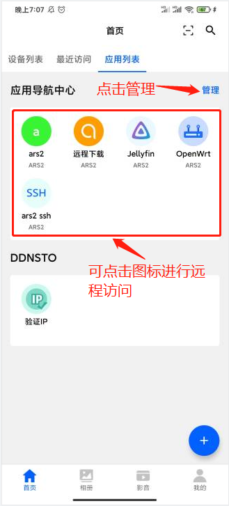


## Jellyfin远程播放

**1.首先要确定绑定了易有云的设备上，已经安装了Jellyfin；**

* 硬路由不支持安装Jellyfin，软路由(x86、ARM平台)、群晖，Unraid，威联通等NAS可安装。

* [ARS2设备安装Jellyfin教程](https://doc.linkease.com/zh/guide/easepi/advanced.html#jellyfin硬解) -->

* 其他设备Docker简单安装命令(说明)：[Jellyfin官方教程](https://jellyfin.org/docs/general/administration/installing.html#docker)

/mnt/sda1/jellyfin/config --> Jellyfin的配置路径，按需修改。

/mnt/sda1/media --> Jellyfin媒体库路径，按需修改。

* 群晖等NAS注意自己硬盘的挂载路径，可能需要“sudo -i”获取临时root权限再执行docker安装。

```
docker run -d --name jellyfin \
  --restart unless-stopped \
  --env UID=0 \
  --env GID=0 \
  --env GIDLIST=0 \
  -p 8096:8096 \
  -v /mnt/sda1/jellyfin/config:/config \
  -v /mnt/sda1/media:/media \
  jellyfin/jellyfin
```

**2.选择Jellyfin；**

```
应用类型：选择Jellyfin
应用名称：自定义即可
内网访问网址：Jellyfin服务的网址，前缀要加http://，端口8096(若更改，请换成更改后的端口)
```

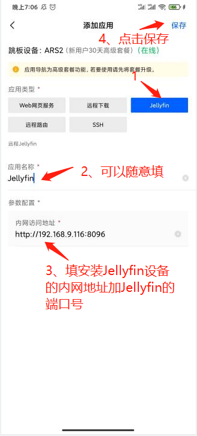

**3.右上角保存后，就能在应用中心里看到刚添加的应用。点击图标即可访问。**

* 每一个应用图标后面都有“删除/编辑/收藏”按钮，其中收藏的话，可以在易有云App首页展示出来。


## 远程路由

便捷的远程访问路由器(支持OpenWrt、LEDE、梅林等)。

* 首先确定要访问的设备上安装绑定了易有云存储端，或者同一IP段内有设备绑定了易有云存储端。

**1.选择远程路由；**

```
应用类型：选择远程路由
应用名称：自定义即可
内网访问网址：路由的访问网址，前缀要加http://
```

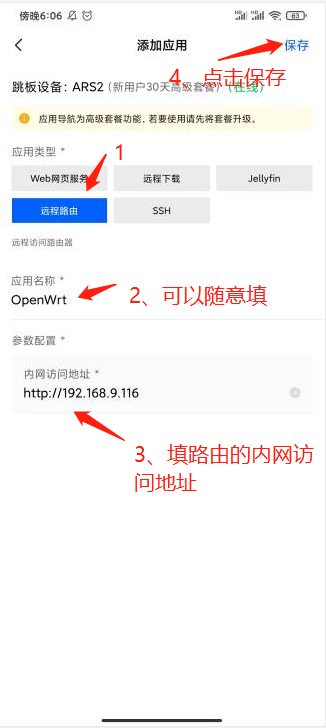

**2.右上角保存后，就能在应用中心里看到刚添加的应用。点击图标即可访问。**

* 每一个应用图标后面都有“删除/编辑/收藏”按钮，其中收藏的话，可以在易有云App首页展示出来。


## 远程SSH

便捷远程访问已开启SSH的设备。

* 首先确认要访问的设备已经开启SSH；

* 访问的设备上安装绑定了易有云存储端，或者同一IP段内有设备绑定了易有云存储端。

**1.选择SSH；**

```
应用类型：选择SSH
应用名称：自定义即可
内网IP：要访问设备的内网IP
端口：22(若更改，请换成更改后的端口)
用户名和密码：设备登录的用户名和密码
```

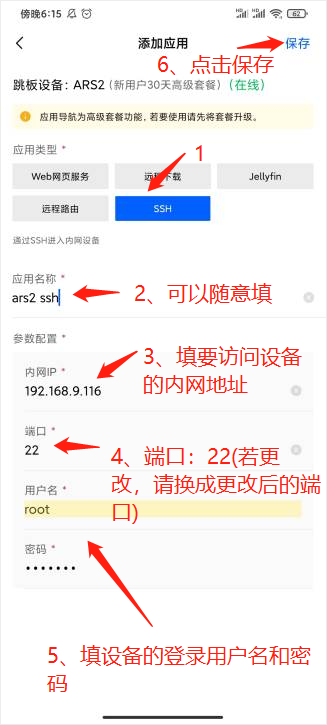

**2.右上角保存后，就能在应用中心里看到刚添加的应用。点击图标即可访问。**

* 每一个应用图标后面都有“删除/编辑/收藏”按钮，其中收藏的话，可以在易有云App首页展示出来。

