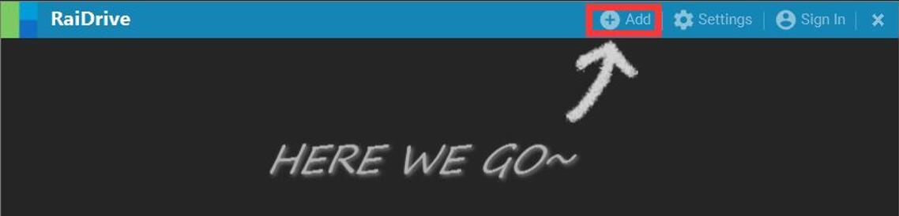
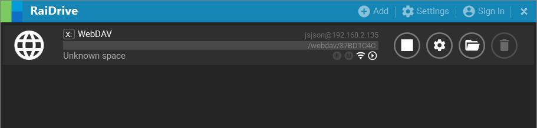
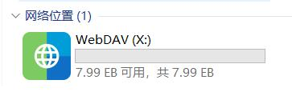

## 网络硬盘

何为网络硬盘，其实就是Web DAV，配置相当简单：

### 配置

**1.打开易有云电脑客户端，点击工具栏，然后点击网络硬盘；**

**2.然后服务设置，设置Webdav用户名和Webdav密码(设置完成请记住)；**

**3.然后磁盘管理，选择一个目标主机，可以选择盘符映射到本地；**

* 推荐用更加稳定的RaiDrive来映射。[RaiDrive映射教程](/zh/guide/linkease/more/network_drive.html#raidrive)

打开“此电脑”，就能看到映射的盘，就能点击进去直接访问了。

## 访问

我们设置好网络硬盘(Web DAV)后，如果在其他客户端访问，怎么做呢？比如在易有云APP。

**1.选择一个目标主机，有个地址，我们整个地址复制下来；**

PS：地址类似这种：**http://192.168.2.135:8896/webdav/xxxxxxx** (这就是WebDAV的服务器url)

**2.然后参考教程，绑定即可。**

[易有云APP WebDAV绑定教程](/zh/guide/linkease_app/tutorial.html#web-dav) -->

### RaiDrive

**介绍一个PC端的软件访问/映射到本地：RaiDrive。[下载地址](https://www.aliyundrive.com/s/5ZP1ymLjmSt)**

**1.下载安装RaiDrive，安装完成后，打开；**

**2.“Add按钮”进来，选择“NAS”，然后选择“WebDav”；**

* Drive：选择映射到本地的盘符，比如：X

* Address：WebDAV的服务器url：http://192.168.2.135:8896/webdav/xxxxxxx

(因为地址是http，不是https，取消前面那个小盾牌)

* Account：Webdav用户名和Webdav密码

* 最后点击“Connect”按钮连接

**3.连接成功就能访问映射的盘。**

