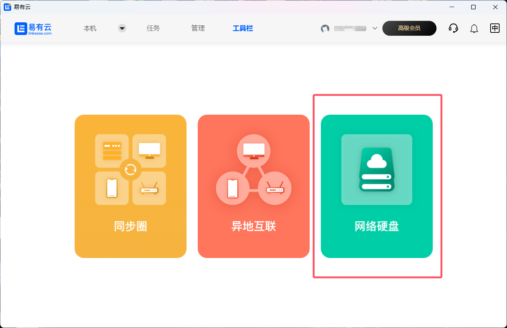
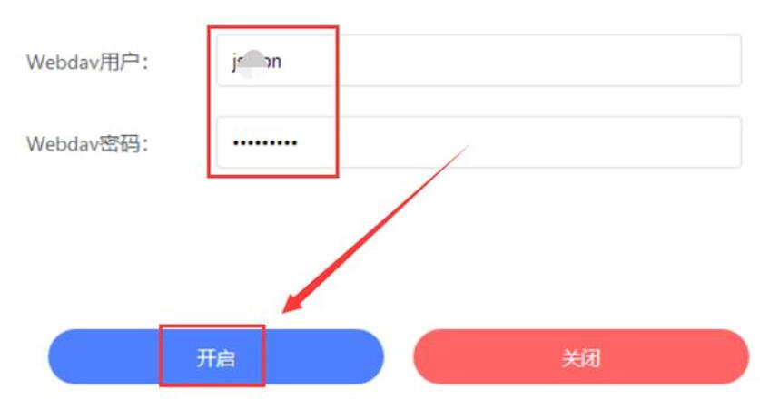
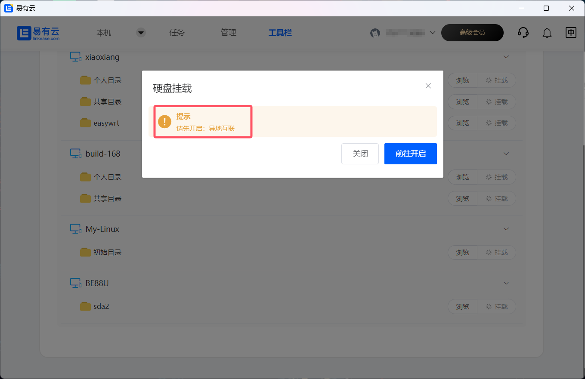
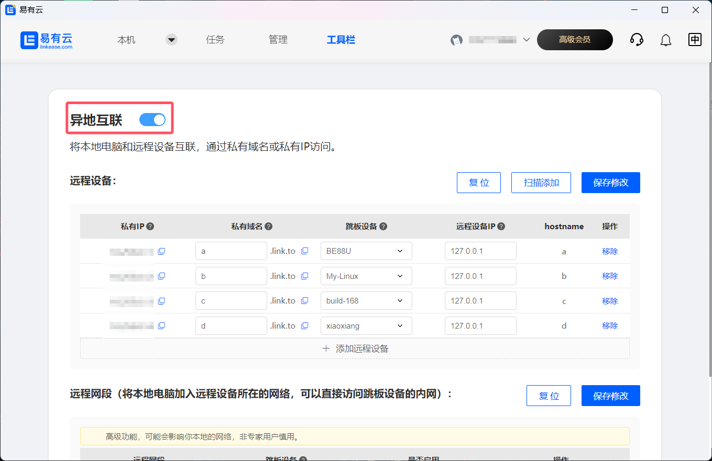
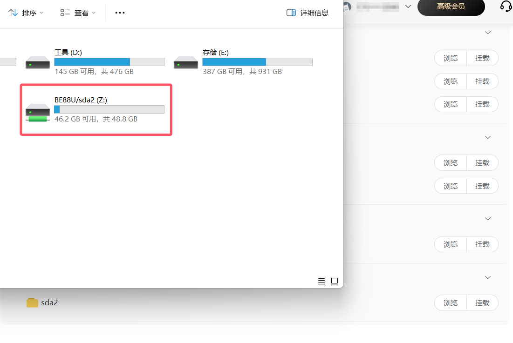
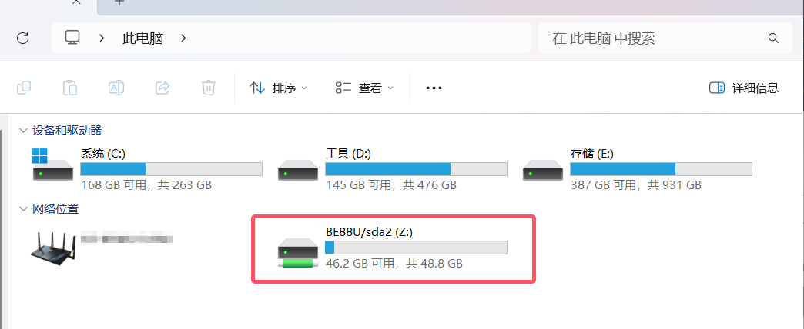

## 网络硬盘

何为网络硬盘，其实就是Web DAV，配置相当简单：

### 配置

**1.打开易有云电脑客户端，点击工具栏，然后点击网络硬盘；**

**2.选择需要挂载的目录，点击挂载；**

**3.若没有开启异地互联，会提示需要开启**

然后开启异地互联即可；

然后再次点击挂载，即可挂载成一个“硬盘”显示在我的电脑里；

## 访问

以后需要访问，直接打开我的电脑，即可看到挂载的“网络硬盘”。

