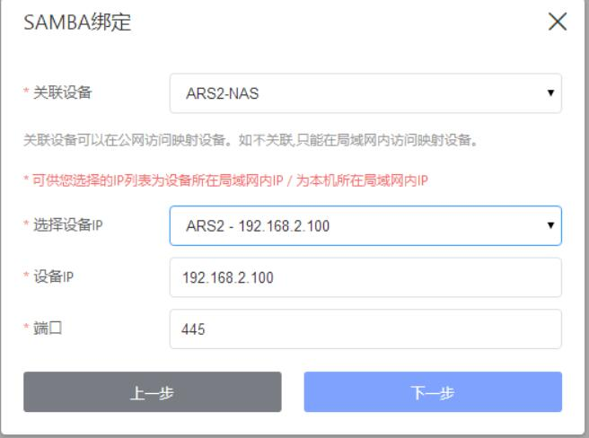
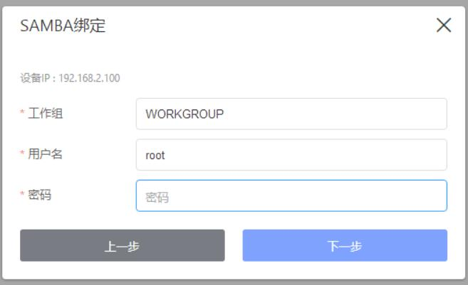
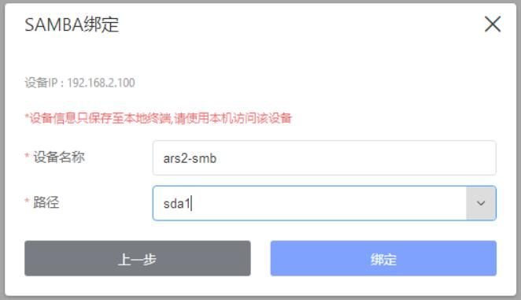
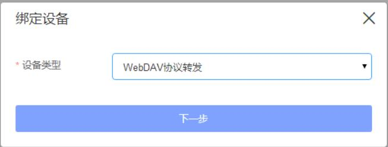
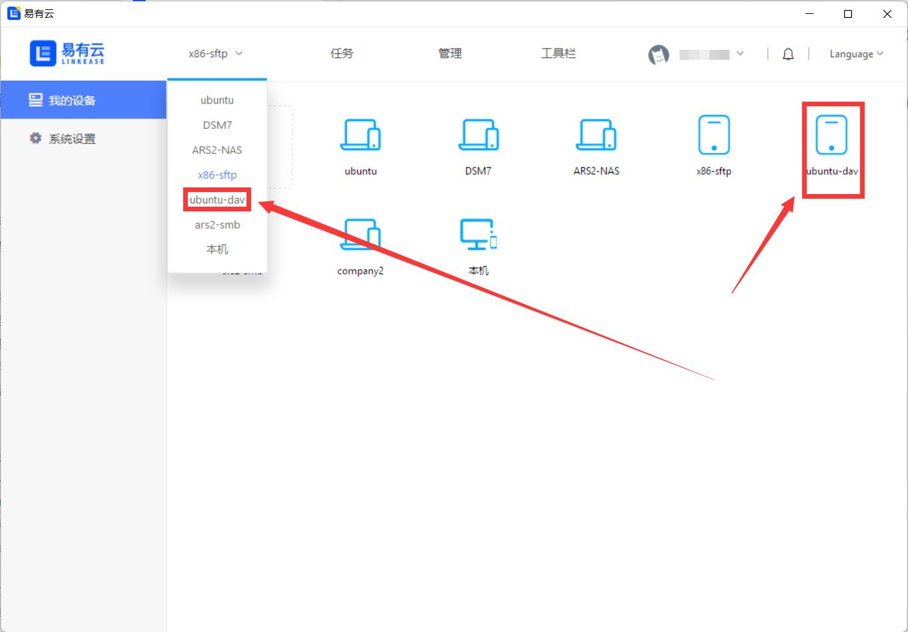

## 协议访问

易有云PC客户端支持多种网络协议(SMB/CIFS、SFTP、WebDAV)访问。

设置位于PC客户端—右上角头像—设置—“+”加号图标，下面开始一一说明各个协议的简单用法。


## Samba

#### 1.选择“Samba”，下一步，进入配置界面；


#### 2.开始配置：



```
关联设备：若选择绑定了易有云的设备，外网都能访问；若不关联设备，仅在设备所在局域网内能访问。

选择设备IP：开启了Samba协议的设备的IP，可以进入“选择”界面选择，也可以自定义输入IP。

端口：一般不需要设置，默认即可。
```

#### 继续下一步：



工作组：一般不需要设置，默认即可。

用户名和密码：Samba设备的用户名和密码。

#### 继续下一步：



设备名称：可随意设置。

路径：选择Samba设备的磁盘。

#### 3.绑定成功后，就能看到刚刚添加的设备，选择即可管理。


## SFTP

#### 1.选择“SFTP”，下一步，进入配置界面；


#### 2.开始配置：


```
关联设备：若选择绑定了易有云的设备，外网都能访问；若不关联设备，仅在设备所在局域网内能访问。

设备IP：开启了SFTP协议的设备的IP，手动输入。

端口：一般不需要设置，默认即可。
```

#### 继续下一步：


用户名称和密码：SFTP设备的用户名和密码。

#### 继续下一步：


设备名称：可随意设置。

路径：设置要访问的路径，默认就是整个磁盘分区，也可以写指定的分区。

#### 3.绑定成功后，就能看到刚刚添加的设备，选择即可管理。


## Web DAV

#### 1.选择“Web DAV”，下一步，进入配置界面；



#### 2.开始配置：


```
关联设备：若选择绑定了易有云的设备，外网都能访问；若不关联设备，仅在设备所在局域网内能访问。

设备别称：可随意设置。

服务端url：WebDAV服务器的地址。若不是url，是ip+端口，就如实写，例如：192.168.2.3:6086。

用户名称和密码：WebDAV设置的用户名和密码。
```

#### 3.绑定成功后，就能看到刚刚添加的设备，选择即可管理。

