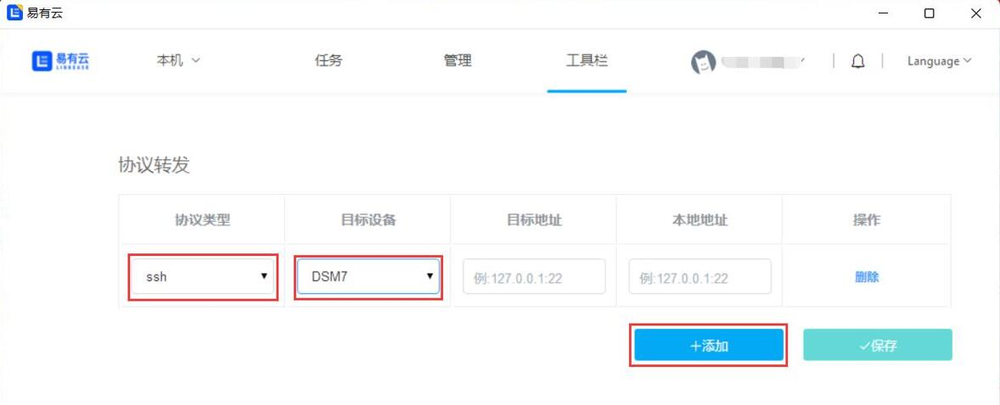
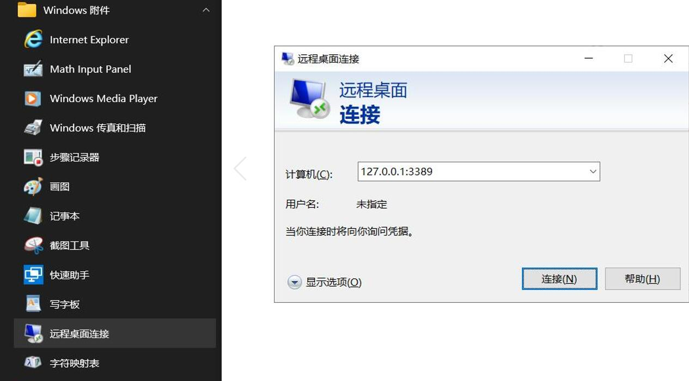

## 协议转发

目前已经支持转发的协议有ssh、samba和rdp，后续功能安排请关注易有云。

## SSH协议转发

1.设置非常简单，进入协议转发，点击“添加”，协议类型选择ssh；目标设备，选择已经绑定了此易有云的设备(请确认设备启用SSH)：

2.目标地址写目标设备的默认地址，本地地址写要转发成的地址，填写完成后，保存。

* 目标地址：比如远端主机ip是http://192.168.2.101/，这就是目标地址，转发ssh，端口就是22。

* 本地地址：就是把远端目标地址转到本地的ip，比如127.0.0.1:22。

3.现在就可以利用Xshell等工具通过本地地址(127.0.0.1:22)SSH访问设备了。

## RDP协议转发

1.进入协议转发，点击“添加”，协议类型选择rdp；目标设备，选择已经绑定了此易有云的设备(请确认设备启用RDP)：

* 若被控电脑是windows家庭版，需要特殊处理才能开启RDP。[家庭版开始RDP](https://doc.linkease.com/zh/guide/ddnsto/cloudapp.html#b-家庭版开启rdp)

2.目标地址写目标设备的默认地址，本地地址写要转发成的地址，填写完成后，保存。

* 目标地址：比如被控主机ip是http://192.168.2.5/，这就是目标地址，rdp默认端口是3389。

* 本地地址：就是把远端目标地址转到本地的ip，比如127.0.0.1:3389。(若本地远程开了就不能用3389端口，换端口，比如3399等。)

3.现在就可以通过本地地址(127.0.0.1:3389)远程访问设备了。

* 安装 [微软RDP远程桌面程序](https://docs.microsoft.com/en-us/windows-server/remote/remote-desktop-services/clients/remote-desktop-clients) (windows电脑建议安装Microsoft Store版本)。

* RDP客户端，添加电脑，填入本地地址访问。(连接过程中会提示填入被控电脑的用户名和密码)

* Windows电脑也可以用自带的“远程桌面连接”，操作是一样的，界面不同而已。

## Samba协议转发

1.设置非常简单，进入协议转发，点击“添加”，协议类型选择samba；目标设备，选择已经绑定了此易有云的设备(请确认设备启用samba)：

2.目标地址写目标设备的默认地址，本地地址写要转发成的地址，填写完成后，保存。

* 目标地址：比如远端主机ip是http://192.168.2.101/，这就是目标地址。

* 本地地址：就是把远端目标地址转到本地的ip，比如127.0.0.1。

3.现在就可以利用可Samba访问的工具通过本地地址(127.0.0.1)访问设备了。