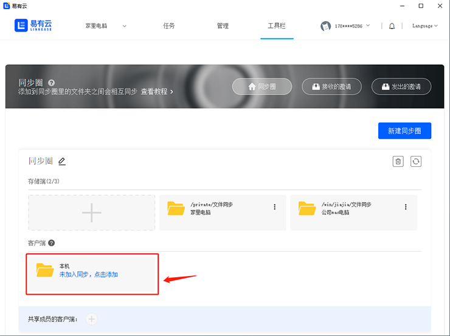
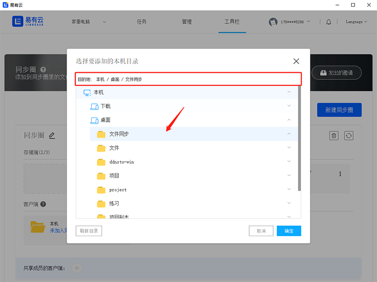
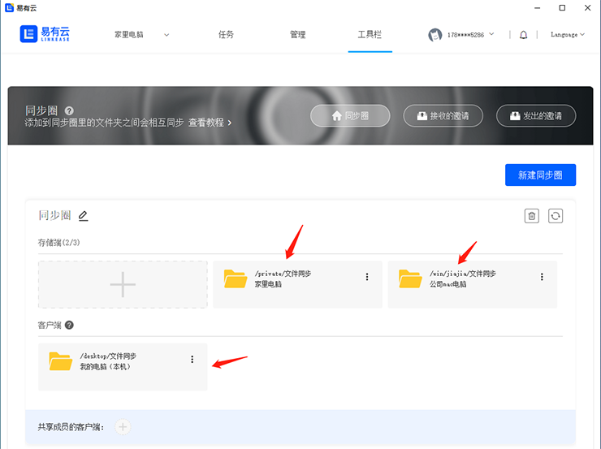
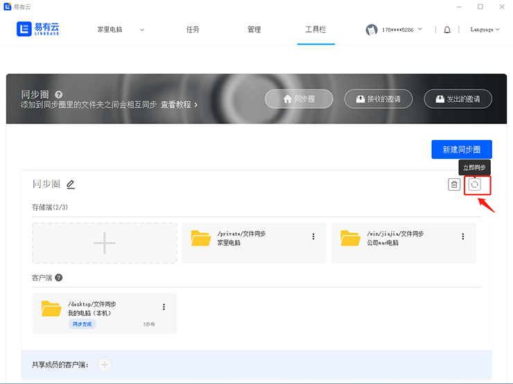
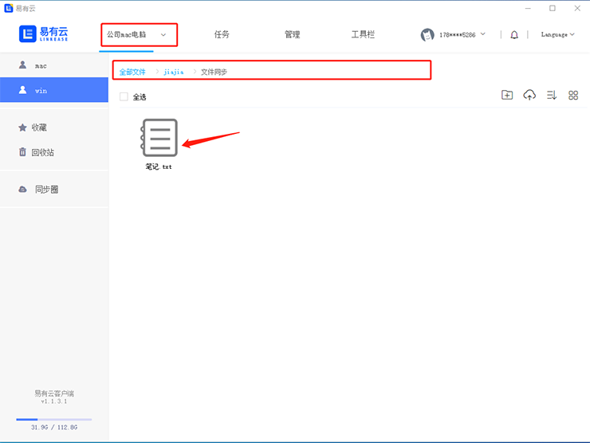
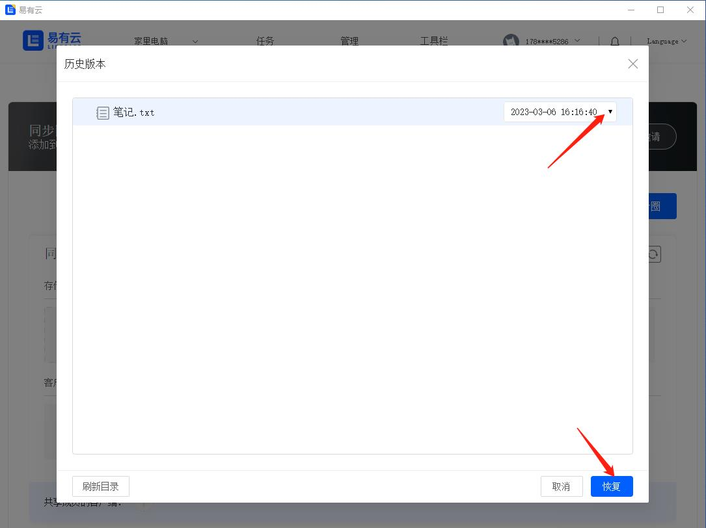

### 多个电脑自动同步文件，要是在公司还没编辑完文件，回到家也可以继续处理

当我们在公司还没编辑完文件，  
想要回家后继续编辑我们公司还没编辑完的文件，  
这时候大家可能会想到[远程公司电脑桌面](https://doc.linkease.com/zh/guide/linkease/tips/remote.html)来完成，   
今天教大家另外一种更简单直接的方法，  
通过易有云同步圈，能让你公司电脑文件和家里电脑文件实时同步。  
  
### 安装易有云
- 家里电脑安装易有云电脑客户端，公司电脑也安装易有云电脑客户端，登录同一易有云账号
- 打开易有云电脑客户端，[开启网盘](https://doc.linkease.com/zh/guide/linkease/install/device/windows.html)
- 成功开启网盘后，我们可以看到【我的存储】下面多了一个叫【家里电脑】 和 【公司mac电脑】

### 开启同步圈

- 在导航栏点击【工具栏】下的【同步圈】

### 添加存储端设备

- 添加【存储端】设备作为文件同步

- 选择存储端设备的文件同步目录路径

### 添加客户端设备

- 添加【客户端】设备（也就是本机电脑）作为文件同步

- 选择客户端设备的文件同步目录路径

- 选择好文件同步目录路径后，点击【立即同步】，三个设备下的文件就开始同步了

### 查看是否已经成功开启了同步圈
- 我们可以在任何一个设备的同步圈目录下增加或者删除文件，另外的同步圈设备也会跟着增加或者删除文件
- 在【家里电脑】的同步圈目录下新增一个文件

- 可以看到【公司mac电脑】的同步圈目录下也同步新增了同样的文件

- 可以看到【本机电脑客户端】的同步圈目录下也同步新增了同样的文件

### 不小心删除或覆盖了文件，可以在【历史版本】重新恢复回来

- 点击设备【更多】里的【历史版本】

- 选择要不小心删除或覆盖了的文件，点击【恢复】就可以恢复回来啦

