### 华硕路由器作为 轻NAS 的前期准备

#### 想要在路由器上拥有更好的 轻NAS 体验，那么我们需要先做哪些准备呢

我们在使用梅林软件中心的时候，比如软件中心的软件安装多了的话，可能会导致内存不够啊，运行不稳定或者其他一些问题，基于这些考虑，我们需要先准备一个硬盘，通过这个硬盘，先安装一个叫虚拟内存的插件，让路由器把一些内存交换到这个硬盘上，路由器的内存就可以变大了，另外你还可以安装另一个插件USB2JFFS，这个插件可以把很多插件安装到硬盘上，你路由器重置或者其他原因你都可以从这个硬盘恢复回来，有了这两个插件，你就能在路由器上更好的使用其他插件了，从而获得很好的 轻NAS 体验。

#### 将华硕路由器官方固件刷成梅林改版固件或者官方改版固件

第一步，我们需要将华硕路由器官方固件刷成梅林改版固件或者官方改版固件，这样就能获取软件中心安装插件的能力了,
怎么刷机可以看 [[koolcenter.com](http://koolcenter.com/)] 的教程.

#### 准备硬盘

接下来需要准备硬盘，最好是选择质量好点的U盘、移动硬盘或者带独立供电的硬盘盒。

#### 做好软件安装到硬盘的准备（硬盘分区）

硬盘有了之后，建议将硬盘做两个分区，
分区1大约50G，用来安装软件的
剩下的容量作为分区2，用来存储你的数据的，
硬盘文件系统的格式，建议是ext4，这样可以和系统有更好的兼容性，读写速度也会更快。

1. 首先在电脑上下载硬盘分区工具 [[DiskGenius](https://www.diskgenius.cn/)]，打开DiskGenius，然后接入硬盘，就可以看到硬盘了。

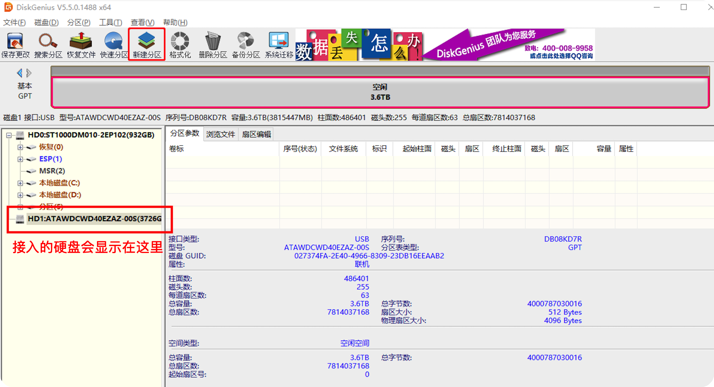

2. 选中接入的硬盘，点击“新建分区”。

3. 分别创建两个文件系统为ext4的分区，一个用来安装软件的，50G左右，剩下的容量作为数据分区。

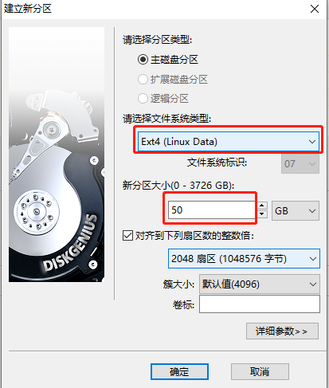
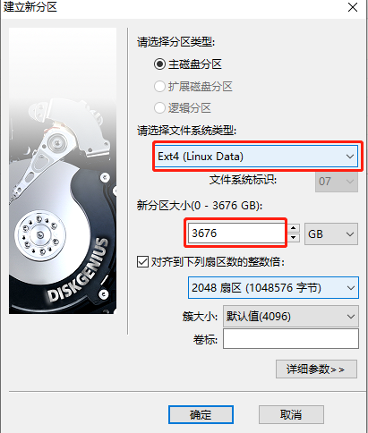

4. 创建完分区后，保存修改，然后立即格式化分区。

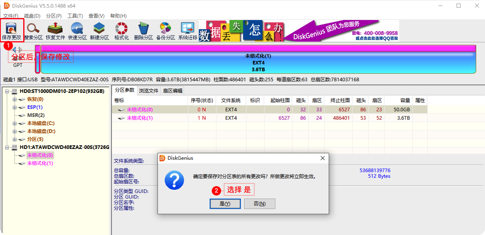
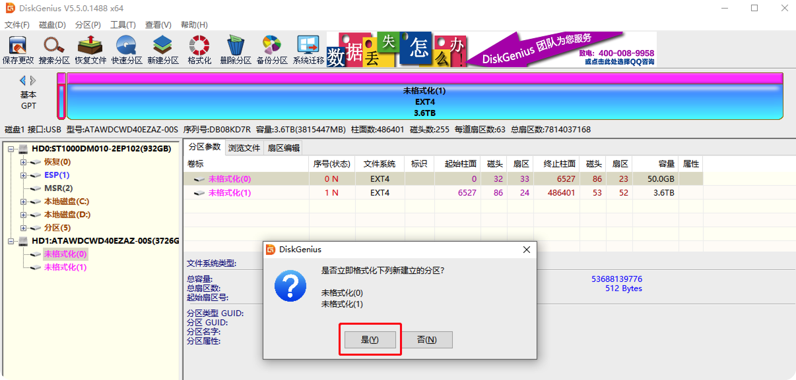

5. 格式化分区后就完成了硬盘的准备了，这样我们就可以把硬盘接到路由器上了。

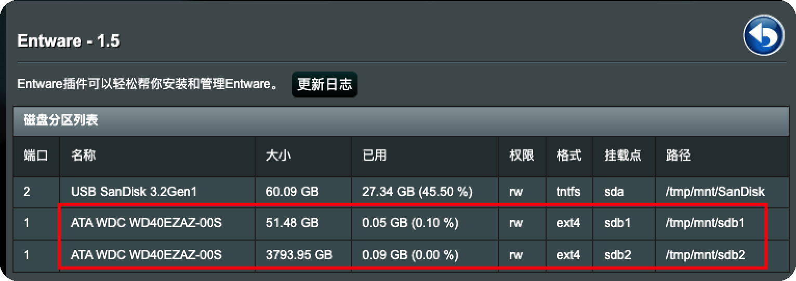

#### 做好虚拟内存（USB2JFFS、虚拟内存的安装）

1. 打开软件中心-全部软件，找到“虚拟内存”，点击安装。

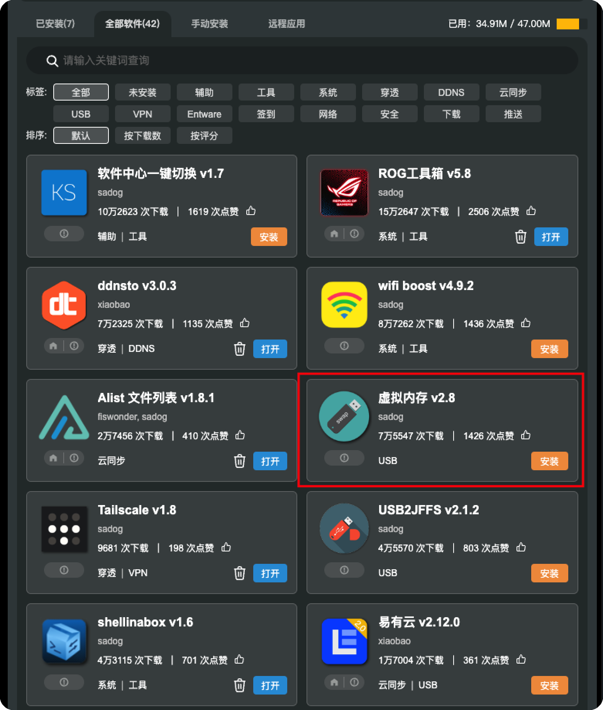

2. 打开虚拟内存，选择磁盘和虚拟内存大小，然后点击“创建虚拟内存”。

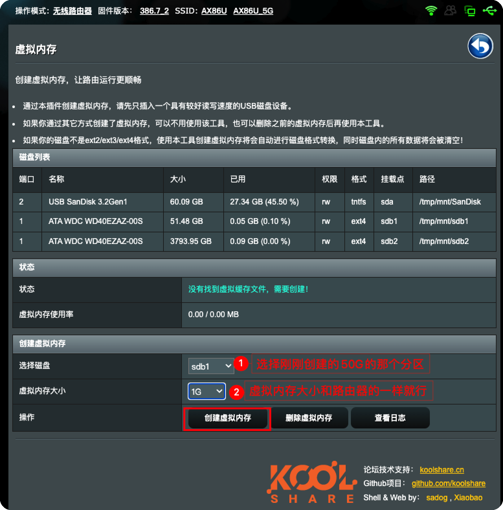

3. 创建的过程中，会检测硬盘的质量，如果通不过，那可能就是硬盘文件系统不是ext4的或者质量不过关。

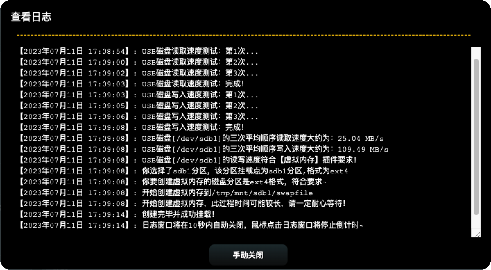

4. 虚拟内存挂载成功。

5. 接下来安装 USB2JFFS，软件中心-全部软件，找到“USB2JFFS”，点击安装。

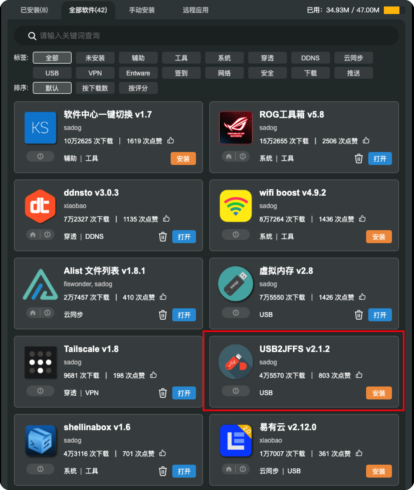

6. 打开 USB2JFFS，挂载路径选择安装软件的分区，然后应用。

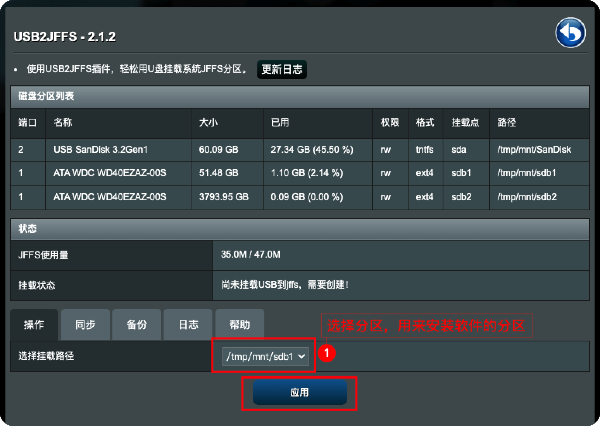

7. 挂载成功。它相当于是把之前存储空间里的插件都转移到了硬盘上了。

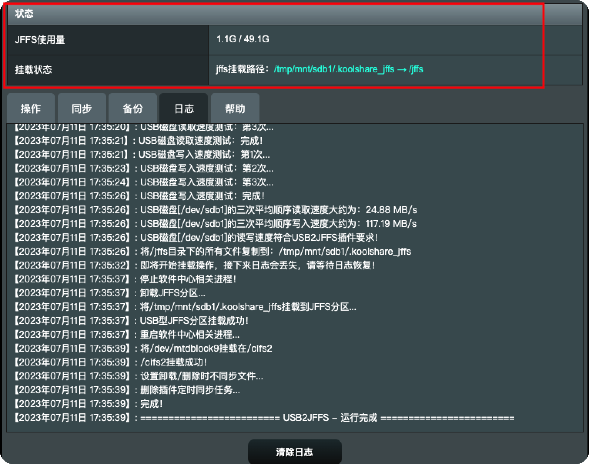

8. 安装软件可以正常安装。

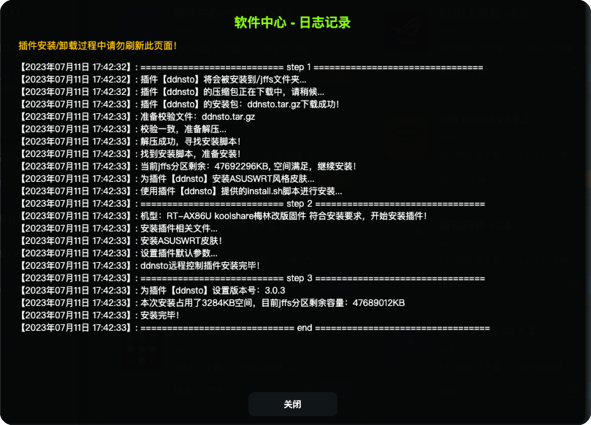

好了，有了 虚拟内存 和 USB2JFFS 这两个插件，你就能在路由器上更好的使用其他插件了，从而获得很好的 轻NAS 体验。