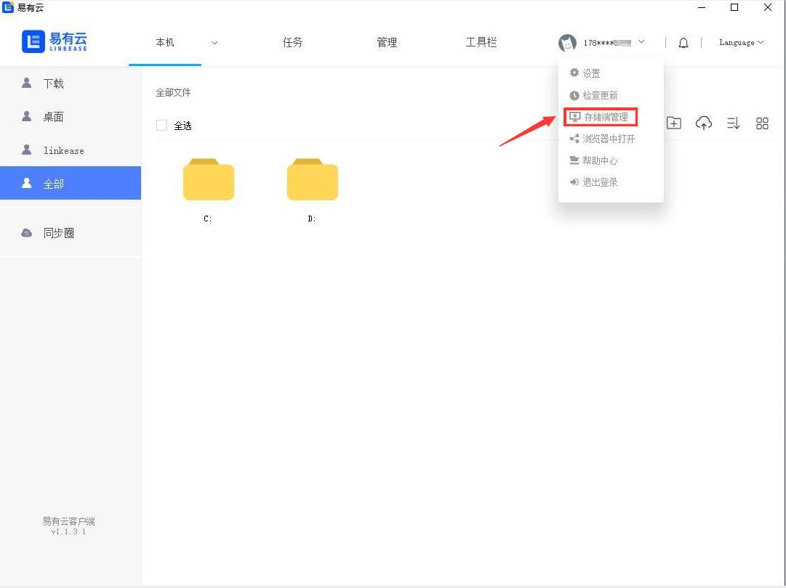
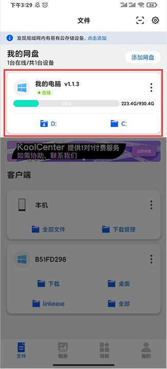
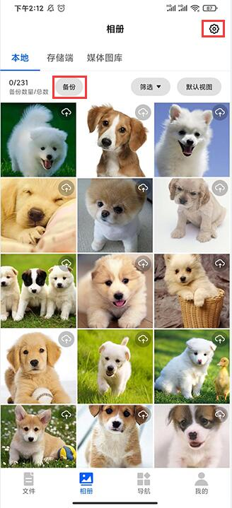
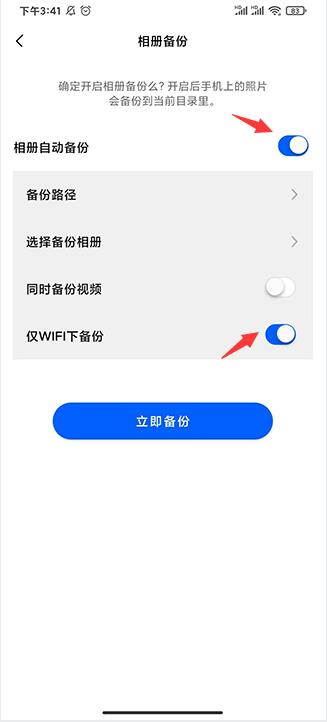
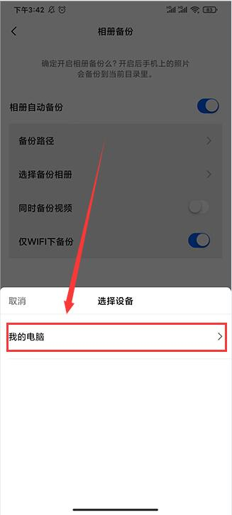
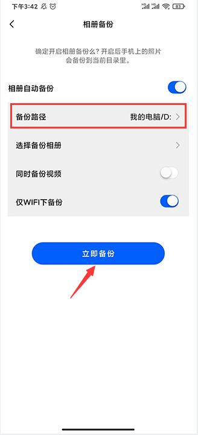

### 手机里相片太多，占用太多手机内存？易有云自动备份功能帮你手机瘦身

- 下面我们演示把自己的电脑作为存储端，如果要把别的设备作为存储端可以查看[安装及配置](https://doc.linkease.com/zh/guide/linkease/install/device/windows.html)
- 打开易有云电脑客户端，在【账户头像】下拉列表找到【存储端管理】，开启存储端（开启网盘）

- 私有网盘的名称和位置可以自己选，建议私有网盘的主目录选除C盘以外的盘
- 注意：私有网盘主目录一旦确定后不能修改，除非删除设备

- 成功开启网盘后，我们可以看到【我的存储】下面多了一个叫【我的电脑】项

- 打开易有云APP,也可以在【我的网盘】下面看到多了一个设备

- 选择【相册】，点击【备份】或者点击右上角的【设置】

- 开启相册自动备份，还可以开启仅WIFI下备份

- 选择备份的路径，设备选择【我的电脑】，如果你还有别的存储设备也可以选择存储到别的设备

- 选择好备份路径后，点击立即备份，手机里的相片就会自动备份到你的电脑里面了

- 现在你就可以在你的电脑里面查看你备份的照片了，你还可以把你的照片分享给你的朋友
- 如果你有多个设备，还可以把你的照片备份到多个设备里，既给你的手机瘦身了，又不用担心你的照片会丢失

