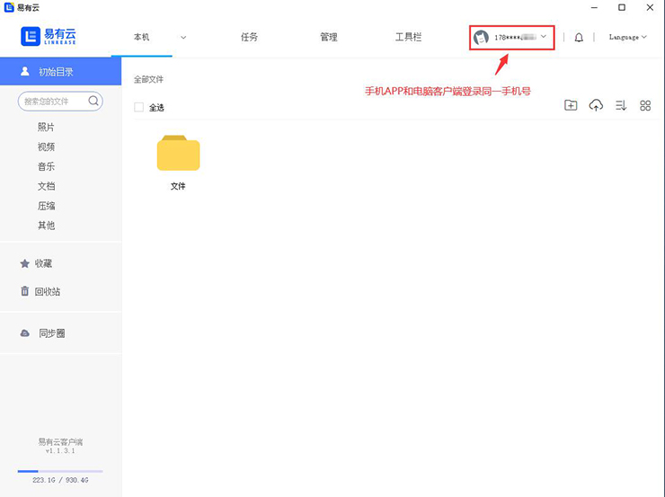
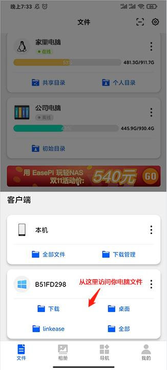
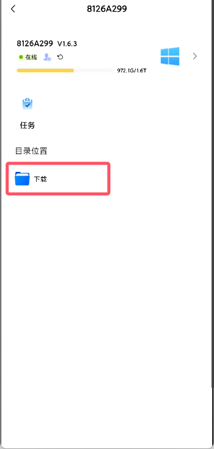
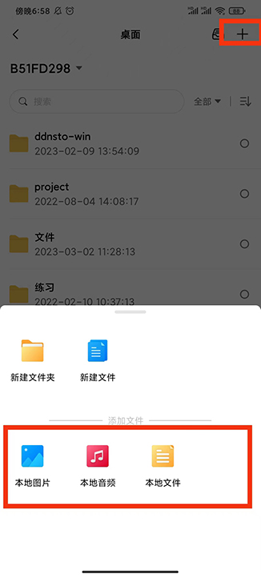

### 安卓手机资料想传给Mac电脑？
怎么把手机资料传给Mac电脑？  
微信、qq、手机数据线和网盘是我们最常见的选择。    
微信传输大文件时需要压缩，不仅传输麻烦、速度也慢。   
图片和视频还会损失画质，并且还会占用空间。  
而各大网盘没会员的话，速度又堪比龟爬。  
难道除了网盘和微信、qq、手机数据线之外，就没有更好的方法了吗？  
当然有，今天就来教大家：
如何不压缩文件并且快速方便的做到随时随地把手机资料传给电脑。

### 安装易有云电脑客户端
- 电脑安装易有云客户端，登录手机号，并且保持易有云客户端是开启的状态

### 安装易有云APP
- 手机安装易有云APP，APP和电脑客户端都登录同一易有云帐号，可以看到【客户端】下面显示了你的电脑

- 【下载】、【桌面】、【linkease】、【全部】 就是对应你电脑里面的路径目录

### 找到目标路径位置
- 找到你要上传资料到电脑里面的路径位置（比如桌面或者你的任意一个盘位）
- 点击右上角的【添加】，然后选择你手机本地要上传到电脑的文件类型（可以选择本地图片、本地音频、本地文件）

