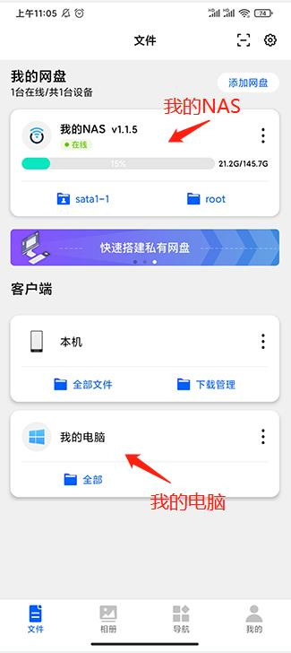
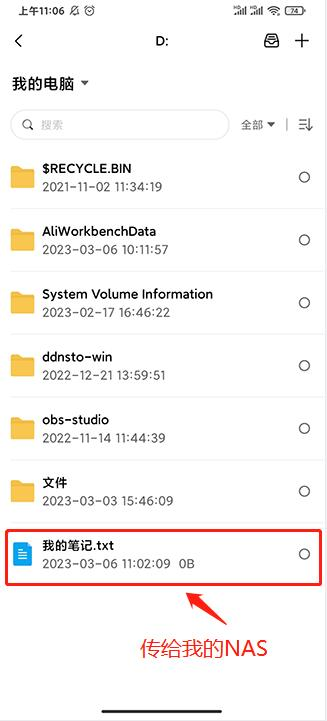
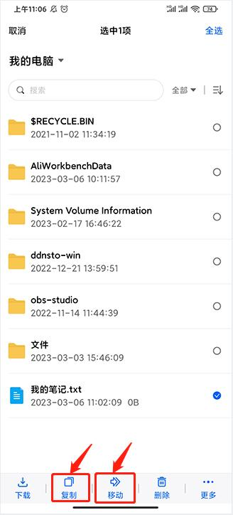
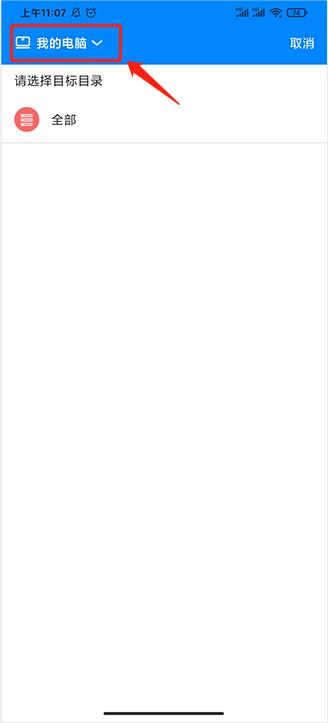
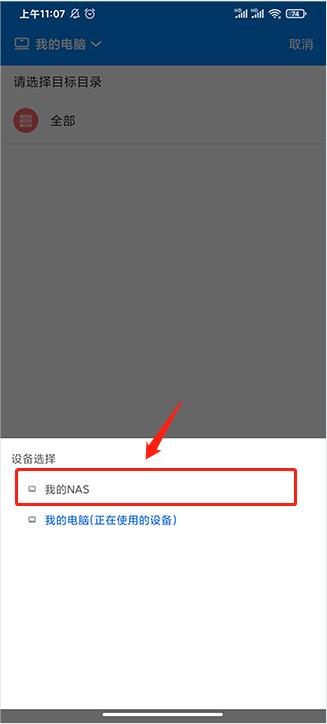
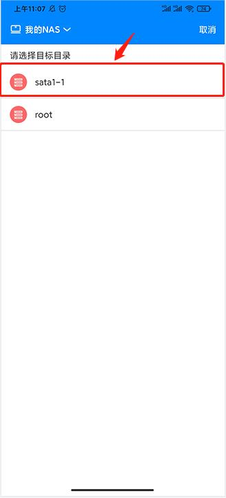
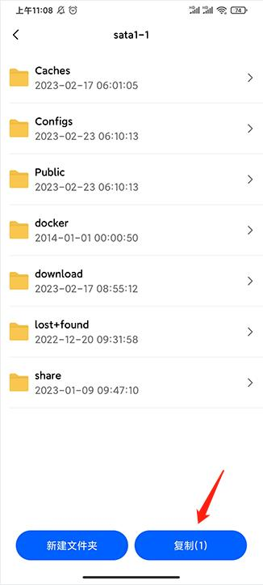
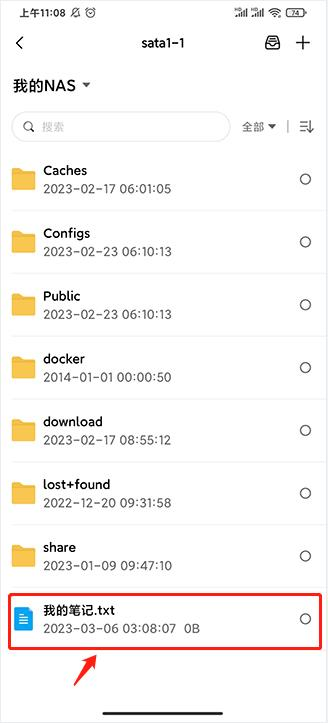

### 想通过手机，把电脑资料传给NAS？
- 手机下载易有云APP,
- [NAS安装易有云存储端](https://doc.linkease.com/zh/guide/linkease/install/device/windows.html)
- 电脑安装易有云电脑客户端
- 易有云APP、NAS易有云存储端、易有云电脑客户端 登录同一易有云账号
- 打开易有云APP

- 找到你电脑资料要传给NAS的存放路径，比如我想把我电脑D盘的一个文件传给我的NAS

- 选中要上传的文件，然后点击【复制】或者【移动】

- 点击左上角【设备选择】我的NAS 

- 然后选择你要复制到NAS的目标目录路径位置

- 点击复制

- 现在就成功的通过手机，把电脑资料传给NAS了

