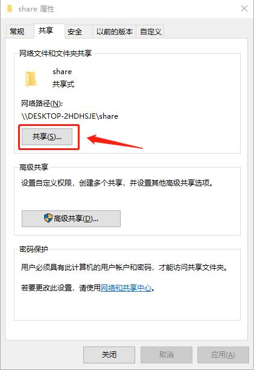
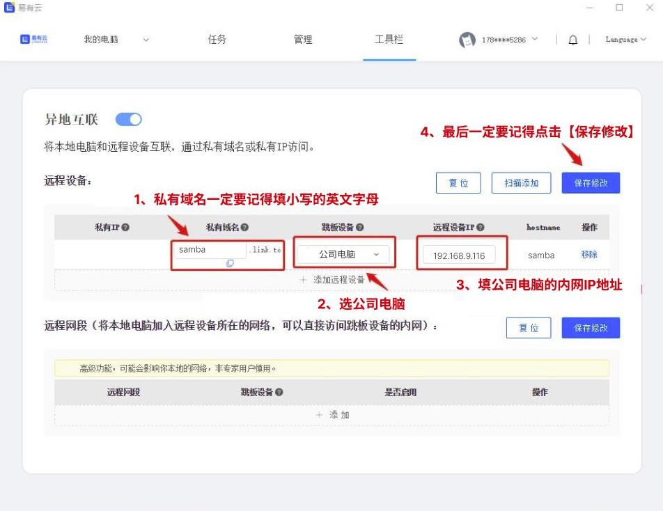
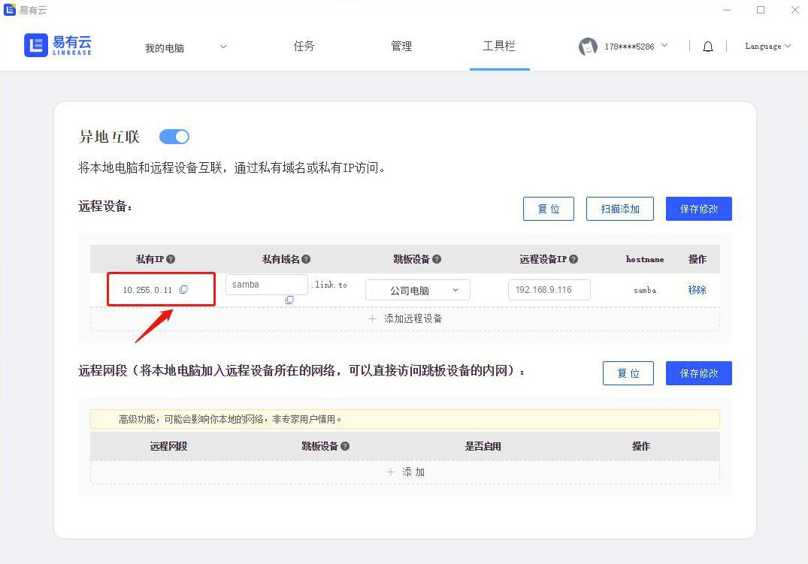
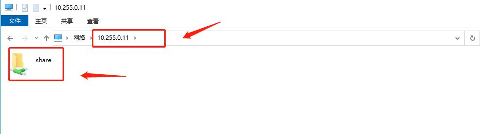
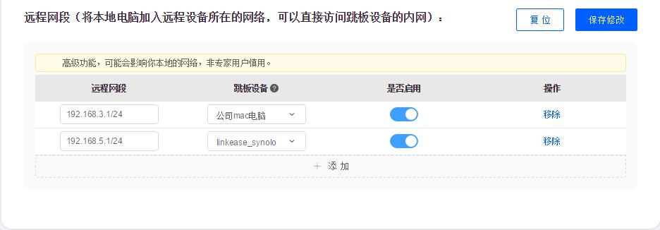
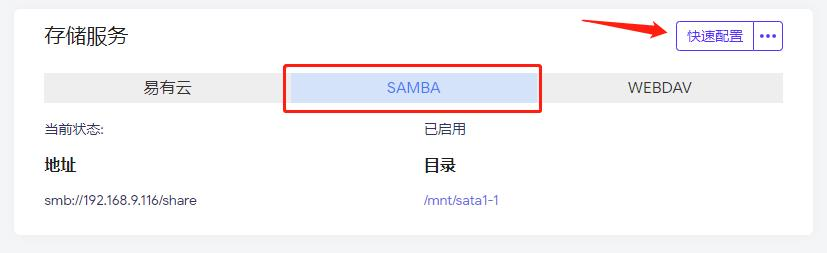

### 远程硬盘挂载

想要在家里远程公司电脑硬盘挂载？   
下面教大家用一种简单的方式来远程公司的电脑硬盘挂载：  
通过易有云的[异地互联](/zh/guide/linkease/function/remote_connects.md)来实现。  
因为易有云是点对点通信的，速度快，  
所以通过易有云来访问就相当于你在内网访问是一样的。  
我们来看看具体是怎么实现的吧！  

### 第一步：公司电脑挂载的硬盘开启文件共享
- 在硬盘目录下，选中你想要共享的文件，点击右键 —— 设置 —— 共享

### 第二步：安装易有云
-  安装易有云电脑客户端，公司电脑要[开启网盘](/zh/guide/linkease/install/device/windows.md)，并且易有云是运行的状态
- 家里电脑和公司电脑易有云客户端要登录同一易有云账号

### 第三步：开启异地互联
- 打开家里电脑易有云客户端，开启[异地互联](/zh/guide/linkease/function/remote_connects.md)
- 点击【添加远程设备】

- 私有域名：可以自己随意填（最好填英文名）
- 跳板设备：选公司电脑
- 远程设备IP：填公司电脑（被控电脑）的内网IP
- 点击【保存修改】

- 易有云会自动帮你生成一个【私有IP】

### 第四步：复制【私有IP】在你家里电脑上打开
- 只需要复制这个【私有IP】在你家里电脑的资料管理器反斜杠\\加上【私有IP】打开
- 就可以在家里远程访问你公司硬盘里开启文件共享的文件了

### 结尾

- 如果你是一个专业用户，也可以用远程网段来方便远程更多的设备

- 如果你使用的是我们的 iStoreOS，开启 Samba（文件共享） 更容易

