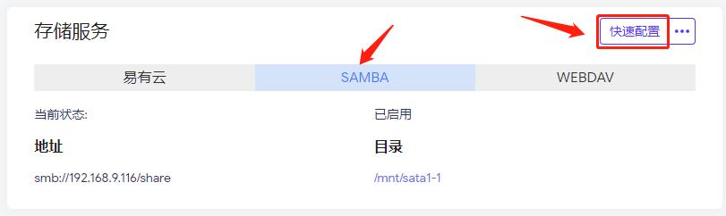
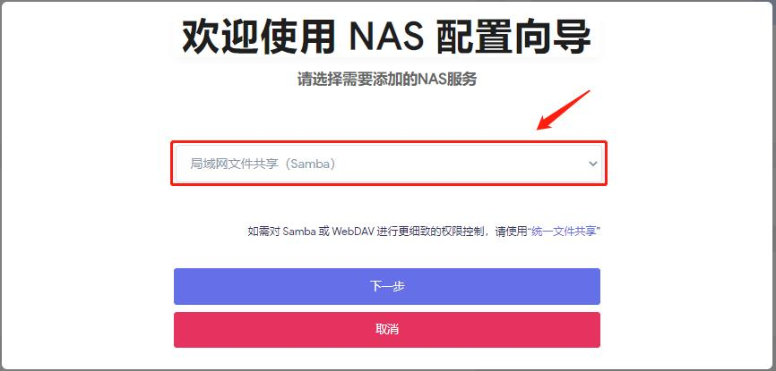
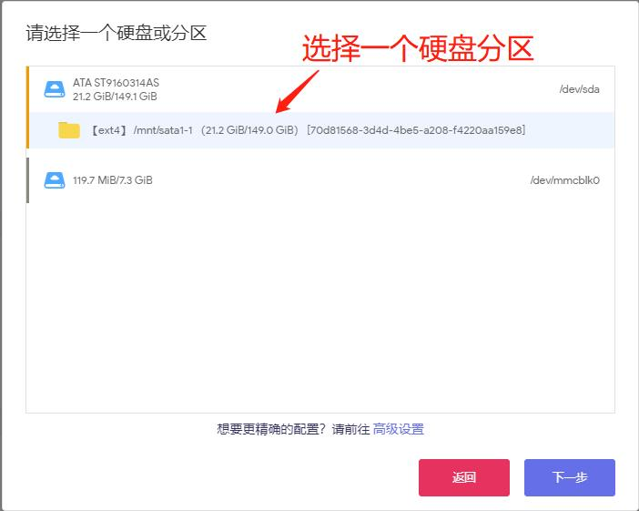
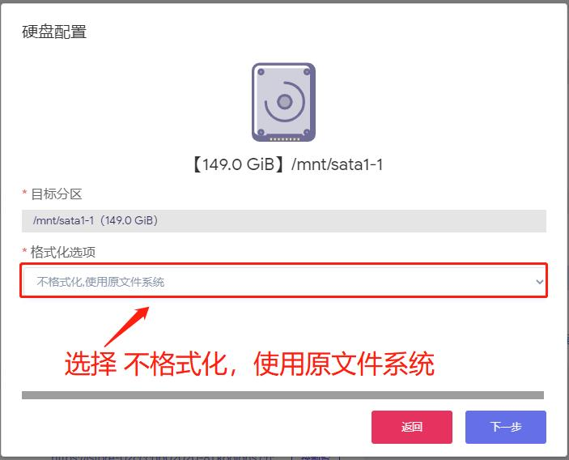
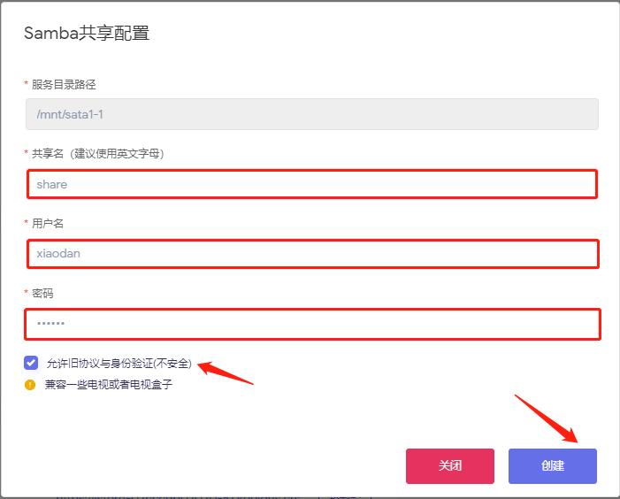

### 远程硬盘挂载

- 如果你的设备是iStoreOS，可以在iStore[安装易有云并配置](https://doc.linkease.com/zh/guide/linkease/install/device/istoreos.html)
- 在【首页】【存储服务】里可以快速配置【SAMBA】

- 点击【快速配置】，选择 局域网文件共享（Samba）

- 选择一个硬盘分区

- 选择不格式化，使用原文件系统

- 输入共享名（建议使用英文字母）
- 输入用户名和密码
- 勾选 允许旧协议与身份验证

- 开启完SAMBA后，我们现在在家里远程访问公司硬盘挂载
- 打开家里电脑易有云客户端，在易有云状态栏的【工具栏】下面找到【异地互联】

- 易有云默认已经帮你开启了异地互联
- 点击【添加远程设备】

- 私有域名：可以自己随意填（最好填英文名）
- 跳板设备：选公司iStoreOS（如果你公司还有别的设备安装了易有云也可以选择别的设备作为跳板设备）
- 远程设备IP：填公司iStoreOS的内网IP

- 点击保存修改，易有云会自动帮你生成一个【私有IP】

- 只需要复制这个【私有IP】在你家里电脑打开
- 就可以在家里远程访问你公司的硬盘挂载了

