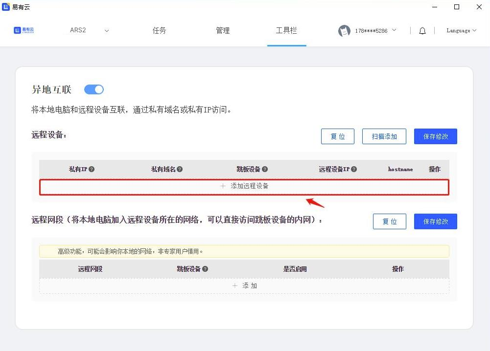
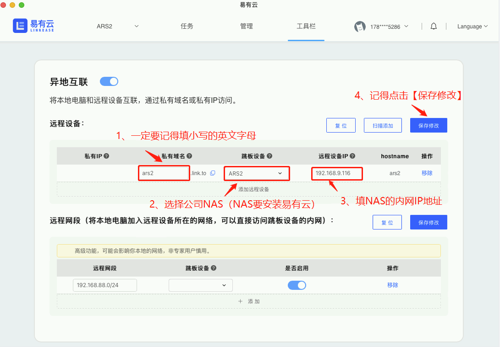
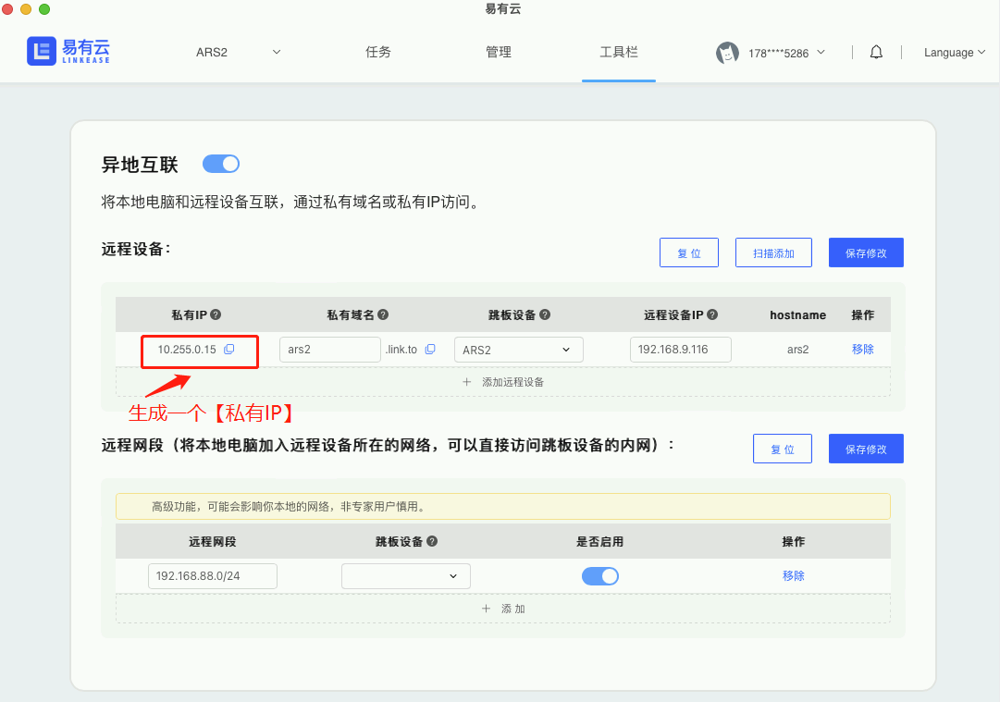
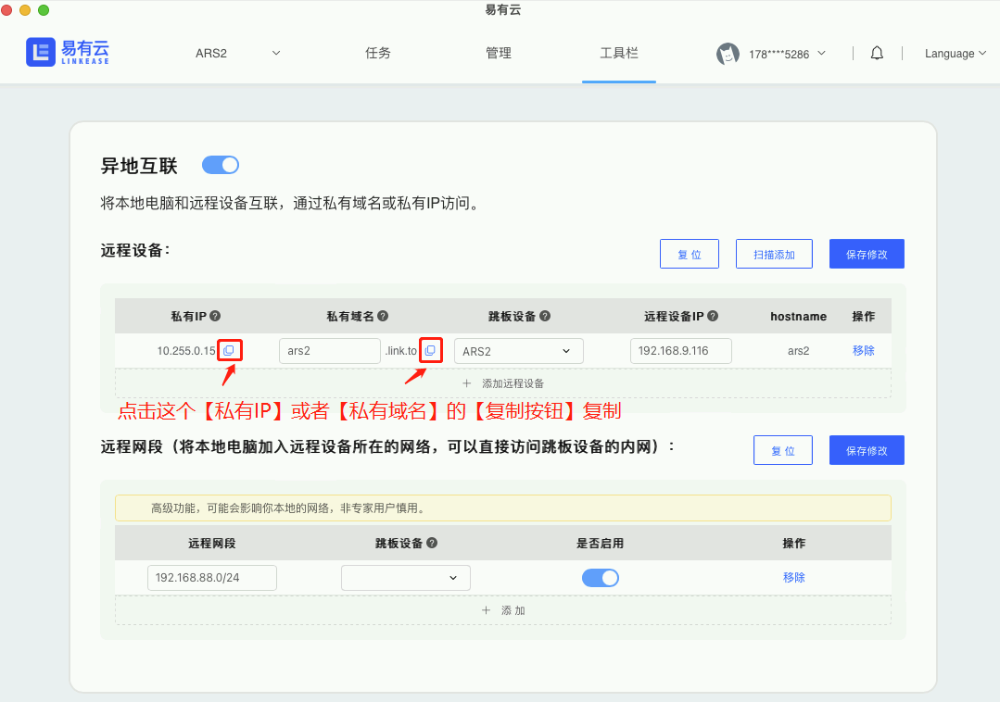
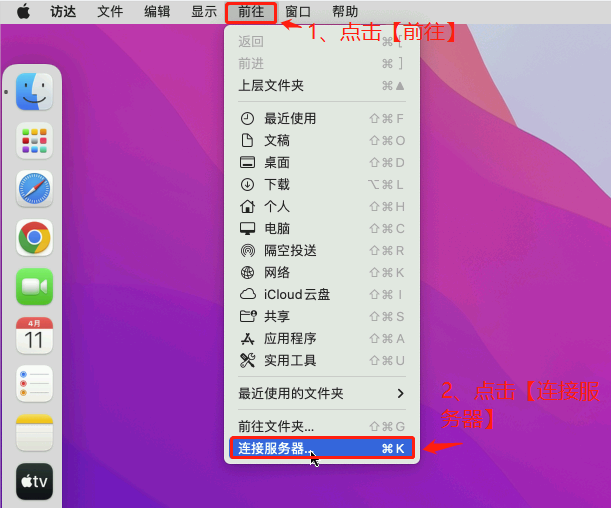
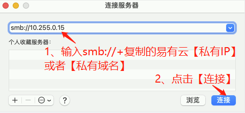
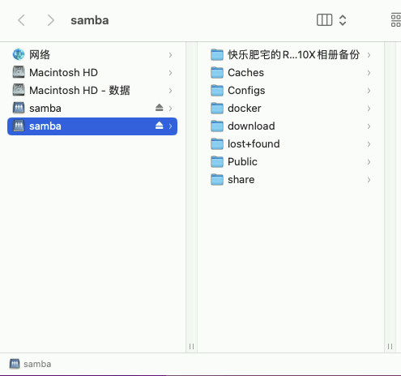

### Mac电脑远程挂载NAS硬盘

想要在家里通过Mac电脑远程公司挂载NAS硬盘？   
下面教大家用一种简单的方式来实现：  
通过易有云的[异地互联](/zh/guide/linkease/function/remote_connects.md)。  
因为易有云是点对点通信的，速度快，  
所以通过易有云来访问就相当于你在内网访问是一样的。  
我们来看看具体是怎么实现的吧！  

### 第一步：公司NAS挂载的硬盘开启文件共享
[查看NAS挂载的硬盘如何开启文件共享]()

### 第二步：安装易有云
- 公司[NAS安装易有云](/zh/guide/linkease/install/device/istoreos.md)；
- 家里Mac电脑[安装易有云客户端](https://www.linkease.com/download)。

### 第三步：开启异地互联
- 打开家里Mac电脑易有云客户端，开启[异地互联](/zh/guide/linkease/function/remote_connects.md)；
- 点击【添加远程设备】。

- 私有域名：一定要填小写的英文字母；
- 跳板设备：选公司NAS（或者选已经安装易有云的设备）；
- 远程设备IP：填公司NAS的内网IP地址；
- 记得点击【保存修改】。

- 易有云会自动帮你生成一个【私有IP】。

### 第四步：复制【私有IP】在你家里电脑上打开
- 点击【前往】，或者直接CMD + k，打开【连接服务器】页面；

- 服务器地址：smb://+复制易有云的【私有IP】;

- 就可以在家里通过Mac电脑远程你公司挂载NAS硬盘里开启文件共享的文件了。

### 结尾

- 如果你是一个专业用户，也可以用远程网段来方便远程更多的设备。

- 如果你使用的是我们的 iStoreOS，开启 Samba（文件共享） 更容易。

