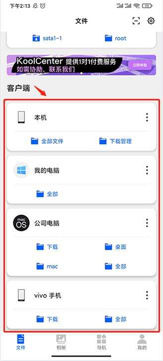
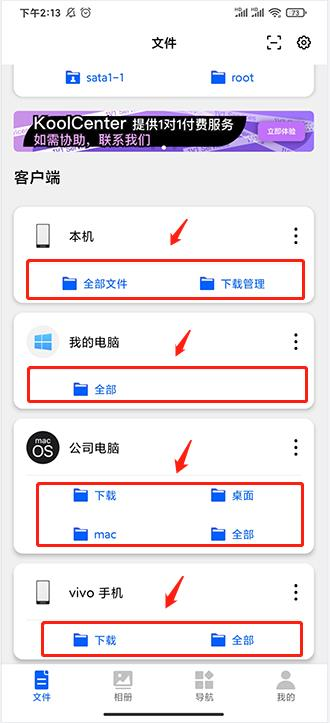
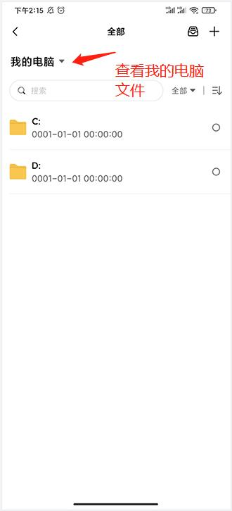
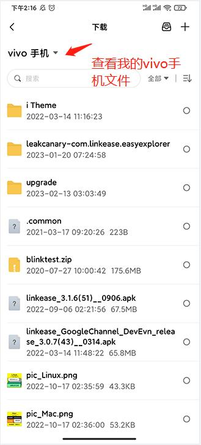

### 有n部手机、n台电脑，资料散布各地？没关系，易有云可以随时查看不同设备下的文件
当你有n部手机、n台电脑，保存着你重要的资料，  
而你想要统一管理和访问你这些散布在各地的资料。    
没关系，易有云可以快速的帮你做到，  
让你随时随地查看不同设备下的文件。

### 安装易有云
- 在你想访问的n部手机安装易有云APP
- 在你想访问的n台电脑安装易有云电脑客户端
- n部手机和n台电脑登录同一易有云账号，并且保持易有云是开启的状态
- 打开易有云APP，在【客户端】下面看到你安装了易有云的n个设备

### 访问你设备下的文件
- 现在你只需要点击你想要访问的设备下面的文件目录，就可以查看该设备的文件了

