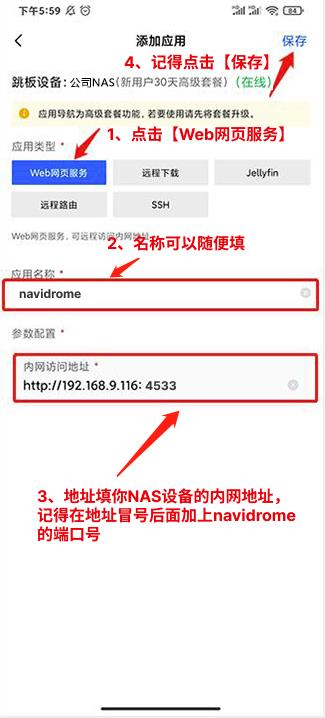
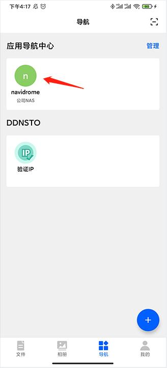
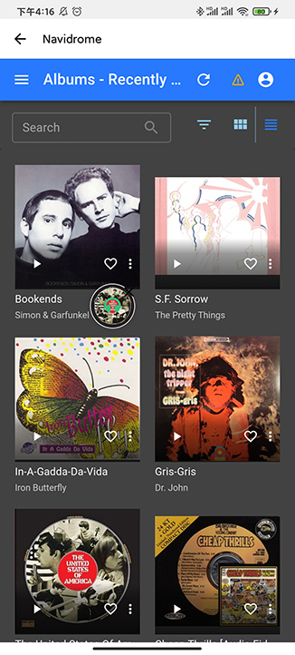
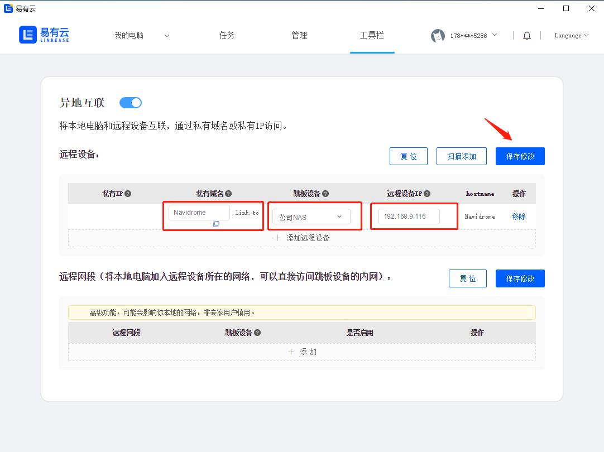
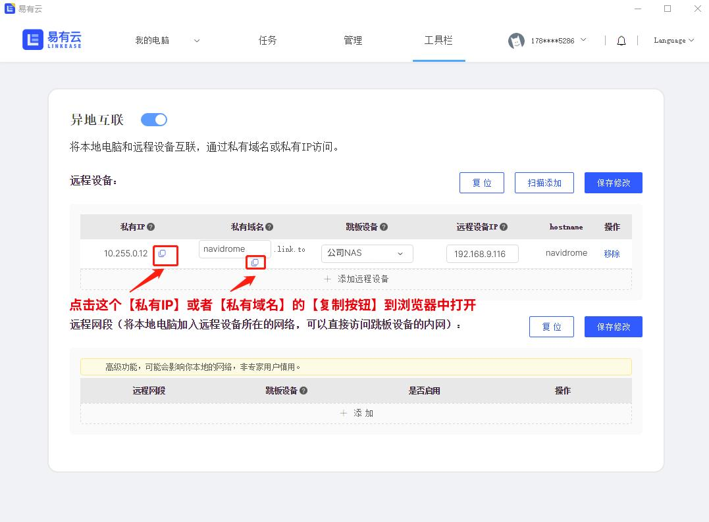
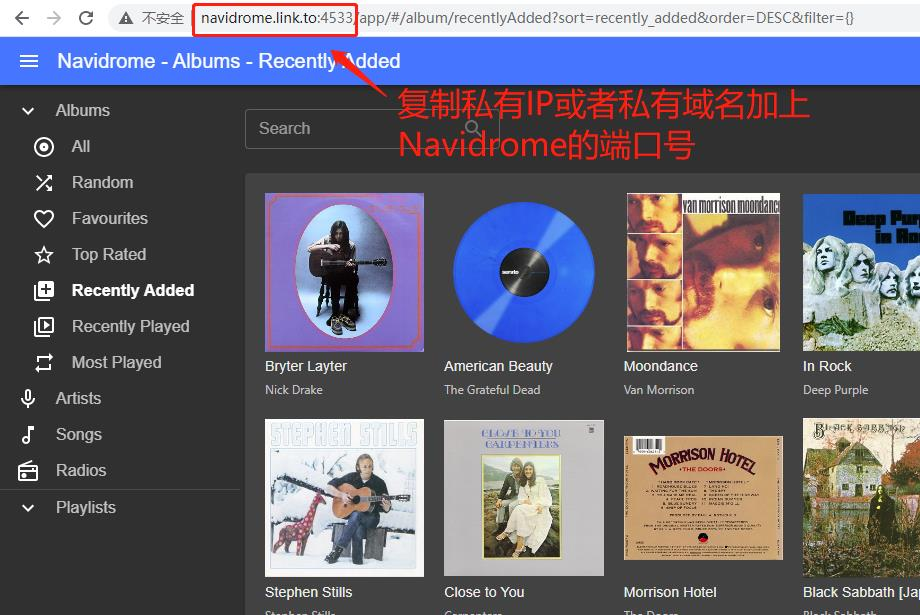

### 远程访问 NAS 使用 Navidrome 音乐播放器？
在外面想要远程访问你公司的NAS使用navidrome音乐播放器听音乐，  
我们可以使用易有云APP的应用导航。  
还可以通过易有云电脑客户端的异地互联快速实现。  
下面我们来看看如何操作吧。

### 前置条件：
公司NAS [安装并配置易有云](/zh/guide/linkease/install/device/synology.md)

### 方式一：使用易有云APP的应用导航实现
#### 第一步：安装易有云
- 手机安装易有云APP，并且登录同一账号。

#### 第二步：配置易有云APP应用导航的Web网页服务
- 打开易有云APP，选择【导航】，在应用导航中心里点击【立即添加】。

- 跳板设备 选择公司NAS

- 应用类型：选择【Web网页服务】；
- 应用名称：可以随便填；
- 远程地址：填你公司NAS的内网地址加上navidrome的端口号；
- 最后点击【保存】。

- 现在你只需要点击【应用导航中心】的navidrome；
- 就可以通过手机APP远程访问公司NAS使用 navidrome 来听下载好的音乐了。

### 方式二：通过易有云电脑客户端的异地互联实现
#### 第一步：安装易有云
- 家里电脑安装易有云电脑客户端，并且登录同一账号。

#### 第二步：开启易有云电脑客户端的异地互联
- 打开家里电脑易有云客户端，开启[异地互联](/zh/guide/linkease/function/remote_connects.md)；
- 点击【添加远程设备】。

- 私有域名：一定要填小写的英文字母；
- 跳板设备：选公司NAS；
- 远程设备IP：填公司NAS的内网IP；
- 点击【保存修改】，易有云会自动帮你生成一个【私有IP】。

#### 第三步：复制【私有IP】或者【私有域名】到浏览器中打开
- 复制这个【私有IP】或者【私有域名】到浏览器中打开；
- 就可以远程访问你公司的NAS。

#### 第四步：在【私有IP】或者【私有域名】后面加上navidrome的端口号
- 在【私有IP】或者【私有域名】后面加上navidrome的端口号；
- 就可以在家里远程访问你公司的NAS使用 navidrome 来听下载好的音乐了。

