### 在家办公，需要访问公司的办公网络？

- 【公司电脑】安装易有云电脑客户端，公司【群晖】或者【QNAP】等【其他设备】也安装易有云，
并且[开启网盘](https://doc.linkease.com/zh/guide/linkease/install/device/windows.html)
- 【家里电脑】安装易有云电脑客户端
- 公司电脑和家里电脑易有云客户端都登录同一易有云账号，并且易有云客户端是开启状态
- 打开家里电脑易有云客户端，在易有云状态栏的【工具栏】下面找到【异地互联】

- 易有云默认已经帮你开启了异地互联，现在我们想要在家里访问公司群晖
- 点击【添加远程设备】

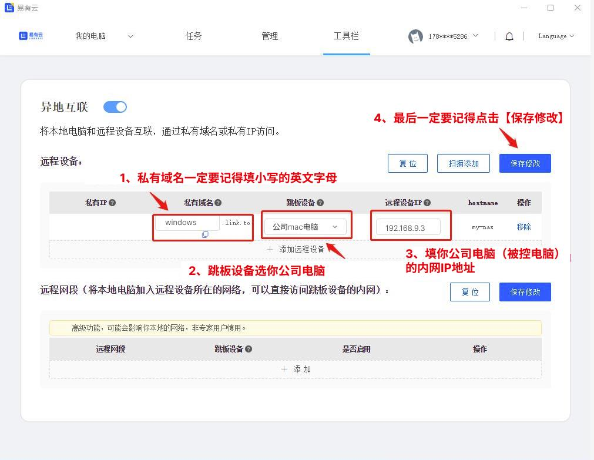

- 私有域名：可以自己随意填（最好填英文名）
- 跳板设备：选公司任意一个安装了易有云的设备
- 远程设备IP：填你要访问的公司设备IP

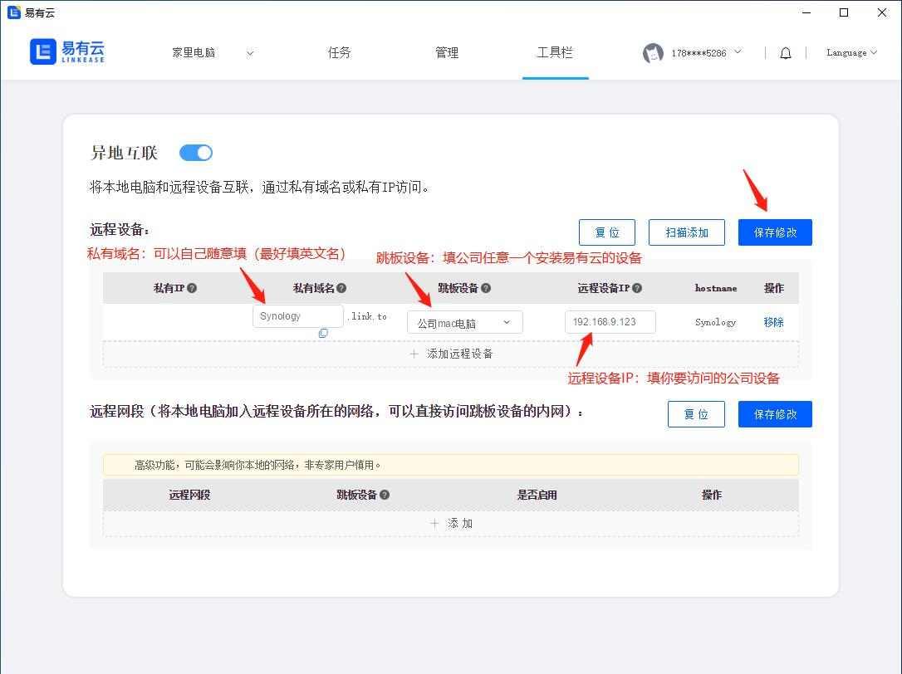

- 点击保存修改，易有云会自动帮你生成一个【私有IP】
- 只需要复制这个【私有IP】或【已有域名】到浏览器打开
- 就可以在家里远程访问你公司的群晖了

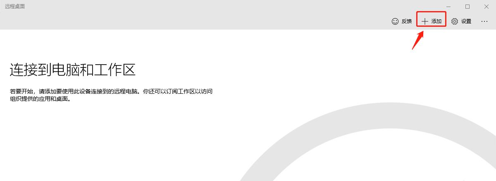

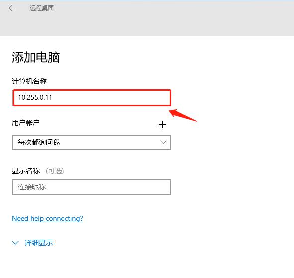

#### 如果觉得自己手动添加太麻烦，可以直接使用【扫描添加】

- 点击【扫描添加】

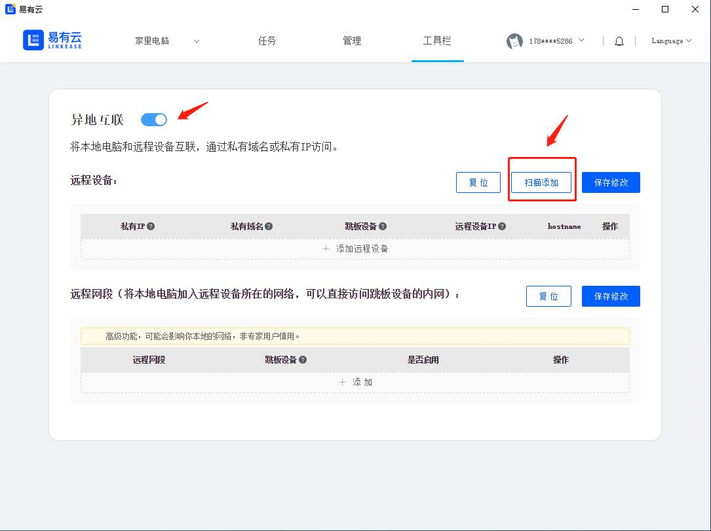

- 跳板设备选择公司安装了易有云的一个设备 比如【我的mac电脑】

- 易有云会帮你扫描出公司同一网络内所有安装易有云的设备

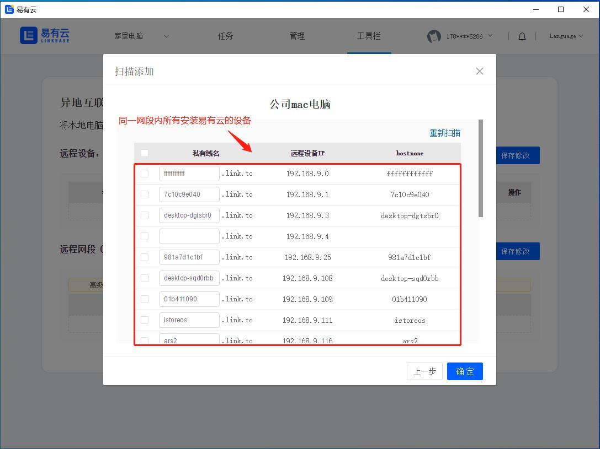

### 我们现在在家里通过异地互联，使用公司群晖的Drive或QNAP的官方客户端

- 选择【公司的群晖】，点击确定

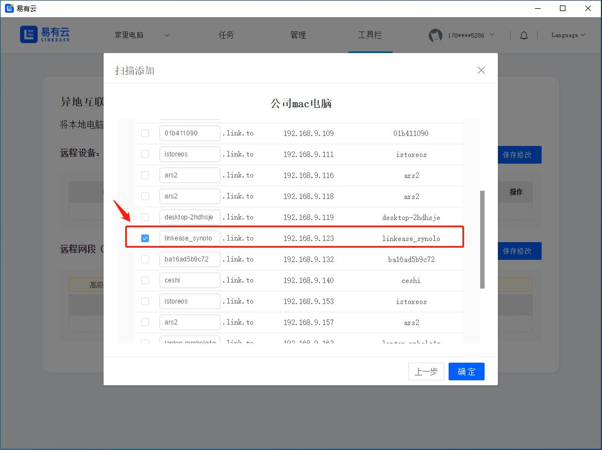

- 易有云的异地互联会自动帮你生成一个新的【私有IP】和【私有域名】
- 我们只需要复制这个【私有IP】或者【私有域名】到浏览器中打开，就可以在家里远程访问我们公司的群晖了

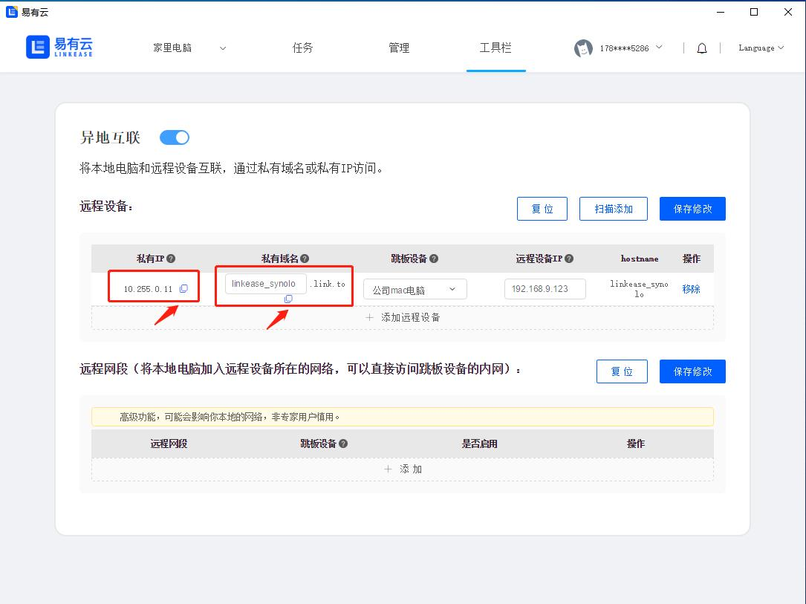

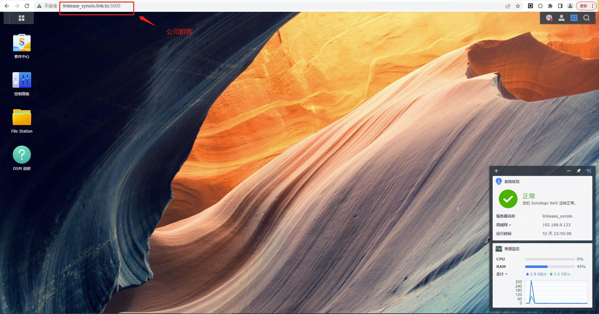

- 要访问群晖的Drive，我们可以在浏览器【私有IP】或者【私有域名】后面加上Drive的地址就可以了

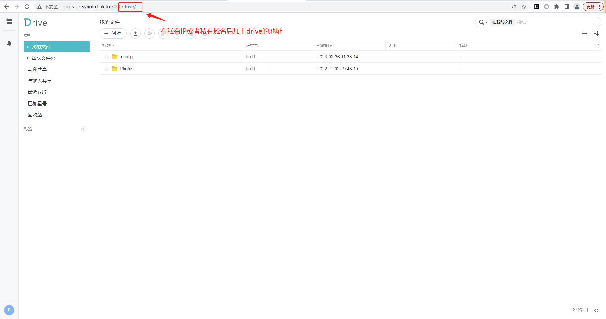

### 通过易有云异地互联访问 NAS 的套件，进行远程下载/远程看电影

- 通过易有云异地互联扫描到公司同一网络内所有安装易有云的设备
- 选择我们要访问的公司 NAS 设备

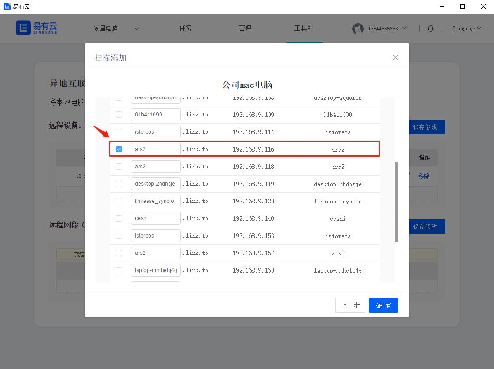

- 复制这个【私有IP】或者【私有域名】到浏览器中打开，就可以在家里远程访问我们公司的 NAS 了

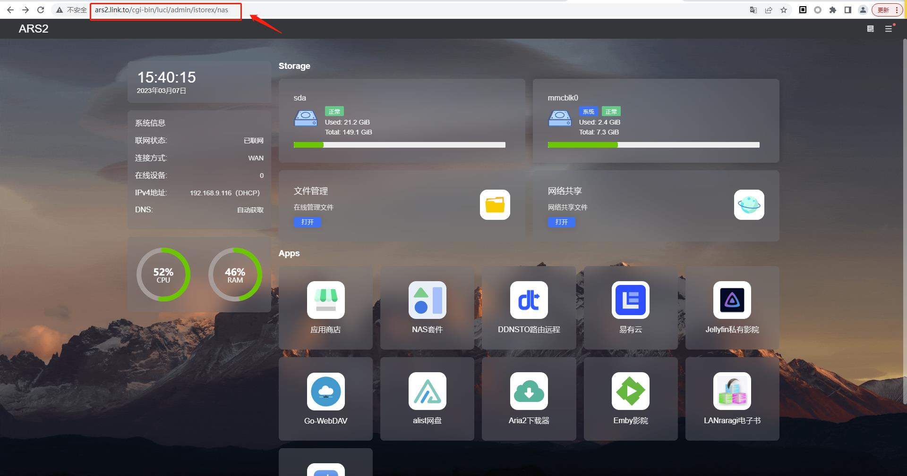

- 要访问 NAS 的套件进下远程下载/远程看电影，
- 我们可以在浏览器【私有IP】或者【私有域名】后面加上远程下载（比如qBittorrent 、Aria2等），远程看电影（比如Jellyfin，emby）的端口号就可以了

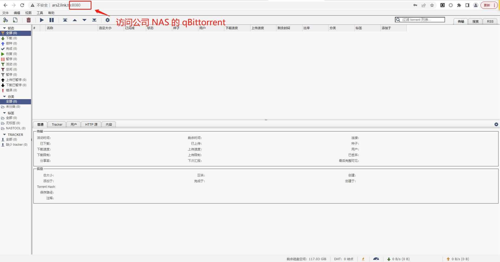

