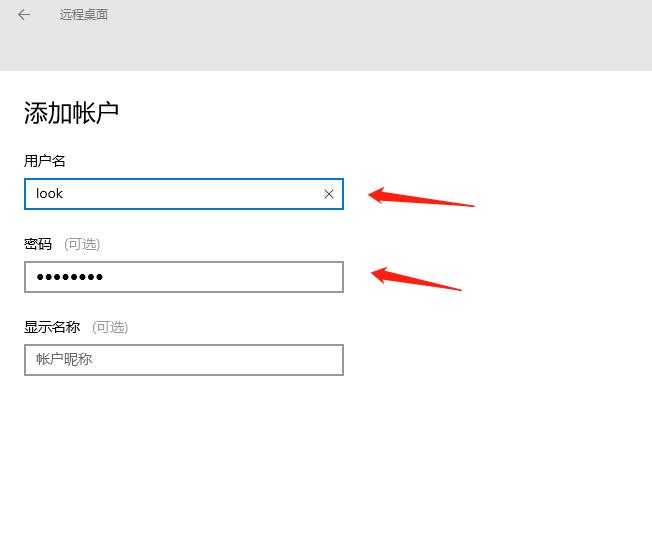
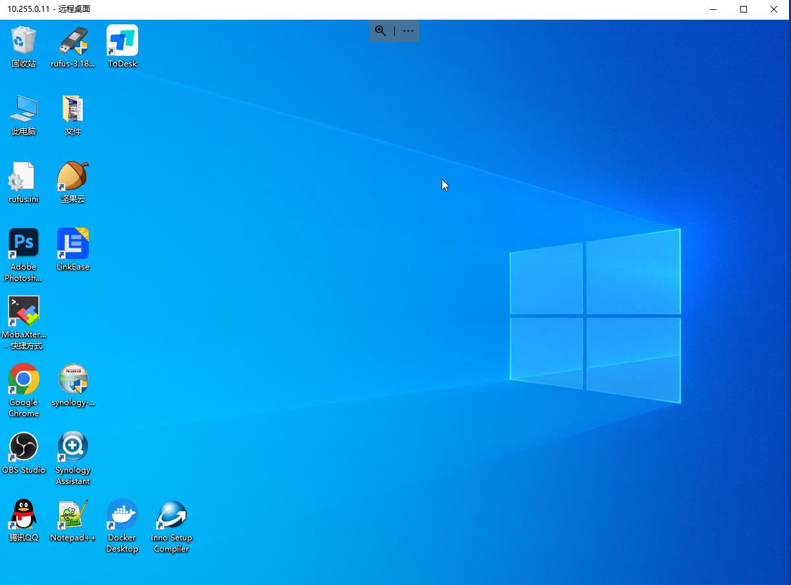

### 在家办公，通过远程桌面控制公司电脑 
现在给大家推荐一种快速远程我们公司电脑桌面的方法：  
通过易有云客户端的[异地互联](/zh/guide/linkease/function/remote_connects.html)，可以快速的实现。   
因为易有云是点对点通信的，所以速度快。  
我们来看看具体的操作吧。  

### 第一步：安装易有云
- 公司电脑安装易有云电脑客户端，并且[开启网盘](/zh/guide/linkease/install/device/windows.html)
- 家里电脑安装易有云电脑客户端
- 公司电脑和家里电脑易有云客户端都登录同一易有云账号，并且易有云客户端是运行状态
### 第二步：易有云电脑客户端开启异地互联
- 打开家里电脑易有云客户端，[开启异地互联](/zh/guide/linkease/function/remote_connects.html)

- 私有域名：一定要记得填小写的英文字母；
- 跳板设备：选公司电脑；
- 远程设备IP：填你公司电脑（被控电脑）的内网IP；
- 最后一定记得要点击【保存修改】。

- 易有云会自动帮你生成一个【私有IP】。

### 第三步：被控电脑（公司电脑）开启远程桌面
**被控电脑（公司电脑）[查看开启远程桌面教程](/zh/guide/wiki/remote.md)** 

### 第四步：家里电脑下载微软远程软件
**[查看下载微软远程软件教程](/zh/guide/wiki/Microsoft.md)**

### 第五步：复制【私有IP】或【私有域名】到微软远程软件打开

- 打开家里电脑的微软远程软件；
- 点击右上角的添加。

- 计算机名称：复制易有云的【私有IP】或者【私有域名】。

- 输入公司电脑（被控电脑）的登录用户名和密码；
- 就可以在家里远程访问你公司电脑桌面了。

