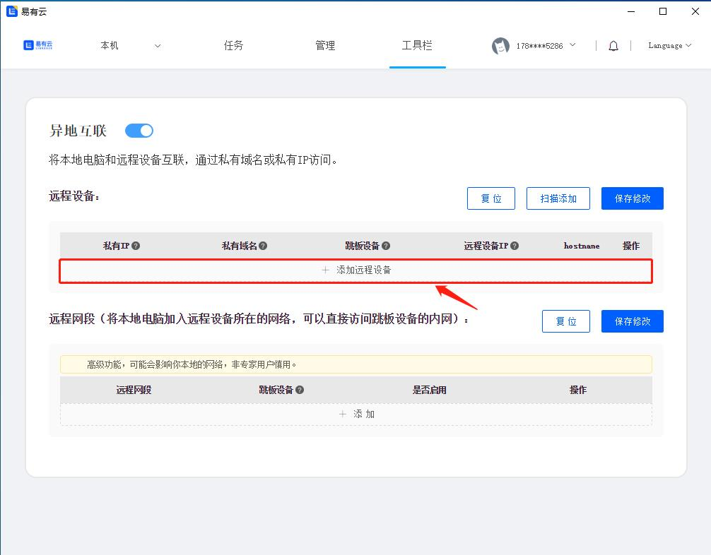
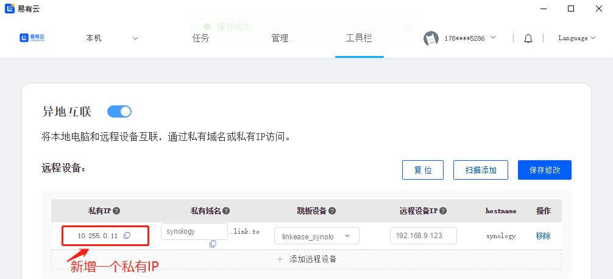
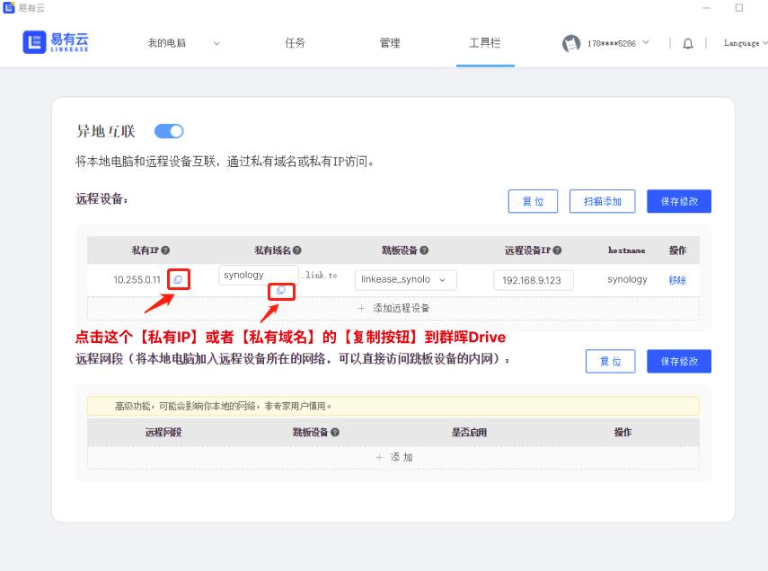
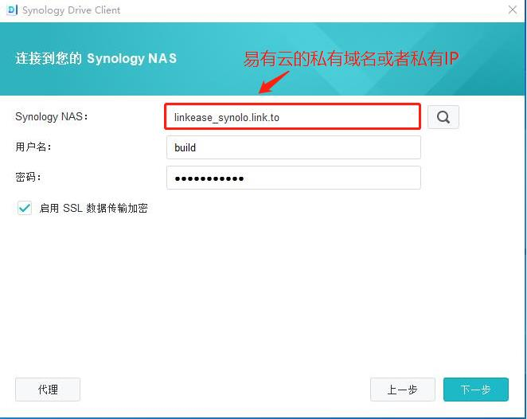

### 如何通过异地互联使用群晖Drive
在外面想要远程公司的群晖使用Drive，  
可以通过易有云的[异地互联](/zh/guide/linkease/function/remote_connects.html)。  
因为易有云是点对点通信，速度快。  
来看看具体操作。

### 安装易有云
- [群晖安装易有云并配置](/zh/guide/linkease/install/device/synology.md)
- [电脑安装易有云客户端](/zh/guide/linkease/install/device/windows.md)
- 登录同一易有云账号，并且群晖要在线

### 开启异地互联

打开易有云客户端，[开启异地互联](/zh/guide/linkease/function/remote_connects.md)

- 点击【添加远程设备】

- 私有域名：可以自己随意填（最好填英文名）
- 跳板设备：选群晖（群晖需要安装易有云开启网盘并且在线）
- 远程设备IP：填群晖的内网IP地址

- 点击保存修改，易有云会自动帮你生成一个【私有IP】

- 只需要复制这个【私有IP】或【已有域名】到Drive中；

- 打开Drive客户端；
- Synology NAS：填易有云的私有域名或者私有IP；
- 用户名和密码填群晖登录的用户名和密码；
- 就可以远程使用群晖Drive了；

#### 更多参考
[远程硬盘挂载](/zh/guide/linkease/tips/mount.md)

