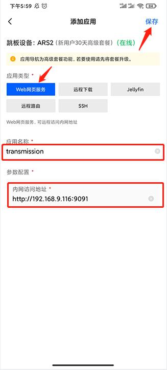
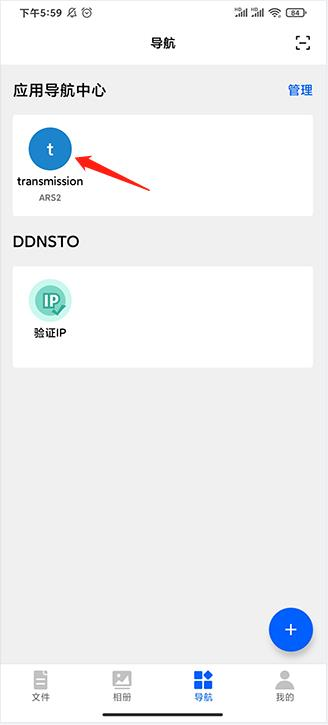
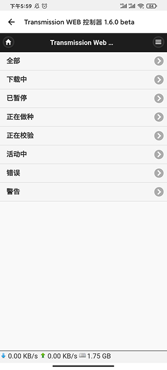
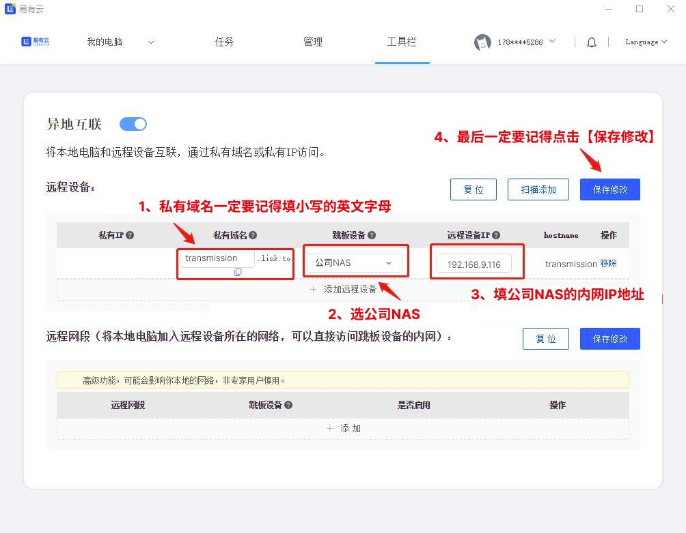
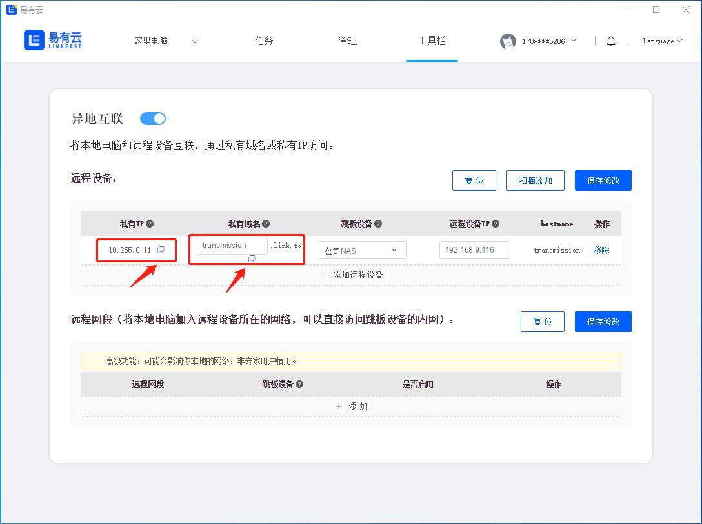
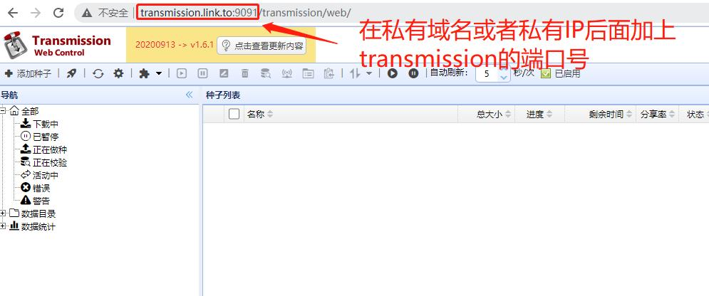

### 远程访问 NAS 使用 transmission下载？
当你在外网想要远程访问你公司的NAS使用transmission下载电影，  
我们可以使用易有云APP的应用导航。  
还可以通过易有云电脑客户端的异地互联快速实现。  
下面我们来看看如何操作吧  

### 方式一：使用易有云APP的应用导航实现
#### 第一步：安装易有云
- 公司NAS [安装并配置易有云](https://doc.linkease.com/zh/guide/linkease/install/device/windows.html)
- 手机安装易有云APP
- 登录同一易有云账号
#### 第二步：配置易有云APP应用导航的Web网页服务
- 打开易有云APP，选择【导航】，在应用导航中心里点击【立即添加】

- 跳板设备 选择公司NAS

- 应用类型：选择【Web网页服务】
- 应用名称：可以随便填
- 远程地址：填你公司NAS的内网地址加上transmission的端口号
- 最后点击保存

- 现在你只需要点击【应用导航中心】的transmission
- 就可以通过手机APP远程访问公司NAS使用 transmission来下载电影了

### 方式二：通过易有云电脑客户端的异地互联实现
#### 第一步：安装易有云
- 公司NAS [安装并配置易有云](https://doc.linkease.com/zh/guide/linkease/install/device/windows.html)
- 家里电脑安装易有云电脑客户端
- 登录同一易有云账号
#### 第二步：开启易有云电脑客户端的异地互联
- 打开家里电脑易有云客户端，在易有云状态栏的【工具栏】下面找到【异地互联】

- 易有云默认已经帮你开启了异地互联
- 点击【添加远程设备】

- 私有域名：可以自己随意填（最好填英文名）
- 跳板设备：选公司NAS
- 远程设备IP：填公司NAS的内网IP
- 点击保存修改，易有云会自动帮你生成一个【私有IP】

#### 第三步：复制【私有IP】或者【私有域名】到浏览器中打开
- 复制这个【私有IP】或者【私有域名】到浏览器中打开
- 就可以远程访问你公司的NAS

#### 第四步：在【私有IP】或者【私有域名】后面加上transmission的端口号
- 在【私有IP】或者【私有域名】后面加上transmission的端口号
- 就可以在家里远程访问你公司的NAS使用transmission下载电影了

