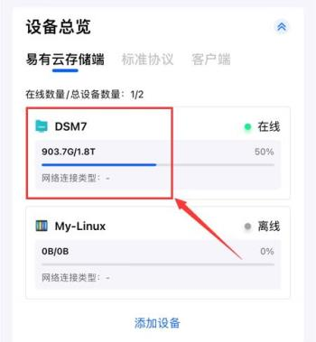
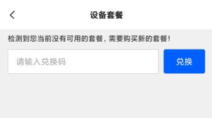
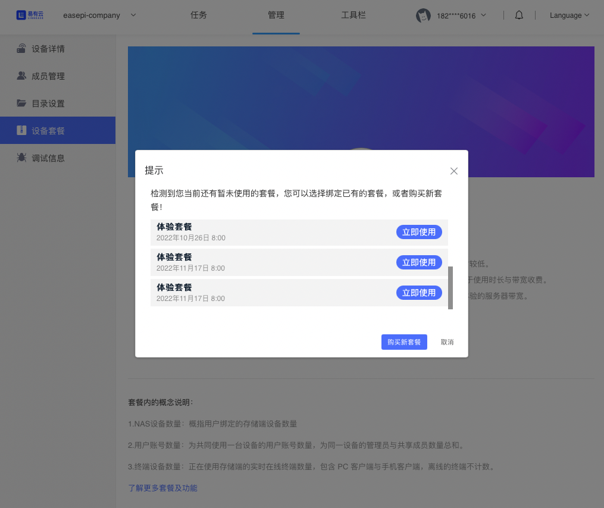
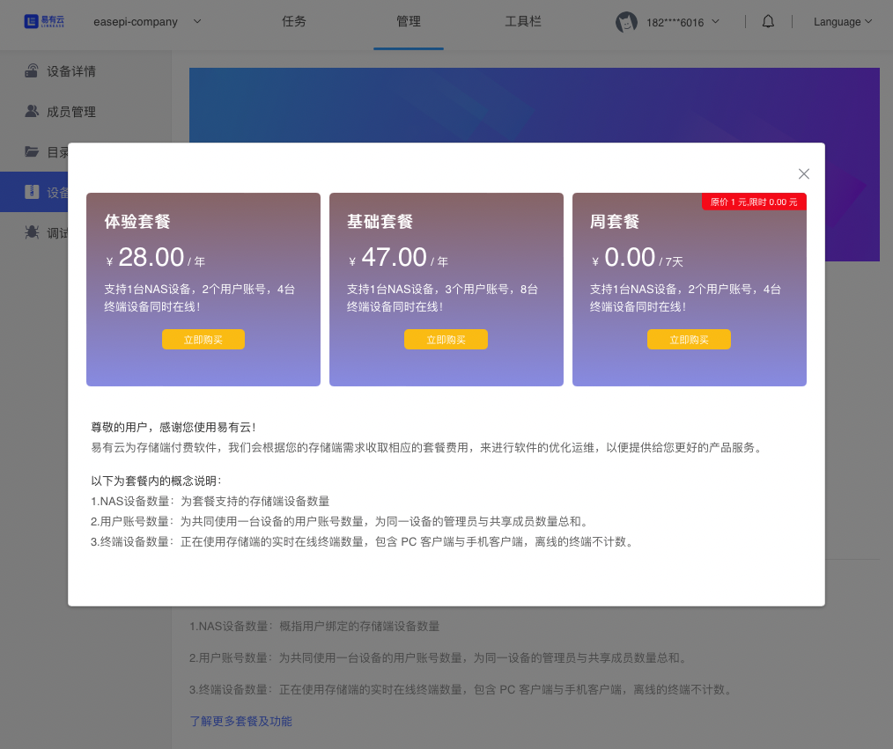

## 收费价格
因为相比公有云，用户自己承担了硬盘与硬件的存储，所以易有云收费相对便宜。

易有云未来偏向基于时长与带宽收费，而功能不收费。

易有云只对存储端收费，用户客户端下载安装不收费。
**(即1台本地电脑可开启存储服务，作为1台NAS设备绑定使用，如您在2台电脑都开启存储服务，就相当于绑定2台NAS设备，我们就要收取2个套餐价格。)**

目前的版本不评估带宽，因为现在无法评估，我将尽最大努力给用户提供足够用户体验的服务器带宽。

| 套餐 |存储端数量|账号数量|在线客户数量|定价|
|-|-|-|-|-|
|周套餐|1|2|4| 1人民币/7天 |
|体验套餐|1|2|4| 28人民币/年 |
|基础套餐|1|3|8| 47人民币/年 |

### 如何购买套餐？

## 易有云APP

**1. 绑定设备后，登录易有云App，首页设备总览里，点击已绑定的设备；**

**2.设备管理页面提示没有绑定套餐，点击“去绑定”；**

* 若有兑换码，输入正确的兑换码，绑定即可使用。

* 若无兑换码，点击底部“购买新套餐”，选择合适的套餐，付费绑定即可使用。

## PC客户端

**1、绑定设备后，登录易有云PC客户端，在左上角选择切换要购买套餐的设备后，如果该设备没有绑定过套餐则会弹窗提示购买套餐，点击"绑定或购买套餐"。**

**2、点击“立即订购”。**

**3、如果当前账号有未使用的套餐，可以选择对应的套餐点击“立即使用”来绑定套餐，如没有，则需“购买新套餐“。**

**4、选择合适的套餐点击“立即购买”即可。**

## 常见问题

**1、我绑定了周套餐后，怎么绑定其他套餐？**

答：目前如果你已经绑定了周套餐，可以等周套餐过期后再购买或者绑定其他套餐。

**2、旧的设备离线或者不用了，但是套餐绑定了旧设备，怎么将套餐绑定到其他新设备上？**

答：将旧设备删除，旧设备上的套餐会解除绑定，然后再在新设备上选择已有套餐进行绑定。