## 同步文件

A.设置同步文件（路由器暂不支持）

目前，PC客户端支持同步文件功能。同步方式有“单向同步”及“双向同步”两种，可以根据个人需求选择。

单向同步：在本地同步文件夹中对文件进行操作（创建、修改、删除、改名、移动）后，将会同步更新到云端，但在云端更改同步文件则不会同步到本地；

双向同步：本地和云端实时同步，一端有变化会同步更新到另一端，同步文件夹中本地文件与云端文件始终保持一致。


设置同步文件操作如下：

**1.切换设备时，选择“本机”设备；**


**2.选择我们想要同步的文件夹（单个文件不可同步），点击鼠标右键选择“同步至”；**


**3.选择要同步至的目的设备目录，点击单向同步或双向同步按钮即可。**


 

B.取消同步文件

**1.点击“我的电脑-全部文件”，选择同步状态进入同步列表，点击同步文件夹右方的“取消同步”按钮；**
 


**2.在弹出的窗口中选择“确定”，当同步列表中没有这个文件夹时表示该文件夹已经取消同步成功。**


## 编辑文档

如何在线创建、编辑和预览Markdown文档？

**1.点击右侧“新建文件”，在出现的文件命名弹窗命名后，将文件格式后缀设置为“.md”，点击“确定”按钮即可创建Markdown文档。**

*无需另外下载软件安装，无需另外下载软件安装，无需另外下载软件安装，直接在易有云中就可以创建编辑；


**2.单击Markdown文档，即可在线编辑。编辑完成后，请点击“保存”按钮，否则此次修改无效。点击“关闭”，退出当前编辑页面。**

*生成html：在线生成html文件，单击可打开预览网页；


## 本地存储

如何将本地电脑作为存储端设备绑定？

**1.请先安装易有云客户端，并正常开启运行。**

**2.Windows端(以Win10为例)：点击任务栏中易有云图标，右键即可展开易有云菜单栏，点击“启动存储服务”，即可打开易有云向导页面（网页）；**


**2-1.Mac端：单击易有云图标，即可展开易有云菜单栏，点击“启动存储服务”，即可打开易有云向导页面（网页）；**


<!-- <font color=#ff0000> <strong> *登录时，请使用客户端登录账号，否则无法绑定！</strong></font> -->
*登录时，请使用客户端登录账号，否则无法绑定！


**4.设置好名称及初始目录路径后，点击"确定"即可绑定！**

*初始目录路径为用户电脑本机上的任一文件夹路径；


**4.绑定完成后，即可将本机作为存储端设备远程管理访问数据！**


## 下载目录

PC客户端下载后的文件在哪里？（以Win10为例）

客户端及浏览器中文件下载后，保存至本机系统默认的下载路径中。
*"Administrator"为本机用户名


## 网络硬盘

何为网络硬盘，其实就是Web DAV，配置相当简单：

### 配置

**1.打开易有云电脑客户端，点击工具栏，然后点击网络硬盘；**

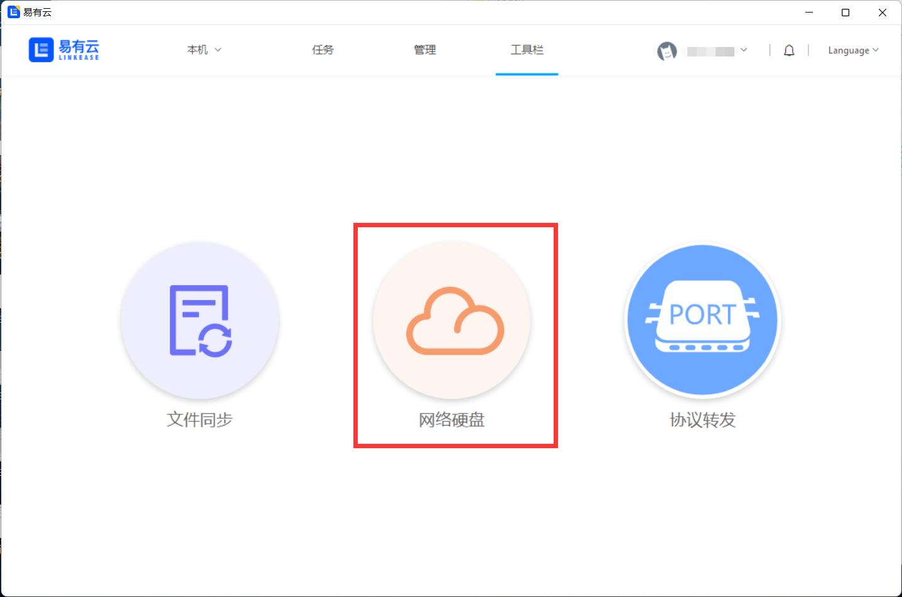

**2.然后服务设置，设置Webdav用户和Webdav密码(设置完成请记住)；**


**3.然后磁盘管理，选择一个目标主机，可以选择盘符映射到本地；**


**4.最后打开“此电脑”，就能看到映射的盘，就能点击进去直接访问了。**


### 访问

我们设置好网络硬盘(Web DAV)后，如果在其他客户端访问，怎么做呢？比如在易有云APP。

**1.选择一个目标主机，有个地址，我们整个地址复制下来；**

PS：地址类似这种：**http://192.168.2.135:8896/webdav/XXXXXXX** (这就是WebDAV的服务器url)

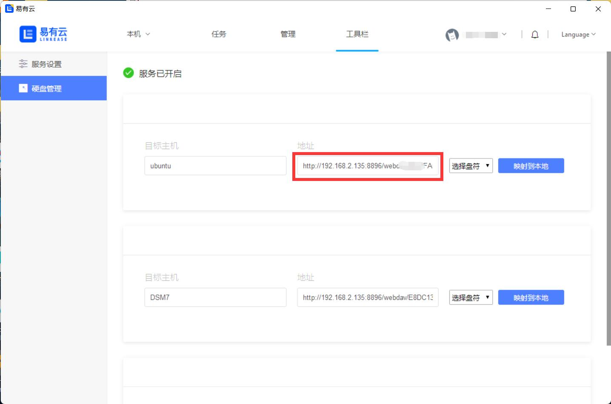

**2.然后参考教程，绑定即可。**

[易有云APP WebDAV绑定教程](/zh/guide/linkease_app/tutorial.html#web-dav) -->

ps：若是其他能访问WebDAV的APP或者客户端，绑定访问也是一样的操作。


## 协议转发

易有云PC版已经上线协议转发了，请更新最新版。

目前已经支持转发的协议有ssh和rdp，后续更多协议敬请期待。


### SSH协议转发

1.设置非常简单，进入协议转发，点击“添加”，协议类型选择ssh；目标设备，选择已经绑定了此易有云的设备(请确认设备启用SSH)：


2.目标地址写目标设备的默认地址，本地地址写要转发成的地址，填写完成后，保存。

* 目标地址：比如远端主机ip是http://192.168.2.101/，这就是目标地址，转发ssh，端口就是22。

* 本地地址：就是把远端目标地址转到本地的ip，比如127.0.0.1:22。

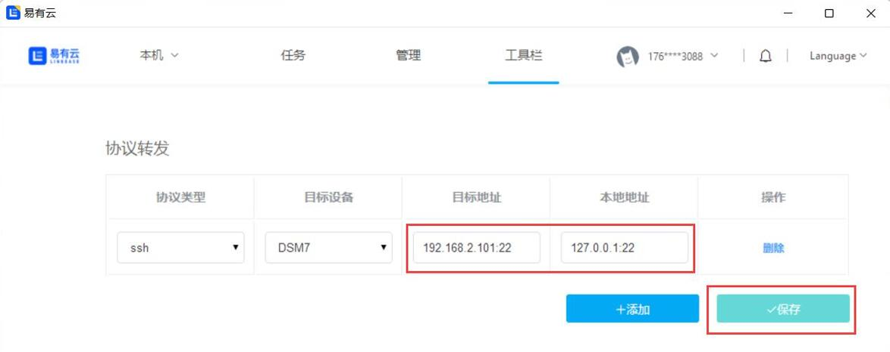

3.现在就可以利用Xshell等工具通过本地地址(127.0.0.1:22)SSH访问设备了。

### RDP协议转发

1.进入协议转发，点击“添加”，协议类型选择rdp；目标设备，选择已经绑定了此易有云的设备(请确认设备启用RDP)：

* 若被控电脑是windows家庭版，需要特殊处理才能开启RDP。[家庭版开始RDP](https://doc.linkease.com/zh/guide/ddnsto/cloudapp.html#b-家庭版开启rdp)


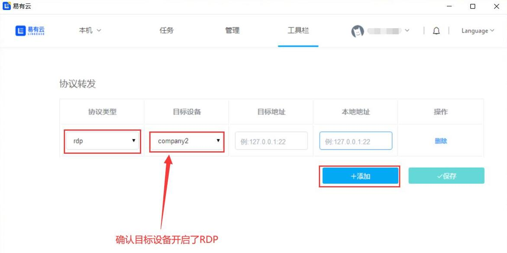

2.目标地址写目标设备的默认地址，本地地址写要转发成的地址，填写完成后，保存。

* 目标地址：比如被控主机ip是http://192.168.2.5/，这就是目标地址，rdp默认端口是3389。

* 本地地址：就是把远端目标地址转到本地的ip，比如127.0.0.1:3389。(若本地远程开了就不能用3389端口，换端口，比如3399等。)

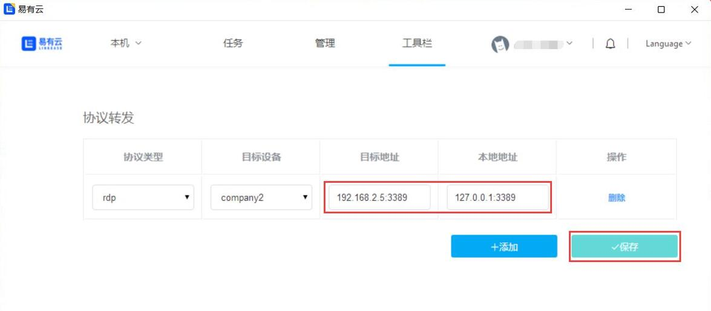

3.现在就可以通过本地地址(127.0.0.1:3389)远程访问设备了。

* 安装 [微软RDP远程桌面程序](https://docs.microsoft.com/en-us/windows-server/remote/remote-desktop-services/clients/remote-desktop-clients) (windows电脑建议安装Microsoft Store版本)。

* RDP客户端，添加电脑，填入本地地址访问。(连接过程中会提示填入被控电脑的用户名和密码)

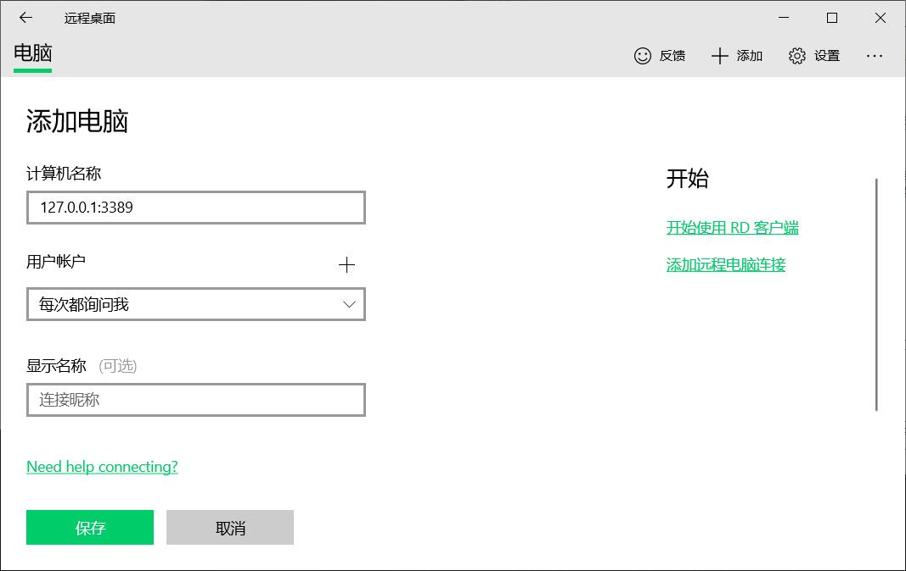

* Windows电脑也可以用自带的“远程桌面连接”，操作是一样的，界面不同而已。


### Samba协议转发

1.设置非常简单，进入协议转发，点击“添加”，协议类型选择samba；目标设备，选择已经绑定了此易有云的设备(请确认设备启用samba)：


2.目标地址写目标设备的默认地址，本地地址写要转发成的地址，填写完成后，保存。

* 目标地址：比如远端主机ip是http://192.168.2.101/，这就是目标地址。

* 本地地址：就是把远端目标地址转到本地的ip，比如127.0.0.1。

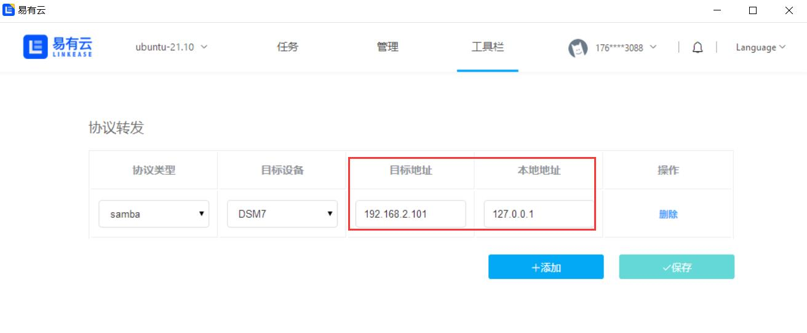

3.现在就可以利用可Samba访问的工具通过本地地址(127.0.0.1)访问设备了。


## 协议访问

易有云PC客户端支持多种网络协议(SMB/CIFS、SFTP、WebDAV)访问。

设置位于PC客户端—右上角头像—设置—“+”加号图标，下面开始一一说明各个协议的简单用法。

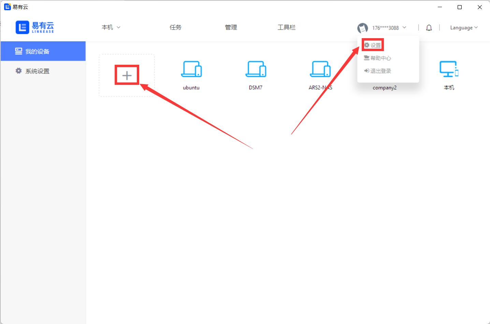

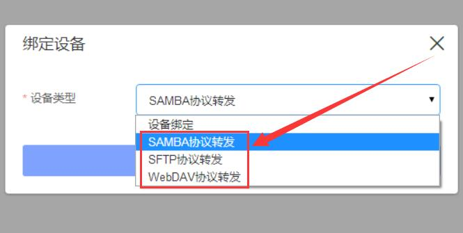


### Samba

#### 1.选择“Samba”，下一步，进入配置界面；


#### 2.开始配置：


```
关联设备：若选择绑定了易有云的设备，外网都能访问；若不关联设备，仅在设备所在局域网内能访问。

选择设备IP：开启了Samba协议的设备的IP，可以进入“选择”界面选择，也可以自定义输入IP。

端口：一般不需要设置，默认即可。
```

#### 继续下一步：


工作组：一般不需要设置，默认即可。

用户名和密码：Samba设备的用户名和密码。

#### 继续下一步：


设备名称：可随意设置。

路径：选择Samba设备的磁盘。

#### 3.绑定成功后，就能看到刚刚添加的设备，选择即可管理。


### SFTP

#### 1.选择“SFTP”，下一步，进入配置界面；


#### 2.开始配置：


```
关联设备：若选择绑定了易有云的设备，外网都能访问；若不关联设备，仅在设备所在局域网内能访问。

设备IP：开启了SFTP协议的设备的IP，手动输入。

端口：一般不需要设置，默认即可。
```

#### 继续下一步：


用户名称和密码：SFTP设备的用户名和密码。

#### 继续下一步：

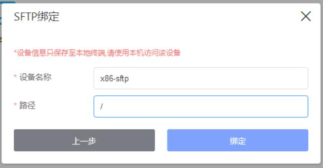

设备名称：可随意设置。

路径：设置要访问的路径，默认就是整个磁盘分区，也可以写指定的分区。

#### 3.绑定成功后，就能看到刚刚添加的设备，选择即可管理。

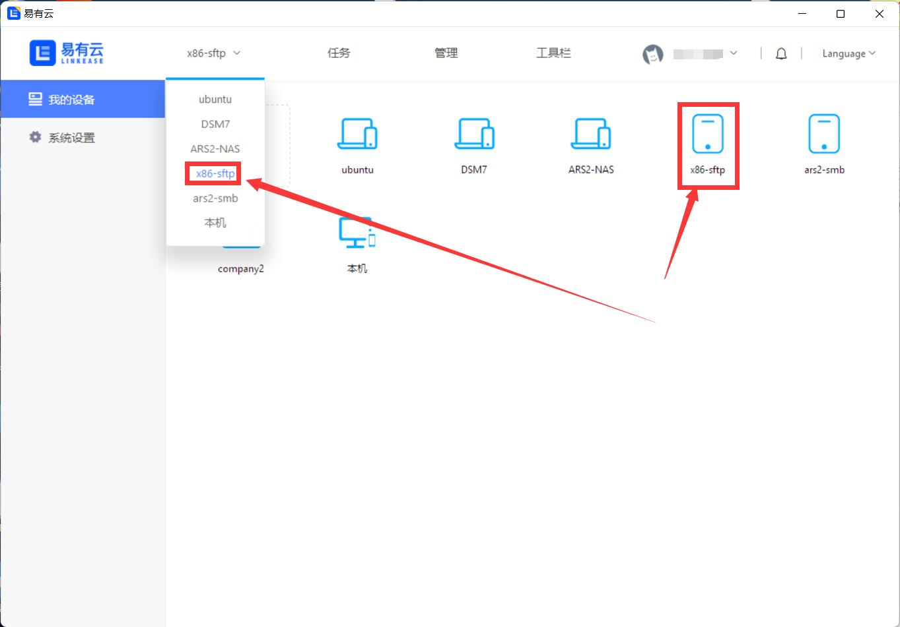


### Web DAV

#### 1.选择“Web DAV”，下一步，进入配置界面；


#### 2.开始配置：


```
关联设备：若选择绑定了易有云的设备，外网都能访问；若不关联设备，仅在设备所在局域网内能访问。

设备别称：可随意设置。

服务端url：WebDAV服务器的地址。若不是url，是ip+端口，就如实写，例如：192.168.2.3:6086。

用户名称和密码：WebDAV设置的用户名和密码。
```

#### 3.绑定成功后，就能看到刚刚添加的设备，选择即可管理。


## 管理目录

管理员如何设置设备上的用户目录？

**设备管理员点击“管理-目录设置”，进入设备目录设置页面**


**1.设置共享目录/家庭空间：在设备目录设置页面，公共目录板块直接更改目录路径和设置索引即可（共享目录名称不可更改）；**
<!-- <blockquote>
<font color="#DC143C"><strong>每个主目录都可以分别设置索引，默认是关闭的。手动开启索引后，即可支持文件智能分类及搜索功能，但占用的CPU会比较高；</strong></font>
</blockquote> -->
每个主目录都可以分别设置索引，默认是关闭的。手动开启索引后，即可支持文件智能分类及搜索功能，但占用的CPU会比较高；


**2.设置个人目录/个人空间：点击成员列表右侧的箭头，展开个人目录列表；点击"添加"按钮，新增个人主目录；**


**3.输入目录名称，选择目录路径，点击下方保存即可新增目录；**


**4.点击目录右侧"删除"按钮，即可删除当前目录；点击索引，即可关闭或开启个人目录索引。**


## 下载目录

如何设置下载目录？

**1.鼠标悬浮在头像上方，在出来的操作栏中点击“设置”，点击“系统设置”。**


**2.点击“浏览”，选择好本地路径后，点击“确定”即可**

*点击“打开”，会直接定位到当前您所选择的目录。


## 更新版本

如何在线更新客户端版本？

**1.正常开启运行易有云客户端。**

**2.Windows端(以Win10为例)：点击任务栏中易有云图标，右键即可展开易有云菜单栏，点击“检查更新”，即可自动更新到最新版本**


**3.也可以点击下载更新易有云客户端。** [客户端下载](https://doc.linkease.com/downloads/)
