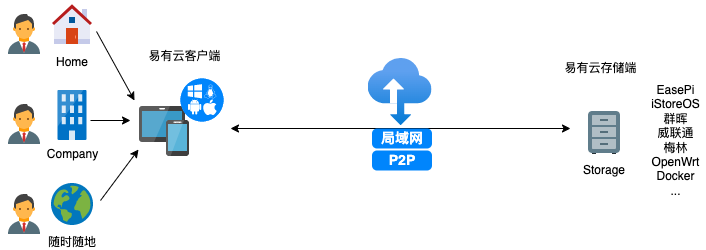
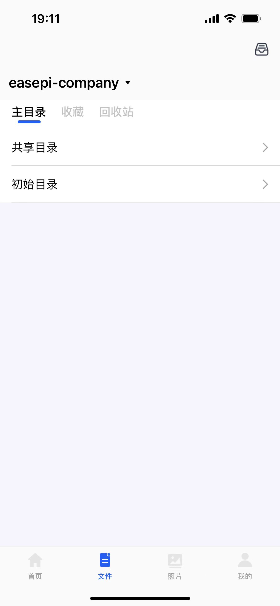
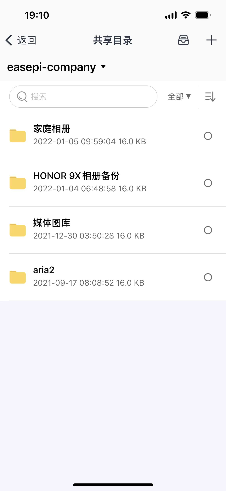
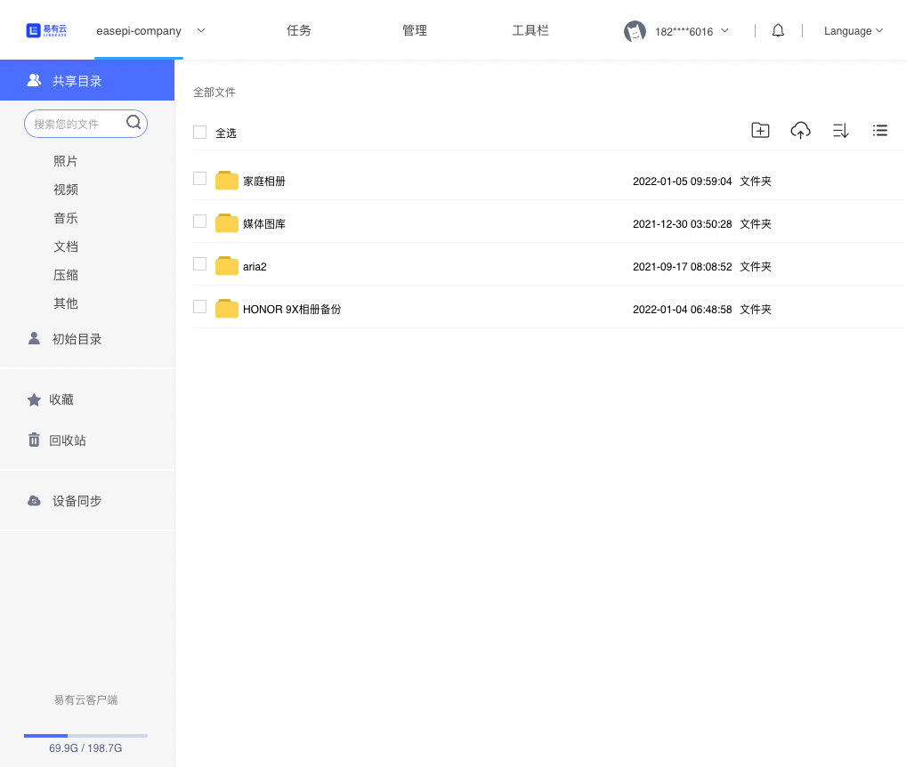
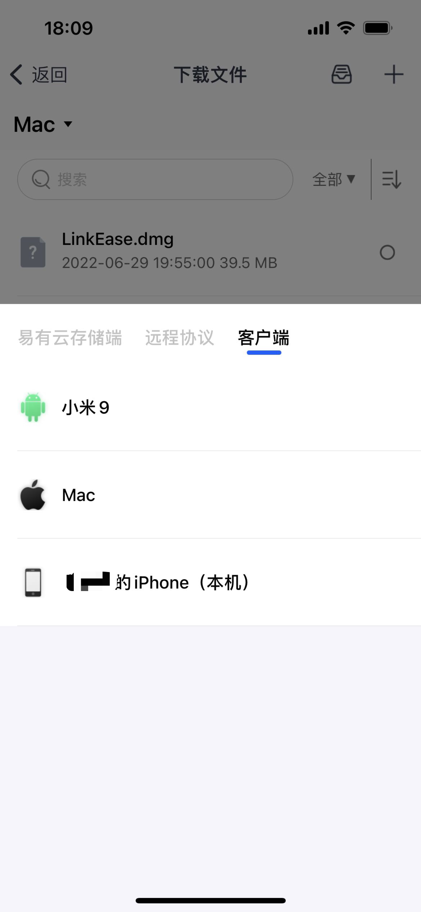
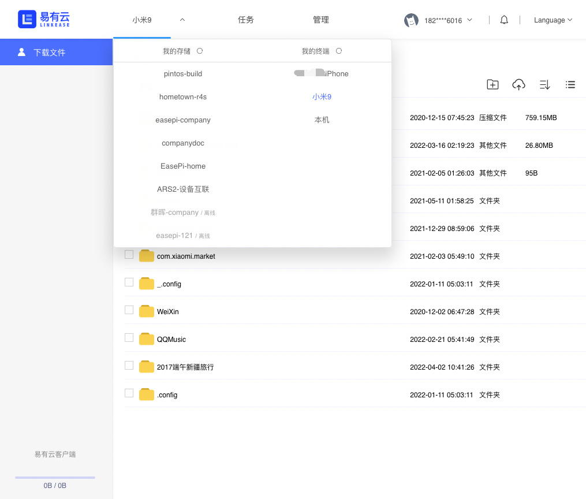

## 搭建私有云

有了易有云的助力，私有云的搭建和访问将会成为一件非常轻松简单的事情，点对点的跨平台传输体验。轻松实现外网和内网的互联互通，随时随地管理和访问私有云，稳定且高效。

越来越多的个人和企业都会搭建自己的私有云，如果你也想拥有自己私有云存储，可以试试简单方便的易有云来进行搭建，让你再也不必为没有自己的私有云而苦恼。

接下来跟着我们一步步引导你搭建属于自己的私有云服务。

图示：

随时随地通过客户端访问存储端服务

## 1、下载客户端，注册易有云账号

第一步需要你先下载客户端并注册易有云账号，后面配置过程中，需要将您的账号和存储端绑定，
支持Windows、macOS、Linux、iOS、安卓等平台，可以通过以上客户端在本地/远程访问你的存储端服务。

* [下载客户端](/zh/guide/linkease_app/download.md) -->

## 2、安装存储端

**选择安装设备**
| 品牌/系统 |教程|
|-|-|
|EasePi| [安装](/zh/guide/linkease_app/storage/easepi.md) |
|iStoreOS| [安装](/zh/guide/linkease_app/storage/istoreos.md) |
|群晖| [安装](/zh/guide/linkease_app/storage/synology.md) |
|威联通| [安装](/zh/guide/linkease_app/storage/qnap.md) |
|华硕NAS| [安装](/zh/guide/linkease_app/storage/asus_nas.md) |
|Koolcenter 梅林| [安装](/zh/guide/linkease_app/storage/koolcenter_merlin.md) |
|Koolcenter Lede| [安装](/zh/guide/linkease_app/storage/koolcenter_lede.md) |
|OpenWrt| [安装](/zh/guide/linkease_app/storage/openwrt.md) |
|Linux| [安装](/zh/guide/linkease_app/storage/linux.md) |
|ReadyNAS| [安装](/zh/guide/linkease_app/storage/ready_nas.md) |
|Unraid| [安装](/zh/guide/linkease_app/storage/unraid.md) |
|爱快| [安装](/zh/guide/linkease_app/storage/ikuai.md) |
|铁威马| [安装](/zh/guide/linkease_app/storage/terra_master.md) |
|Docker| [安装](/zh/guide/linkease_app/storage/docker.md) |
|Windows| [安装](/zh/guide/linkease_app/storage/windows.md) |
|Mac| [安装](/zh/guide/linkease_app/storage/mac.md) |

## 3、开始配置，将你的账号和存储端绑定

* [存储端绑定](/zh/guide/linkease_app/bind.md) -->

至此，你的私有云服务已经搭建完成。

## 4、访问存储端文件

下面你就可以通过客户端登录你的账号来访问你的存储端设备文件了，你就可以在这个目录下进行上传、下载、管理文件等操作了。

* “初始目录”，就是你刚刚配置的目录
* “共享目录”，可以将你的设备共享给别人，这样别人也可以访问你的设备“共享目录“了

预览:
| APP | APP |
|-|-|
||  |

| PC |
|-|
||

## 我没有存储设备怎么办？

没有存储设备，你也可以利用易有云客户端管理账号下全部客户端的文件，相互传输，摆脱数据线。

**1、下载客户端，注册易有云账号**

第一步需要你先下载客户端并注册易有云账号，支持Windows、macOS、Linux、iOS、安卓等平台。

* [下载客户端](/zh/guide/linkease_app/download.md) -->

**2、在APP上登录你刚刚注册的易有云账号，同时在PC客户端也登录该账号，这样客户端之间就可以相互访问了。**

| iPhone | Android |
|-|-|
||  |

| PC |
|-|
||

**3、同理，可以在更多客户端上使用你的账号，实现更多平台的统一管理、数据互通。**

